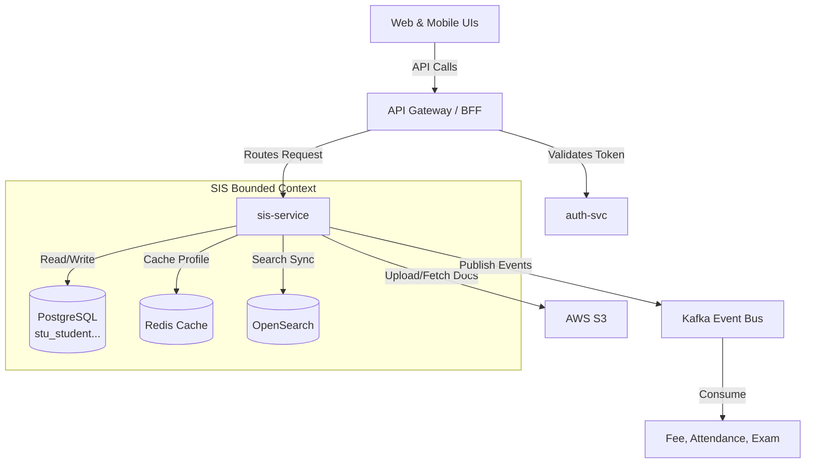
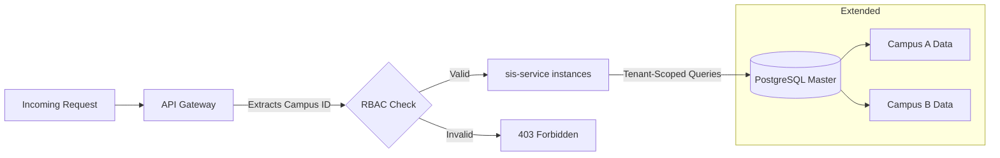
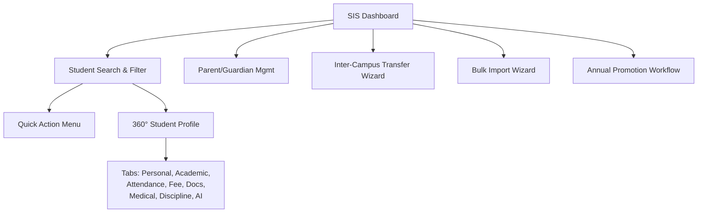
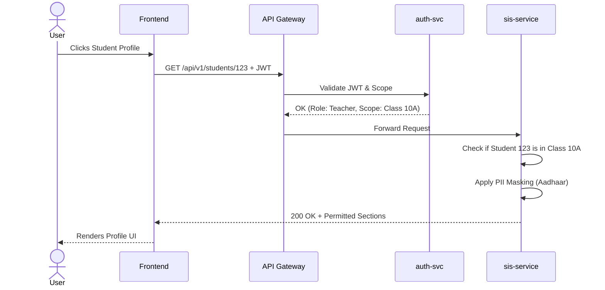
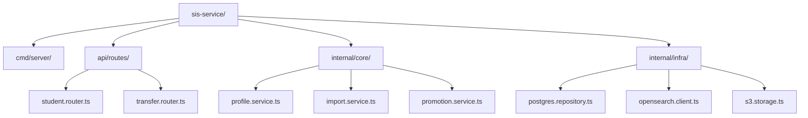
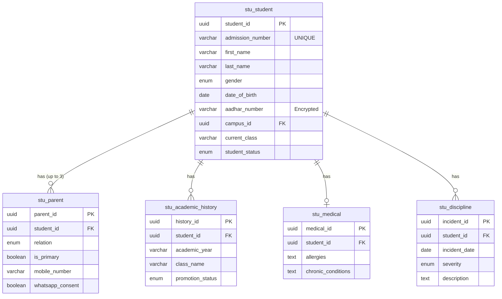
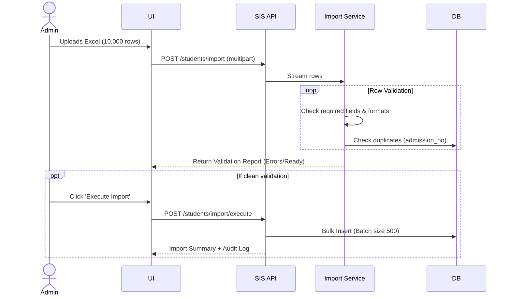
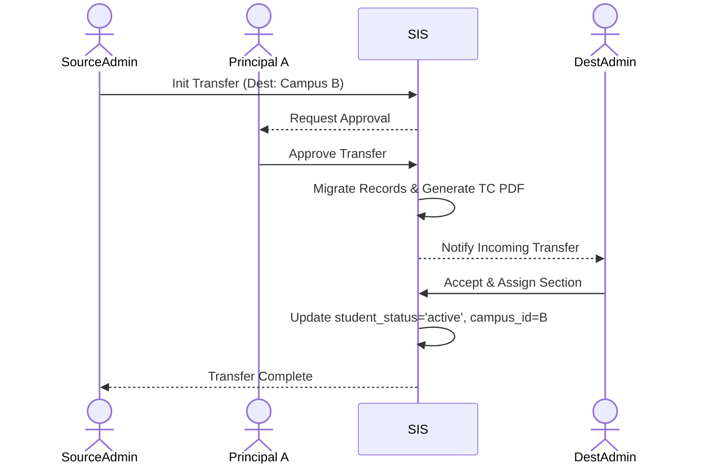
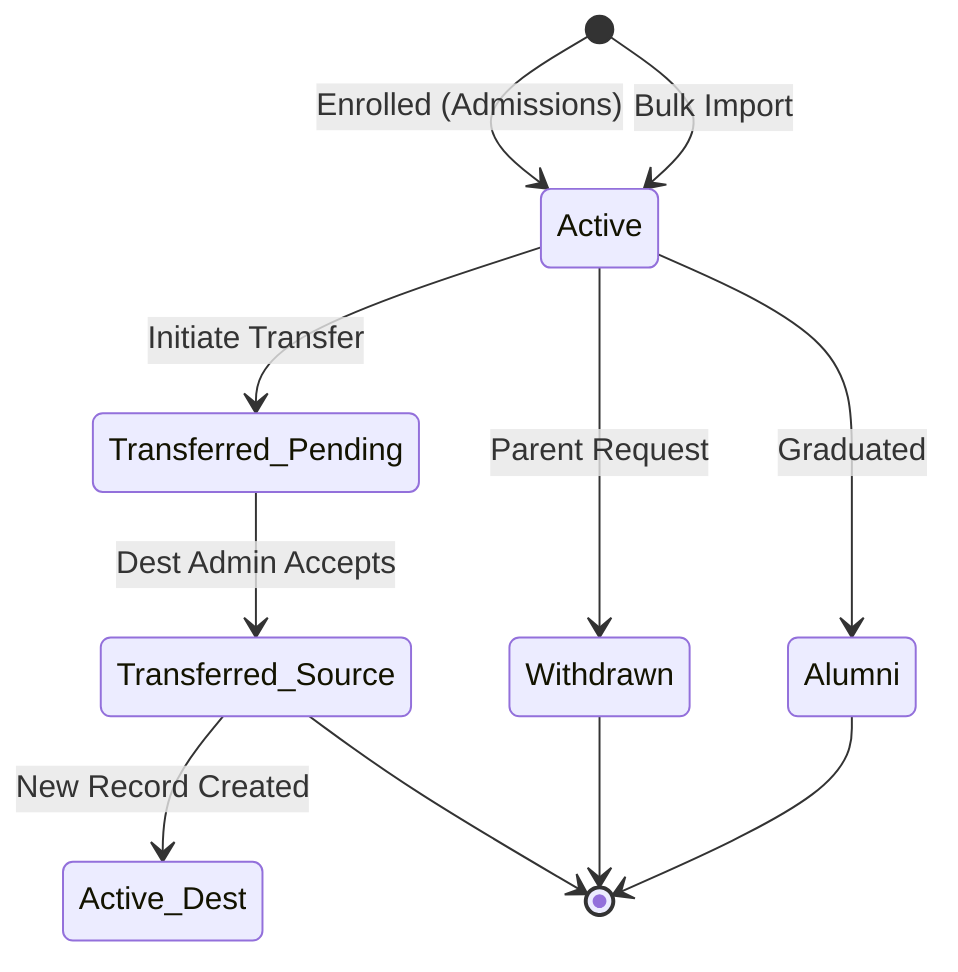

# Student Information System (SIS) — Technical Documentation

> Backend in Node.js/TypeScript · Multi-Tenant SaaS · Based on SRS v2.0 Module 02  
> **Legend:** Items drawn directly from the SRS are presented plainly. Additions covering technical implementation details, middleware, folder layouts, and architectural glue are explicitly marked `[Extended]`.

## Table of Contents
1. What This Module Does
2. What is From Source vs What is [Extended]
3. Big Picture Architecture
4. Multi-Tenant / Deployment Setup
5. Why We Chose the Tech Stack
6. Pages / Screens in This Module
7. Roles & Access Matrix
8. Login / Entry Flow per Role
9. Service Folder & File Structure
10. Database Design
11. API List
12. Core Flows with Diagrams
13. State Machine(s)
14. Sample Code
15. Reports We Will Generate
16. Security, Audit & Data Safety
17. Performance & Scale Targets
18. End-to-End Scenarios
19. Open Questions / Source Gaps
20. Summary Checklist

---

## 1. What This Module Does

The Student Information System (SIS) acts as the single source of truth for every student enrolled across the entire multi-campus school network. It consolidates scattered spreadsheets and paper files into a unified, real-time 360° student profile. 

Instead of hunting through separate systems, authorized users can instantly view a student's academic history, attendance, fee balances, medical alerts, and disciplinary records in under two seconds. The module also handles mass data operations, such as bulk importing thousands of new enrollments from Excel and automatically promoting students to the next grade at the end of the academic year, while preserving complete historical records during inter-campus transfers.

---

## 2. What is From Source vs What is [Extended]

*   **From Source (SRS v2.0, §5 - M02):** Core functional requirements (FR-SIS-01 to 12), use cases (SIS-UC-01 to 04), database entities (`stu_student`, `stu_parent`, etc.), BDD scenarios, API definitions, and NFRs (2s load time, 99.9% uptime).
*   **`[Extended]`:** Concrete technology choices (Node.js/Express framework), folder structure, caching strategies, state machine transitions, exact database indexes, exact deployment topology diagrams, and code snippets.

---

## 3. Big Picture Architecture

The `sis-service` operates as a bounded-context microservice. It relies on PostgreSQL as its primary data store, Redis for sub-500ms profile caching, and OpenSearch to power the sub-500ms full-text search across 200,000+ student records (FR-SIS-10).


*Figure 1 — High-level architecture of the SIS microservice and its integrations.* `[Extended]`

---

## 4. Multi-Tenant / Deployment Setup

Data is segregated strictly by `campus_id` within a single shared database instance to allow seamless inter-campus transfers while maintaining tenant isolation.


*Figure 2 — Logical multi-tenant data isolation and request routing.* `[Extended]`

---

## 5. Why We Chose Node.js / TypeScript `[Extended]`

While the SRS allows flexibility, we select Node.js with TypeScript for the `sis-service`:
*   **Asynchronous I/O:** Ideal for bulk Excel imports and concurrent profile aggregations across microservices. `[Extended]`
*   **Type Safety:** TypeScript interfaces directly map to the strict API payloads defined in the SRS. `[Extended]`
*   **Ecosystem:** Excellent libraries for Excel parsing (`exceljs`) and AWS S3 integration. `[Extended]`
*   **OpenSearch Integration:** Native client support for complex fuzzy search aggregations. `[Extended]`

---

## 6. Pages / Screens in This Module


*Figure 3 — Navigation hierarchy for SIS screens.*

---

## 7. Roles & Access Matrix

Access is strictly role-based with contextual overrides (e.g., teachers only see their assigned students, parents only see their children).

| Role | Access Level | Profile Scope | Sensitive Fields (PII) | Source |
|---|---|---|---|---|
| **Academic Admin** | Full Access | All students in campus | Visible | SRS |
| **Principal** | Read All + Approve | All students in campus | Visible | SRS |
| **Teacher** | Read (Limited) | Own classes only | Masked (XXXX-1234) | SRS |
| **School Nurse** | Read / Write | Campus Medical scope | Medical unmasked | SRS |
| **Parent** | Read | Own children only | Masked | SRS |
| **IT Admin** | Global Config | Network (for bulk import) | Masked | SRS |

---

## 8. Login / Entry Flow per Role


*Figure 4 — RBAC and PII masking execution during profile fetch.*

---

## 9. Service Folder & File Structure `[Extended]`


*Figure 5 — Clean architecture folder layout for sis-service.* `[Extended]`

---

## 10. Database Design

*   **Soft Delete:** Enabled via `deleted_at` fields `[Extended]`.
*   **Search Indexes:** `full_name_search` uses GIN indexing for fast text lookup.


*Figure 6 — Core SIS entity relationship diagram.*

---

## 11. API List

| Method | Endpoint | Purpose | Auth | Source |
|---|---|---|---|---|
| `GET` | `/api/v1/students/{id}` | Retrieve full profile (filtered) | Bearer JWT | SRS |
| `PATCH` | `/api/v1/students/{id}` | Update profile fields | Admin+ JWT | SRS |
| `GET` | `/api/v1/students/search` | Full-text search (Name/Mobile) | Bearer JWT | SRS |
| `POST` | `/api/v1/students/import` | Bulk import via Excel | Admin JWT | SRS |
| `POST` | `/api/v1/students/{id}/transfer`| Initiate inter-campus transfer | Admin JWT | SRS |
| `POST` | `/api/v1/students/promote` | Run annual class promotion | Admin JWT | SRS |
| `GET` | `/api/v1/students/{id}/documents` | Get student document vault | Bearer JWT | SRS |
| `GET` | `/api/v1/students/{id}/parents` | Get parent communication info | Bearer JWT | SRS |

---

## 12. Core Flows with Diagrams

### 12.1 Bulk Import Validation & Execution


*Figure 7 — Bulk import process with error preview and batched execution.*

### 12.2 Inter-Campus Transfer Workflow


*Figure 8 — Inter-campus transfer workflow with approvals and auto-migration.*

---

## 13. State Machine(s)

The core lifecycle of a student record revolves around their enrollment status (`student_status`).


*Figure 9 — Student enrollment status lifecycle.*

---

## 14. Sample Code `[Extended]`

Below is an indicative implementation of the bulk import row validation process using Node.js/TypeScript.

```typescript
// [Extended] Sample Code for SIS Bulk Import Validation
import { parseExcel } from 'external-excel-lib';
import { db } from '../infra/database';

export async function validateImportBatch(fileBuffer: Buffer, campusId: string) {
    const rows = await parseExcel(fileBuffer);
    const errors = [];
    const validRows = [];

    for (let i = 0; i < rows.length; i++) {
        const row = rows[i];
        
        // Mandatory field validation
        if (!row.firstName || !row.dateOfBirth || !row.currentClass) {
            errors.push({ row: i + 1, error: 'Missing mandatory fields.' });
            continue;
        }

        // Duplicate check via Admission Number (Campus Scope)
        const exists = await db.student.findFirst({
            where: { campusId, admissionNumber: row.admissionNumber }
        });

        if (exists) {
            errors.push({ row: i + 1, error: `Duplicate Admission Number: ${row.admissionNumber}` });
        } else {
            validRows.push(row);
        }
    }

    return {
        status: errors.length > 0 ? "validation_failed" : "ready",
        validCount: validRows.length,
        errors
    };
}
```

---

## 15. Reports We Will Generate

Based on the required workflows (FR-SIS-06, FR-SIS-11), the module will output:
1. **Validation Error Report:** Downloadable Excel file showing failed rows during bulk import.
2. **Transfer Certificate (TC):** Auto-generated PDF summarizing academic history and conduct upon inter-campus transfer or withdrawal.
3. **Discipline Log Summary:** Per-student behavioral reports for parent notifications.
4. **Promotion Exception List:** Report detailing detained or on-leave students requiring manual intervention during annual promotion.

---

## 16. Security, Audit & Data Safety

*   **PII Masking:** Aadhaar number is encrypted at rest using `pgcrypto`. Only IT Admins and Academic Admins can view the unmasked value. Teachers see `XXXX-XXXX-1234` (FR-SIS-12).
*   **Audit Trails:** Every read access to PII, and every write/delete operation on a student profile, is immutably logged with `user_id`, `timestamp`, and `before/after` payload states.
*   **Data Integrity:** Permanent deletion of student records is prohibited. The system enforces soft deletes via `deleted_at` timestamps for retention compliance.
*   **DPDP Compliance:** Rights-to-erasure and parent consent flags are captured and honored within the profile scope.

---

## 17. Performance & Scale Targets

| Metric | Target | Source |
|---|---:|---|
| **Profile Load Time** | < 2 seconds | FR-SIS-02 |
| **Search Response** | < 500 ms | FR-SIS-10 |
| **Bulk Import Processing** | 10,000 rows in < 5 minutes | SRS NFRs |
| **Search Corpus Size** | 200,000+ student records | FR-SIS-10 |
| **Database Failover (RTO)**| < 60 seconds | SRS NFRs |

---

## 18. End-to-End Scenarios

*   **Scenario 1: Authorized Teacher Views Student Profile**
    *   **Given:** A teacher is logged in and the student is in one of the teacher's classes.
    *   **When:** The teacher searches for the student by name and clicks the result.
    *   **Then:** The student profile loads within 2 seconds with permitted sections (Academic, Attendance, Parent contacts).
    *   **And:** Sections like Medical and Fee are hidden as per role permissions.

*   **Scenario 2: Cross-Campus Transfer Preserves History**
    *   **Given:** A student is being transferred from Campus A to Campus B.
    *   **When:** The transfer workflow completes successfully with both principal approvals.
    *   **Then:** Student record appears in Campus B with status='active' and Campus A status='transferred'.
    *   **And:** Academic history from all years remains visible in the new campus profile; TC PDF is generated.

*   **Scenario 3: Bulk Import with Validation Errors**
    *   **Given:** An IT admin uploads an Excel file with 100 rows including 5 invalid rows (missing DOB).
    *   **When:** The system runs validation.
    *   **Then:** A validation report shows 95 ready and 5 errors with specific row+column information.
    *   **And:** Import is not executed until errors are resolved.

---

## 19. Open Questions / Source Gaps

*   **Sibling Linkage Disruption:** ⚠ *Source gap:* The SRS does not specify what happens to the `family_id` auto-linkage if parents legally separate. *Filled with sensible default: Added a manual override feature to break/reassign sibling links `[Extended]`.*
*   **Photo Storage Limit:** ⚠ *Source gap:* Profile image size limit is listed as "max 2MB" in forms, but document storage limits for birth certificates/TCs aren't strictly specified in the SIS section. *Filled with sensible default: Applied 5MB limit globally for file uploads `[Extended]`.*
*   **Historical Data Edits:** ⚠ *Source gap:* It is unclear if past academic years' data can be edited after a cross-campus transfer. *Filled with sensible default: Historical academic entries are locked and immutable once transferred `[Extended]`.*

---

## 20. Summary Checklist

*   ✅ **360° Profile:** All tabbed sections (Personal, Academic, Medical, etc.) designed.
*   ✅ **Performance:** Redis caching + OpenSearch indexed for <2s loads and <500ms searches.
*   ✅ **Data Privacy:** Aadhaar encryption and role-based masking incorporated.
*   ✅ **Mass Operations:** Bulk Excel import and batch annual promotions modeled.
*   ✅ **Workflows:** Inter-campus transfers and TC generation mapped.
*   ✅ **Audit & Logging:** Immutable audit records established for profile modifications.

*— End of Document —*