# Academic Management — Technical Documentation
> Backend in Go · Multi-Tenant SaaS · React JS Frontend · Based on SRS v2.0 Module M04 [FEAT-ACA-004]
>
> **Legend:** All content that appears verbatim or is directly inferable from the source SRS is presented as plain text. Any addition, design decision, or detail not present in the SRS is tagged with `[Extended]` at the smallest possible unit (heading, table row, bullet, field, endpoint). A Business Analyst can strip every `[Extended]` line and the remainder is a faithful read of the original source.

---

## Table of Contents

1. What This Module Does (in simple words)
2. What is From Source vs What is [Extended]
3. Big Picture Architecture
4. Multi-Tenant / Deployment Setup
5. Why We Chose Go + React
6. Pages / Screens in This Module
7. Roles & Access Matrix (who can do what)
8. Login / Entry Flow per Role
9. Service Folder & File Structure
10. Database Design (tables, columns, indexes, RLS)
11. API List (request / response per endpoint)
12. Core Flows with Diagrams
13. State Machine(s)
14. Sample Code (key handlers, middleware, jobs)
15. Reports We Will Generate
16. Security, Audit & Data Safety
17. Performance & Scale Targets
18. End-to-End Scenarios (BDD-style walk-throughs)
19. Open Questions / Source Gaps
20. Summary Checklist (Go-Live Gate)

---

## 1. What This Module Does (in simple words)

The Academic Management module is the operational backbone of what happens inside classrooms every day. It lets a school define what is taught (curriculum, syllabus, subjects), when it is taught (timetables, period schedules), how it is assessed (assignments, gradebook, report cards), and how teachers plan their lessons. Without this module, teachers manually write timetables on notice boards, hand out homework on paper, and calculate grades in spreadsheets — which is error-prone, invisible to parents, and impossible to analyse across campuses.

**Actors:** Principals configure the academic structure. Vice-Principals and Coordinators build timetables, handle substitutions, and oversee syllabus coverage. Teachers create assignments, grade submissions, and write lesson plans. Parents and students view timetables, assignments, and marks. HO Academic Heads approve curriculum changes and compare syllabus coverage across campuses. The CEO reads consolidated dashboards.

**Triggers:** Academic year activation by HO. Principal creating a new section. Coordinator publishing a timetable. Teacher posting an assignment. Student submitting work. Teacher entering a mark. End-of-term report card generation.

**Outcomes:** A published timetable with zero conflicts visible to all stakeholders. Assignments tracked from creation to grading. A gradebook that auto-computes term totals. Report cards generated from a single data source. Syllabus coverage visibility per section. Substitution audit trail. All of this feeds the analytics and AI engines for academic risk prediction.

**Success Metrics (numeric targets):** [Extended]
- Timetable generation conflict resolution time less than 30 minutes per campus
- Assignment creation-to-submission tracking coverage 100%
- Gradebook entry completion rate within 5 business days of assessment greater than 95%
- Substitution fill rate within 2 hours of absence report greater than 90%
- Parent visibility into child academic progress within 24 hours of grade entry

**Non-goals:** This module does not deliver video lectures, host online exams (that is the Examination module), manage fee receipts, handle transport routes, or run the AI prediction models directly. It publishes data events that the AI module consumes.

---

## 2. What is From Source vs What is [Extended]

| Aspect | From Source | [Extended] |
|--------|-------------|------------|
| Module existence and priority | FEAT-ACA-004, Must Have (SRS §5) | — |
| Core scope | Curriculum, Timetable, Assignments, Gradebook (SRS §4.3) | — |
| Database | PostgreSQL (SRS §4.3) | — |
| Consumers | sis, mobile, analytics (SRS §4.3) | — |
| RBAC levels | CEO=R, HO Head=R/A, Principal=F, Teacher=RA, Parent=O, Student=O (SRS §3.2) | — |
| VP/Coordinator usage | Timetables, substitutions (SRS §2.5) | — |
| Teacher usage | Grading, assignments (SRS §2.5) | — |
| Strategic goal | Reduce teacher admin workload 60%+ (SRS §2.2) | — |
| Academic year/term configuration | — | Full entity and lifecycle design |
| Grade and section CRUD | — | Full entity and API design |
| Subject and subject-group management | — | Full entity and API design |
| Period template and slot design | — | Full entity and API design |
| Timetable conflict detection algorithm | — | Full algorithm and API |
| Timetable auto-generation | — | Constraint-solver approach |
| Substitution workflow | Mentioned in persona (SRS §2.5) | Full workflow, state machine, API |
| Assignment lifecycle with submissions | — | Full lifecycle, file upload, grading |
| Gradebook with weighted categories | — | Full category, entry, computation design |
| Lesson planning | — | Full entity and API |
| Syllabus and topic coverage tracking | — | Full entity and progress API |
| Academic calendar | — | Full entity and API |
| Report card generation | — | Template-based generation design |
| Class teacher assignment | — | Entity and API |
| All code samples | — | Go snippets |
| All performance targets | — | Numeric targets |
| All database indexes | — | Index design per query |

---

## 3. Big Picture Architecture

This section walks through every component that a request touches when a user interacts with the Academic Management module, what each component owns, depends on, publishes, consumes, and what happens when it fails.

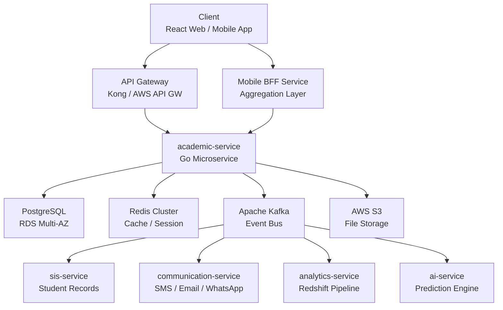

*Figure 1 — High-level architecture for Academic Management module.*

**Step-by-step request flow for "Teacher creates an assignment":**

1. **Client (React web):** Teacher clicks "Create Assignment" on the section dashboard. React renders a form with subject dropdown (fetched earlier), due date picker, file upload zone, and marks field. Client validates required fields locally before sending.

2. **API Gateway (Kong):** Receives the POST request at `/api/v1/academic/assignments`. Extracts the JWT from the Authorization header. Validates token signature against the JWKS endpoint. Enforces rate limit (60 requests/min per user). Checks that the token has not been revoked (queries Redis). Forwards the request with `X-Tenant-ID`, `X-User-ID`, `X-User-Roles` headers injected.

3. **academic-service (Go):** Receives the request. The tenant middleware reads `X-Tenant-ID` and sets `tenant_id` in the Gin context. The RBAC middleware checks that the user has role `teacher` and that the `section_id` in the payload belongs to a subject assigned to this teacher (queries DB). If unauthorized, returns 403. The handler parses the multipart form, validates fields (subject exists, due date is in the future, marks is non-negative). Uploads any attached file to S3 under path `tenant_id/assignments/{assignment_id}/{filename}`. Inserts a row into `aca_assignments`. Publishes a Kafka event `academic.assignment.created`. Returns 201 with the assignment object.

4. **PostgreSQL (RDS):** Stores the assignment row in the `aca_assignments` table. The `tenant_id` column is part of every index to enforce isolation. Row-Level Security (RLS) policies ensure no cross-tenant reads. The INSERT triggers a `created_at` default.

5. **Redis:** The tenant middleware caches the tenant configuration (academic year status, feature flags) with a 5-minute TTL to avoid repeated DB hits. The RBAC middleware caches the teacher-subject-section mapping for 10 minutes.

6. **Kafka:** The event `academic.assignment.created` is published to the topic `academic.events`. Three consumers react:
   - **communication-service:** Sends a push notification to the parent app and an in-app notification to each student in the section. Sends WhatsApp message if opted in.
   - **analytics-service:** Increments the "assignments created this week" counter for the campus in Redshift.
   - **ai-service:** Logs the assignment creation timestamp for teacher workload analysis model.

7. **S3:** Stores the teacher-attached reference material (PDF, DOCX) with server-side encryption (AES-256). The URL is stored in `aca_assignments.attachment_url`.

**Failure modes:**

| Component | Failure | Impact | Mitigation |
|-----------|---------|--------|------------|
| API Gateway | Down | No requests reach any service | Multi-AZ deployment, health checks, auto-failover |
| PostgreSQL | Primary down | No reads/writes for academic data | Multi-AZ automatic failover, RPO 0, RTO 30s |
| Redis | Down | Slower responses, no cache | Fallback to direct DB queries, no data loss |
| Kafka | Down | No events published, no notifications | Local outbox table with retry job every 60s |
| S3 | Down | File uploads fail | Return 503 with retry-after header, queue for later |
| SIS service | Down | Cannot validate student list for section | Use cached student list from Redis, mark as stale |

**External services touched:** AWS S3 (file storage), Apache Kafka (event bus), Redis (caching), PostgreSQL (primary data store). No direct calls to payment gateways, SMS providers, or external APIs from this service.

---

## 4. Multi-Tenant / Deployment Setup

This section covers how the system ensures that Campus A never sees Campus B's data, how a request arriving at the API Gateway knows which tenant it belongs to, and how tenant context flows through every layer.

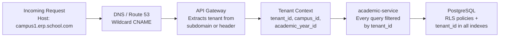

*Figure 2 — Tenant resolution and isolation flow.*

**URL-to-tenant resolution:** [Extended]

Each campus gets a unique subdomain: `campus1.erp.school.com`, `campus2.erp.school.com`. The API Gateway extracts the subdomain, maps it to a `tenant_id` via a cached lookup table (loaded from `platform_tenants` table in a shared DB), and injects `X-Tenant-ID` as an HTTP header. For mobile apps, the tenant ID is stored in local storage after login and sent as a header on every request. For API-only integrations, the tenant ID is embedded in the JWT claims at token issuance time.

**JWT shape:** [Extended]

```json
{
  "sub": "user-uuid-here",
  "tenant_id": "tenant-uuid-here",
  "campus_ids": ["campus-uuid-1", "campus-uuid-2"],
  "roles": ["teacher"],
  "academic_year_id": "ay-uuid-2026",
  "iat": 1714000000,
  "exp": 1714086400,
  "iss": "erp-auth-service",
  "aud": "academic-service"
}
```

The `tenant_id` claim is mandatory. The `campus_ids` array limits the user to specific campuses within the tenant. The `academic_year_id` is set during login based on the currently active academic year for the tenant.

**Context propagation:** [Extended]

Every internal service call (HTTP or gRPC) carries the tenant context via headers: `X-Tenant-ID`, `X-Campus-ID`, `X-User-ID`, `X-Request-ID`. The Go middleware in every service extracts these and stores them in `context.Context`. No service ever trusts a client-supplied tenant ID without verifying it against the JWT.

**DB-level isolation:** [Extended]

Two layers of defense:

1. **Application level:** Every SQL query includes `WHERE tenant_id = $1` as the first condition. The repository layer in Go enforces this — no raw query function is exposed without a tenant parameter.

2. **RLS (Row-Level Security):** PostgreSQL RLS policies are enabled on every table. Example for `aca_assignments`:

```sql
ALTER TABLE aca_assignments ENABLE ROW LEVEL SECURITY;

CREATE POLICY tenant_isolation ON aca_assignments
  USING (tenant_id = current_setting('app.tenant_id')::uuid);
```

The `app.tenant_id` session variable is set at connection pool checkout time via a PgBouncer query hook. Even if application code has a bug and forgets the WHERE clause, RLS prevents cross-tenant reads.

**Per-tenant configurable settings vs platform-fixed settings:** [Extended]

| Setting | Scope | Stored In | Example |
|---------|-------|-----------|---------|
| Academic year start/end date | Tenant | `aca_academic_years` | 2026-04-01 to 2027-03-31 |
| Number of periods per day | Campus | `aca_campus_config` | 8 periods |
| Period duration in minutes | Campus | `aca_campus_config` | 40 minutes |
| Break slots | Campus | `aca_period_templates` | 10:20-10:35 recess |
| Grading scale (percentage or GPA) | Tenant | `aca_tenant_config` | Percentage |
| Assignment file max size MB | Tenant | `aca_tenant_config` | 10 |
| Max assignments per subject per term | Campus | `aca_campus_config` | 15 |
| Report card template ID | Campus | `aca_campus_config` | template-uuid-01 |
| JWT session timeout minutes | Platform | Environment variable | 480 |
| Max file upload size MB | Platform | Environment variable | 25 |

**Device/agent to tenant binding:** [Extended]

Mobile apps receive the tenant ID during the login flow (the auth service resolves the user to a tenant and embeds it in the JWT). The app stores this locally and sends it on every API call. If a user belongs to multiple campuses, the app shows a campus switcher, and switching updates the `X-Campus-ID` header.

**Cross-tenant attack prevention:** [Extended]

- API Gateway rejects requests with missing or invalid `X-Tenant-ID` header (400).
- JWT `tenant_id` must match the header `X-Tenant-ID`; mismatch returns 403.
- No endpoint accepts a `tenant_id` in the request body — it is always derived from the token.
- RLS policies are the final safety net even if application code is compromised.
- Integration webhooks include an HMAC signature that is validated against a per-tenant secret stored in AWS Secrets Manager.

---

## 5. Why We Chose Go + React [Extended]

> ⚠ Source gap: The SRS (§4.2) mentions Node.js/TypeScript as the primary microservice language. The project owner has confirmed Go as the backend language. This entire section is [Extended].

| Factor | Go (Backend) | Rationale |
|--------|-------------|-----------|
| Concurrency model | Goroutines + channels | High concurrent request handling (50,000 sessions at peak) with low memory footprint |
| Binary deployment | Single static binary | No runtime dependency, trivial Docker images, fast CI/CD builds |
| Performance | Compiled, sub-millisecond p50 | Meets NFR latency targets without complex JVM tuning |
| Team availability | Growing Go ecosystem in India | Easier hiring than Rust; more performant than Node.js for CPU-bound timetable solver |
| Standard library | `net/http`, `database/sql`, `encoding/json` | Minimal third-party dependency for core HTTP + DB operations |
| Microservice fit | Small binary size, fast startup | Ideal for Kubernetes pods, quick horizontal scaling |

| Factor | React JS (Frontend) | Rationale |
|--------|---------------------|-----------|
| Component model | Declarative UI with hooks | Complex timetable grid, drag-and-drop assignment builder, gradebook matrix |
| Ecosystem | MUI/Ant Design, React Query, Zustand | Rich data-grid libraries for timetable and gradebook views |
| Mobile parity | React Native for mobile apps | Share types and API client between web and mobile |
| Team familiarity | Most common frontend skill in India | Largest hiring pool |

**Framework choices within Go:** [Extended]
- HTTP framework: `gin-gonic/gin` for routing and middleware
- ORM: `gorm.io/gorm` for migrations and simple queries; `sqlc` for complex read queries
- Validation: `go-playground/validator` for request DTO validation
- Kafka client: `confluent-kafka-go` for event production and consumption
- Logging: `slog` (Go 1.21+ structured logger) with JSON output
- Configuration: `viper` for YAML/env-based config loading
- Migrations: `golang-migrate/migrate` for versioned SQL migrations

---

## 6. Pages / Screens in This Module

Every screen in the Academic Management module, who can reach it, what it shows, its interactive controls, and the API calls it makes.

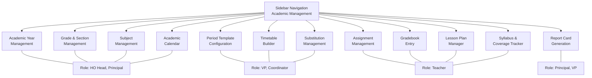

*Figure 3 — Pages and roles map for Academic Management.*

### 6.1 Academic Year Management [Extended]

**Who can reach it:** HO Academic Head (R/A), Principal (F). Accessed from sidebar "Academic > Academic Years".

**What they see:** A table listing all academic years for the tenant with columns: Year Label, Start Date, End Date, Status (Draft/Active/Archived), Number of Terms, Actions (Edit/Activate/Archive). Above the table: a "Create Academic Year" button.

**Interactive controls:**
- "Create Academic Year" button opens a modal with fields: Year Label (e.g. "2026-27"), Start Date, End Date, Number of Terms (1-4). Each term row expands to show Term Name, Start Date, End Date.
- "Activate" button on a Draft year. Confirmation dialog: "Activating this year will archive the current active year. Continue?"
- "Archive" button on an Active year. Only allowed if no timetable entries exist for the year.

**Empty state:** "No academic years configured. Click 'Create Academic Year' to get started."

**Loading state:** Skeleton table with 5 shimmer rows.

**Error state:** Red banner: "Failed to load academic years. Retry" button.

**API calls:**
- Page load: `GET /api/v1/academic/years`
- Create: `POST /api/v1/academic/years`
- Activate: `PATCH /api/v1/academic/years/:id/status`
- Edit: `PUT /api/v1/academic/years/:id`

### 6.2 Grade & Section Management [Extended]

**Who can reach it:** HO Academic Head (R/A), Principal (F). Accessed from sidebar "Academic > Grades & Sections".

**What they see:** Two-panel layout. Left panel: list of grades (Grade 1, Grade 2, ... Grade 12) with section count badges. Right panel: sections for the selected grade in a card grid. Each section card shows: Section Name, Class Teacher (if assigned), Student Count, Capacity.

**Interactive controls:**
- "Add Grade" button (HO Head only): opens modal with Grade Name, Display Order.
- "Add Section" button: opens modal with Section Name (A, B, C...), Capacity (default 40).
- "Assign Class Teacher" link on section card: opens a searchable dropdown of teachers assigned to any subject in this grade.
- "Delete Section" button: only enabled if student count is 0. Confirmation required.

**Empty state (no grades):** "No grades configured. Add your first grade to begin."

**API calls:**
- Page load: `GET /api/v1/academic/grades?include_sections=true`
- Add grade: `POST /api/v1/academic/grades`
- Add section: `POST /api/v1/academic/grades/:id/sections`
- Assign class teacher: `PUT /api/v1/academic/sections/:id/class-teacher`

### 6.3 Subject Management [Extended]

**Who can reach it:** HO Academic Head (R/A), Principal (F). Sidebar "Academic > Subjects".

**What they see:** A table with columns: Subject Code, Subject Name, Subject Group (Languages/Sciences/Mathematics/Humanities/Co-curricular), Type (Core/Elective), Grades Applicable (comma-separated), Teachers Assigned (count badge), Actions.

**Interactive controls:**
- "Add Subject" button: modal with Subject Code (auto-generated optional), Name, Group, Type, applicable grades (multi-select checkboxes for Grade 1-12).
- "Assign Teachers" button per row: opens a multi-select panel showing teachers filtered by the grades this subject applies to. Each assignment row has: Teacher Name, Sections (multi-select), Weekly Periods count.
- Inline edit for subject name and group via pencil icon.

**API calls:**
- Page load: `GET /api/v1/academic/subjects`
- Add subject: `POST /api/v1/academic/subjects`
- Assign teachers: `POST /api/v1/academic/subjects/:id/teachers`

### 6.4 Period Template Configuration [Extended]

**Who can reach it:** VP, Coordinator, Principal. Sidebar "Academic > Period Templates".

**What they see:** A timeline-style visual showing the daily schedule. Each row is a period slot with: Slot Number, Start Time, End Time, Label (Period 1, Period 2, Recess, Lunch), Duration (auto-calculated). A "Set as Default" toggle.

**Interactive controls:**
- Drag to reorder periods (updates display order).
- "Add Slot" button: modal with Label, Start Time, End Time, Type (Academic/Break/Lunch/Assembly).
- "Edit" inline on each slot.
- "Delete" on custom slots; built-in slots (Recess, Lunch) are not deletable.
- "Save Template" button: validates no overlapping times, then saves.

**Validation rules shown inline:**
- Red highlight if two slots overlap in time.
- Warning if total academic time is less than 240 minutes or more than 420 minutes.
- Error if no break slot exists for schedules longer than 3 hours.

**API calls:**
- Page load: `GET /api/v1/academic/periods`
- Save: `PUT /api/v1/academic/periods/bulk`
- Add slot: `POST /api/v1/academic/periods`

### 6.5 Timetable Builder [Extended]

**Who can reach it:** VP, Coordinator, Principal. Sidebar "Academic > Timetable".

**What they see:** A grid with rows = Days (Monday to Saturday) and columns = Period Slots (from period template). Each cell shows the subject name, teacher name, and room (if configured). A toolbar above the grid has: Section dropdown (to switch section view), Teacher View toggle, "Auto-Generate" button, "Check Conflicts" button, "Publish" button, "Export PDF" button.

**Interactive controls:**
- Click a cell to open a slot editor: select Subject (filtered to subjects assigned to this section), Teacher (auto-suggested based on subject assignment, filtered for availability), Room (optional dropdown).
- Drag-and-drop: drag a filled cell to another empty cell to swap/move.
- "Auto-Generate" button: triggers the server-side timetable solver. Shows a progress indicator. On completion, the grid is replaced with the generated timetable and a "Review & Publish" banner appears.
- "Check Conflicts" button: highlights conflicting cells in red. A panel below lists each conflict: "Teacher X is assigned to two classes at Period 3 on Monday."
- "Publish" button: confirmation dialog "Publishing will make this timetable visible to teachers, parents, and students. Unpublished changes will be lost." On confirm, status changes to Published.
- Teacher View: grid transpose — rows = Teachers, columns = Days+Periods.

**Empty state:** "No period template configured. Set up period templates first."

**Loading state (auto-generate):** Full-screen overlay with progress bar and estimated time.

**Error state (conflicts):** Red cells in grid + conflict list panel below.

**Keyboard shortcuts:** `Ctrl+S` to save draft, `Ctrl+G` to auto-generate, `Escape` to close cell editor.

**API calls:**
- Page load: `GET /api/v1/academic/timetable/section/:section_id`
- Save cell: `PUT /api/v1/academic/timetable/entries/:id`
- Auto-generate: `POST /api/v1/academic/timetable/generate`
- Check conflicts: `POST /api/v1/academic/timetable/conflicts/check`
- Publish: `POST /api/v1/academic/timetable/publish`
- Teacher view: `GET /api/v1/academic/timetable/teacher/:teacher_id`

### 6.6 Substitution Management [Extended]

**Who can reach it:** VP, Coordinator. Sidebar "Academic > Substitutions".

**What they see:** A list view of today's substitutions grouped by period. Each card shows: Period, Original Teacher (absent), Section, Subject, Substitute Teacher (assigned or "Unassigned" in amber), Status (Pending/Confirmed/Completed). Filters: Date picker, Section dropdown, Teacher dropdown.

**Interactive controls:**
- "Create Substitution" button: modal with Date, Period, Absent Teacher (dropdown), Section (auto-filled based on teacher timetable), Subject (auto-filled), Substitute Teacher (dropdown filtered to available teachers for that slot — excludes those already assigned).
- "Confirm" button on Pending substitutions: sends notification to substitute teacher.
- "Mark Completed" button after the period is over.
- "Bulk Create" button: select an absent teacher, auto-populate all their periods for the day, assign substitutes in a table view, submit all at once.

**Empty state:** "No substitutions for the selected date."

**API calls:**
- List: `GET /api/v1/academic/substitutions?date=2026-04-15`
- Create: `POST /api/v1/academic/substitutions`
- Bulk create: `POST /api/v1/academic/substitutions/bulk`
- Confirm: `PATCH /api/v1/academic/substitutions/:id/confirm`
- Complete: `PATCH /api/v1/academic/substitutions/:id/complete`

### 6.7 Assignment Management [Extended]

**Who can reach it:** Teacher (RA — own subjects only), Principal (F — read all), Parent (O — own child's), Student (O — own). Sidebar "Academic > Assignments".

**What they see (Teacher view):** A table with columns: Title, Subject, Section, Due Date, Submissions (received/total), Status (Draft/Published/Overdue/Closed), Actions (Edit/Publish/View Submissions/Grade).

**What they see (Parent/Student view):** A card list showing: Title, Subject, Due Date, Status (Pending/Submitted/Graded), Submitted At timestamp, Grade (if graded). Overdue items highlighted in amber.

**Interactive controls (Teacher):**
- "Create Assignment" button: opens a multi-step wizard — Step 1: Title, Subject (filtered), Section (multi-select), Due Date, Max Marks. Step 2: Instructions (rich text editor), Attach Files (multi-file upload, max 10 files, 10MB each). Step 3: Review and Save as Draft or Publish.
- "Publish" on draft: confirms and sends notifications.
- "View Submissions": opens a table per section with Student Name, Submitted At, File Links, Grade (editable input), Remarks (textarea). Bulk-grade option: select multiple students, enter grade, apply.
- "Close Assignment": prevents further submissions after due date (auto-closes by cron as well).

**Interactive controls (Student):**
- "Submit" button: opens file upload area (max 5 files, 10MB each) + text area for notes. "Submit" confirms.
- "View Grade" after grading: shows grade, remarks, and teacher-annotated file (if any).

**API calls (Teacher):**
- List: `GET /api/v1/academic/assignments?teacher_id=me`
- Create: `POST /api/v1/academic/assignments`
- Publish: `PATCH /api/v1/academic/assignments/:id/publish`
- Submissions: `GET /api/v1/academic/assignments/:id/submissions`
- Grade: `POST /api/v1/academic/assignments/:id/grades/bulk`

**API calls (Student):**
- My assignments: `GET /api/v1/academic/assignments?student_id=me`
- Submit: `POST /api/v1/academic/assignments/:id/submissions`

### 6.8 Gradebook Entry [Extended]

**Who can reach it:** Teacher (RA — own subjects only), Principal (F — read all), Parent (O — own child's). Sidebar "Academic > Gradebook".

**What they see (Teacher view):** A matrix grid. Rows = Students in the section. Columns = Assessment categories (e.g., "Class Test 1", "Homework Average", "Mid-Term", "Project"). Each cell is an editable number input. Rightmost column: Term Total (auto-computed, weighted). Bottom row: Class average per column. Header shows: Section, Subject, Term, Grading Scale.

**Interactive controls:**
- Click a cell to enter a mark. Tab key moves to next cell (right then down).
- "Save" button (also `Ctrl+S`): saves all changed cells in a single bulk API call.
- "Validate" button: highlights cells that exceed max marks in red.
- "Lock" button: locks the gradebook for the term (prevents further edits). Principal approval required.
- "Export" button: downloads as Excel.
- "Import" button: uploads an Excel file with marks. Shows validation errors before saving.

**What they see (Parent view):** A simplified table: Assessment Name, Max Marks, Obtained Marks, Percentage, Grade Letter (if configured). Term total at bottom.

**API calls:**
- Load gradebook: `GET /api/v1/academic/gradebook/section/:section_id?subject_id=x&term_id=y`
- Save marks: `PUT /api/v1/academic/gradebook/entries/bulk`
- Lock: `PATCH /api/v1/academic/gradebook/section/:section_id/lock`
- Student view: `GET /api/v1/academic/gradebook/student/:student_id`

### 6.9 Report Card Generation [Extended]

**Who can reach it:** Principal, VP, Coordinator. Sidebar "Academic > Report Cards".

**What they see:** A form with: Academic Year, Term, Section (multi-select), Template (dropdown of configured templates). A "Preview" button and a "Generate" button. Below: a table of previously generated report cards with: Section, Term, Generated At, Generated By, Status, Actions (Download PDF, Send to Parents).

**Interactive controls:**
- "Preview" button: generates a single sample PDF for the first student in the selected section. Opens in a new tab.
- "Generate" button: bulk generates PDFs for all students in selected sections. Shows progress bar. On completion, lists all generated PDFs with download links.
- "Send to Parents" button: triggers WhatsApp + email + in-app notification for each parent with the report card PDF attached.

**API calls:**
- Preview: `POST /api/v1/academic/report-cards/preview`
- Generate: `POST /api/v1/academic/report-cards/generate`
- Download: `GET /api/v1/academic/report-cards/:id/download`
- Send: `POST /api/v1/academic/report-cards/send`

### 6.10 Lesson Plan Manager [Extended]

**Who can reach it:** Teacher (RA — own), VP/Coordinator (R), Principal (R). Sidebar "Academic > Lesson Plans".

**What they see (Teacher):** A calendar view (weekly) showing lesson plans per day per period. Each entry shows: Topic, Status (Planned/Completed/Carried Forward). A list view alternative shows a table with: Date, Period, Subject, Section, Topic, Objectives, Status, Actions (Edit/Delete).

**Interactive controls:**
- "Create Lesson Plan" button: modal with Date, Period, Subject (auto), Section (auto from timetable), Topic (linked to syllabus unit dropdown), Objectives (textarea), Teaching Method (dropdown), Resources (file upload), Remarks (textarea for post-class notes).
- "Mark Completed" button: sets status to Completed, optionally links to next plan date if topic carried forward.
- "Bulk Plan" button: select a week, auto-creates draft plans for each period from the timetable with empty topics.

**API calls:**
- List: `GET /api/v1/academic/lesson-plans?teacher_id=me&week=2026-W16`
- Create: `POST /api/v1/academic/lesson-plans`
- Update: `PUT /api/v1/academic/lesson-plans/:id`
- Bulk create: `POST /api/v1/academic/lesson-plans/bulk`

### 6.11 Syllabus & Coverage Tracker [Extended]

**Who can reach it:** Teacher (RA), VP/Coordinator (R), HO Academic Head (R). Sidebar "Academic > Syllabus".

**What they see:** A tree view on the left: Subject > Unit > Topic. Each topic shows a progress bar (0-100% based on lesson plans marked Completed). Right panel: topic detail with: Description, Expected Hours, Actual Hours (from lesson plans), Start Date, Completion Date (if completed), Status (Not Started/In Progress/Completed).

**Interactive controls:**
- "Add Unit" and "Add Topic" buttons in the tree.
- Edit topic details inline.
- "Mark Completed" on a topic: validates that all sub-topics are completed first.
- HO view: a cross-campus comparison table showing per-topic coverage percentage across campuses for the same subject and grade.

**API calls:**
- Tree: `GET /api/v1/academic/syllabus?subject_id=x&grade_id=y`
- Update: `PUT /api/v1/academic/syllabus/topics/:id`
- Coverage: `GET /api/v1/academic/syllabus/coverage?section_id=x&subject_id=y`
- HO comparison: `GET /api/v1/academic/syllabus/coverage/compare?subject_id=x&grade_id=y`

### 6.12 Academic Calendar [Extended]

**Who can reach it:** HO Academic Head (R/A), Principal (F), Teacher (R), Parent (R), Student (R). Sidebar "Academic > Calendar".

**What they see:** A monthly calendar grid. Events are color-coded by type: Exam (red), Holiday (green), Parent-Teacher Meeting (blue), Sports Day (orange), Term Start/End (purple). A list view toggle shows events in chronological order. Filters: Event Type, Grade (optional).

**Interactive controls (Principal/HO):**
- "Add Event" button: modal with Title, Start Date, End Date, Type (dropdown), Description, Applicable Grades (multi-select), Attach File (optional).
- Edit/delete existing events.
- "Import Holidays" button: uploads a CSV of government holidays, bulk-creates calendar events.

**Interactive controls (Teacher/Parent/Student):** Read-only. Click an event to see details in a side panel.

**API calls:**
- Calendar: `GET /api/v1/academic/calendar?month=2026-04`
- Create: `POST /api/v1/academic/calendar/events`
- Update: `PUT /api/v1/academic/calendar/events/:id`
- Delete: `DELETE /api/v1/academic/calendar/events/:id`
- Import: `POST /api/v1/academic/calendar/events/import`

---

## 7. Roles & Access Matrix (who can do what)

This matrix defines every role crossed with every page in this module and the access scope. The source clause that authorises each access is cited where available.

**Legend:** F = Full CRUD | C = Create | R = Read | RA = Read Assigned (own scope) | A = Approve | — = No Access

### 7.1 Page-Level Access Matrix [Extended]

| Page | CEO | HO Head | Principal | VP / Coord | Teacher | Parent | Student |
|------|-----|---------|-----------|------------|---------|--------|---------|
| Academic Years | R | R/A | F | R | — | — | — |
| Grades & Sections | R | R/A | F | R | — | — | — |
| Subjects | R | R/A | F | R | — | — | — |
| Period Templates | — | R | F | F | — | — | — |
| Timetable Builder | — | R | F | F | RA | R | R |
| Substitutions | — | R | R | F | R | — | — |
| Assignments | — | R | R | R | RA | RA | RA |
| Gradebook | — | R | R | R | RA | RA | RA |
| Report Cards | — | R | F | F | — | RA | RA |
| Lesson Plans | — | R | R | R | RA | — | — |
| Syllabus | — | R | R | R | RA | — | — |
| Academic Calendar | R | R/A | F | R | R | R | R |

*Source: CEO=R, HO Head=R/A, Principal=F, Teacher=RA, Parent=O, Student=O from SRS §3.2. Specific page assignments are [Extended].*

### 7.2 Field-Level Access Matrix [Extended]

Some pages restrict which fields a role can see or edit within a page they can access.

| Page | Field | Teacher | Principal | HO Head |
|------|-------|---------|-----------|---------|
| Gradebook | Marks entry cells | Write | Read | Read |
| Gradebook | Lock/Unlock | — | Write | — |
| Gradebook | Class average row | Read | Read | Read |
| Timetable | Edit cell | Write (own) | Write (all) | Read |
| Timetable | Publish | — | Write | — |
| Assignments | Due date | Write | Read | Read |
| Assignments | Max marks | Write | Read | Read |
| Report Cards | Generate PDF | — | Write | — |
| Report Cards | Send to parents | — | Write | — |
| Subjects | Delete subject | — | Write | Write |

### 7.3 Enforcement Layers [Extended]

| Layer | Mechanism | Example |
|-------|-----------|---------|
| API Gateway | Route-level role check | `/academic/timetable/publish` requires role in `principal,vp,coordinator` |
| Service middleware | RBAC policy evaluated from JWT claims + DB policy table | Teacher accessing gradebook: middleware checks `subject_teacher_assignment` table |
| Repository | Every query includes `tenant_id` and scope filter | Teacher gradebook query: `WHERE tenant_id=$1 AND teacher_id=$2` |
| Database RLS | PostgreSQL row-level security as final safety net | `USING (tenant_id = current_setting('app.tenant_id')::uuid)` |
| Frontend | Conditional rendering based on role from JWT | "Publish" button not rendered if user role is `teacher` |

---

## 8. Login / Entry Flow per Role

> ⚠ Source gap: The SRS mentions Azure AD SSO for staff (§4.5) and JWT/OAuth2 for parents/students but does not detail the per-role login flow for Academic Management specifically. All flows below are [Extended].

### 8.1 Principal Login Flow

1. Principal opens `campus1.erp.school.com` in browser.
2. Browser redirects to Azure AD login page (SAML 2.0).
3. Principal enters corporate email and password.
4. Azure AD prompts for MFA (Microsoft Authenticator push notification).
5. MFA successful. Azure AD posts SAML assertion to the ERP callback URL.
6. Auth service validates the SAML assertion, extracts `email`, `object_id`.
7. Auth service queries the `platform_users` table by `azure_ad_object_id`, finds the user record with role `principal`, campus assignment.
8. Auth service determines the active academic year for the tenant from `aca_academic_years` where `status = 'active'`.
9. Auth service generates a JWT with claims: `sub`, `tenant_id`, `campus_ids`, `roles: ["principal"]`, `academic_year_id`.
10. Auth service sets an `httpOnly`, `Secure`, `SameSite=Strict` cookie with the JWT and redirects to `/dashboard`.
11. React app reads the cookie (or receives token via redirect), decodes the JWT client-side for role-based UI rendering.
12. Principal sees the dashboard with the "Academic Management" menu item expanded, showing all pages they have access to.
13. Session timeout: 480 minutes of inactivity. After timeout, the cookie is cleared and the user is redirected to Azure AD login again.
14. Account lock: After 5 consecutive failed MFA attempts, the Azure AD account is locked for 30 minutes (Azure AD policy, not ERP-managed).

### 8.2 Teacher Login Flow

1. Teacher opens the React web app or the Teacher mobile app.
2. If web: redirect to Azure AD login (same SAML flow as Principal).
3. If mobile app: teacher enters employee code + password. Mobile app calls `POST /api/v1/auth/login` with credentials.
4. Auth service validates credentials against `platform_users` table (bcrypt hash comparison).
5. Auth service sends an OTP to the teacher's registered mobile via SMS (MSG91).
6. Teacher enters OTP in the app. Auth service verifies OTP (stored in Redis with 5-minute TTL).
7. Auth service generates JWT with claims: `sub`, `tenant_id`, `campus_ids`, `roles: ["teacher"]`, `academic_year_id`.
8. Mobile app stores JWT in secure storage (Keychain on iOS, EncryptedSharedPreferences on Android).
9. Teacher sees the mobile app home screen with "My Timetable", "My Assignments", "Gradebook" quick actions.
10. Session timeout: 480 minutes. Refresh token (opaque, 7-day TTL) is used to obtain a new JWT without re-login.
11. Device binding: The first login from a device registers the device ID. Subsequent logins from unregistered devices require re-verification (OTP).

### 8.3 Parent Login Flow

1. Parent opens the Parent mobile app or web portal.
2. Enters registered mobile number.
3. System sends OTP via SMS.
4. Parent enters OTP. Auth service verifies.
5. Auth service looks up `platform_users` by mobile, finds role `parent`, fetches linked student IDs from `sis_student_parent` table.
6. JWT generated with claims: `sub`, `tenant_id`, `campus_ids`, `roles: ["parent"]`, `student_ids: ["s1", "s2"]`, `academic_year_id`.
7. Parent sees the app with their children listed. Tapping a child shows Timetable, Assignments, Grades for that child.
8. Session timeout: 1440 minutes (24 hours) for mobile app.
9. No MFA required for parent login (OTP is the second factor).
10. Account lock: After 10 consecutive wrong OTP attempts, the mobile number is locked for 1 hour. DPO notification sent.

### 8.4 Student Login Flow

1. Student (Grade 6-12) opens the web portal or mobile app.
2. Enters school-provided student code + password (initial password set during enrollment, must change on first login).
3. Auth service validates credentials.
4. Student must set a new password meeting complexity rules (min 8 chars, uppercase, lowercase, digit).
5. JWT generated with claims: `sub`, `tenant_id`, `campus_ids`, `roles: ["student"]`, `student_id: "s1"`, `academic_year_id`.
6. Student sees Timetable, Assignments, My Grades pages.
7. Session timeout: 480 minutes.
8. Password reset: Student clicks "Forgot Password", system sends OTP to parent's registered mobile (not the student's), parent approves the reset.

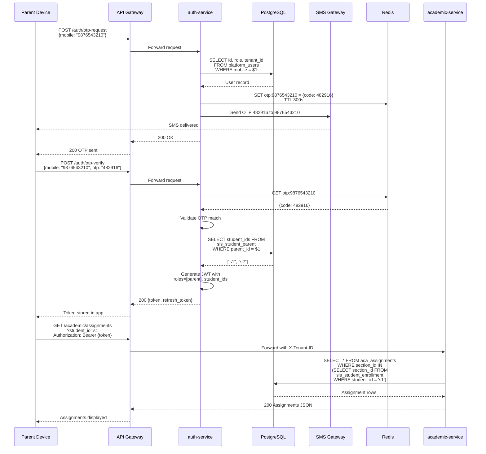

*Figure 4 — Generic parent login and assignment fetch flow.*

---

## 9. Service Folder & File Structure [Extended]

The following is the complete directory tree for the `academic-service` Go microservice. Every file has a one-line description of what lives there.

```mermaid
flowchart TB
    ROOT["academic-service/"]
    CMD["cmd/server/main.go<br/>Entry point, starts HTTP server"]
    INTERNAL["internal/"]
    API["api/<br/>HTTP layer"]
    HANDLERS["api/handlers/<br/>Request handlers per domain"]
    MW["api/middleware/<br/>Tenant, RBAC, Audit middleware"]
    ROUTES["api/routes/<br/>Route registration, route groups"]
    DTO["api/dto/<br/>Request/response structs, validators"]
    DOMAIN["domain/<br/>Business domain layer"]
    MODELS["domain/models/<br/>GORM model structs for all tables"]
    ENUMS["domain/enums/<br/>Status enums, constants"]
    EVENTS["domain/events/<br/>Kafka event schemas"]
    ERRORS["domain/errors/<br/>Domain error types, error codes"]
    REPO["repository/<br/>Data access layer"]
    SERVICE["service/<br/>Business logic layer"]
    AUTH["auth/<br/>Token parsing, role helpers"]
    TENANT["tenant/<br/>Tenant config loader"]
    CONFIG["config/<br/>Viper config struct"]
    MIG["migrations/<br/>SQL migration files"]
    CRON["cron/<br/>Scheduled jobs"]
    EVT["events/<br/>Kafka producer, consumer handlers"]
    PKG["pkg/<br/>Shared utilities"]
    PKGDB["pkg/db/<br/>PostgreSQL connection pool"]
    PKGLOG["pkg/logger/<br/>Structured slog logger"]
    PKGKAFKA["pkg/kafka/<br/>Kafka client wrapper"]
    PKGUTIL["pkg/utils/<br/>Pagination, date helpers"]
    DOCS["docs/<br/>OpenAPI spec, README"]
    DOCKER["Dockerfile<br/>Multi-stage build"]
    DC["docker-compose.yml<br/>Local dev stack"]
    GOMOD["go.mod / go.sum<br/>Module dependencies"]
    MAKE["Makefile<br/>Build, test, lint targets"]
    ENV[".env.example<br/>Environment variable template"]

    ROOT --> CMD
    ROOT --> INTERNAL
    ROOT --> MIG
    ROOT --> CRON
    ROOT --> EVT
    ROOT --> PKG
    ROOT --> DOCS
    ROOT --> DOCKER
    ROOT --> DC
    ROOT --> GOMOD
    ROOT --> MAKE
    ROOT --> ENV

    INTERNAL --> API
    INTERNAL --> DOMAIN
    INTERNAL --> REPO
    INTERNAL --> SERVICE
    INTERNAL --> AUTH
    INTERNAL --> TENANT
    INTERNAL --> CONFIG

    API --> HANDLERS
    API --> MW
    API --> ROUTES
    API --> DTO

    DOMAIN --> MODELS
    DOMAIN --> ENUMS
    DOMAIN --> EVENTS
    DOMAIN --> ERRORS

    PKG --> PKGDB
    PKG --> PKGLOG
    PKG --> PKGKAFKA
    PKG --> PKGUTIL
```

*Figure 5 — Service folder layout for academic-service.*

**Detailed file listing:**

```
academic-service/
├── cmd/
│   └── server/
│       └── main.go                          # HTTP server bootstrap, graceful shutdown
├── internal/
│   ├── api/
│   │   ├── handlers/
│   │   │   ├── academic_year.go             # CRUD handlers for academic years & terms
│   │   │   ├── grade_section.go             # CRUD handlers for grades, sections, class teacher
│   │   │   ├── subject.go                   # CRUD handlers for subjects, teacher assignments
│   │   │   ├── period_template.go           # CRUD handlers for period slots
│   │   │   ├── timetable.go                 # Timetable CRUD, generate, publish, conflicts
│   │   │   ├── substitution.go              # Substitution CRUD, bulk create, confirm
│   │   │   ├── assignment.go                # Assignment CRUD, publish, file upload
│   │   │   ├── assignment_submission.go     # Student submission handlers, file upload
│   │   │   ├── assignment_grade.go          # Bulk grading handlers
│   │   │   ├── gradebook.go                 # Gradebook load, bulk save, lock
│   │   │   ├── report_card.go               # Report card preview, generate, send
│   │   │   ├── lesson_plan.go               # Lesson plan CRUD, bulk create
│   │   │   ├── syllabus.go                  # Syllabus tree, topic CRUD, coverage
│   │   │   └── calendar.go                  # Calendar event CRUD, import
│   │   ├── middleware/
│   │   │   ├── tenant.go                    # Extracts X-Tenant-ID, sets DB context
│   │   │   ├── rbac.go                      # Checks role + scope from JWT against policy
│   │   │   ├── audit.go                     # Writes audit log for every write operation
│   │   │   ├── ratelimit.go                 # Token-bucket rate limiter per user
│   │   │   └── requestid.go                 # Injects X-Request-ID, sets in logger context
│   │   ├── routes/
│   │   │   └── routes.go                    # All route registrations with middleware chains
│   │   └── dto/
│   │       ├── academic_year_dto.go         # CreateYearRequest, YearResponse, TermRequest
│   │       ├── grade_dto.go                 # CreateGradeRequest, SectionResponse
│   │       ├── subject_dto.go               # SubjectRequest, TeacherAssignmentRequest
│   │       ├── period_dto.go                # PeriodSlotRequest, PeriodTemplateResponse
│   │       ├── timetable_dto.go             # TimetableEntryRequest, GenerateRequest
│   │       ├── substitution_dto.go          # SubstitutionRequest, BulkSubstitutionRequest
│   │       ├── assignment_dto.go            # CreateAssignmentRequest, SubmissionRequest
│   │       ├── gradebook_dto.go             # GradebookEntryRequest, BulkEntryRequest
│   │       ├── report_card_dto.go           # GenerateReportCardRequest
│   │       ├── lesson_plan_dto.go           # LessonPlanRequest, BulkPlanRequest
│   │       ├── syllabus_dto.go              # UnitRequest, TopicRequest, CoverageResponse
│   │       ├── calendar_dto.go              # CalendarEventRequest, ImportRequest
│   │       └── common_dto.go                # PaginationRequest, PaginatedResponse, ErrorResponse
│   ├── domain/
│   │   ├── models/
│   │   │   ├── academic_year.go             # GORM model for aca_academic_years
│   │   │   ├── academic_term.go             # GORM model for aca_academic_terms
│   │   │   ├── grade.go                     # GORM model for aca_grades
│   │   │   ├── section.go                   # GORM model for aca_sections
│   │   │   ├── subject.go                   # GORM model for aca_subjects
│   │   │   ├── subject_group.go             # GORM model for aca_subject_groups
│   │   │   ├── subject_teacher.go           # GORM model for aca_subject_teacher_assignments
│   │   │   ├── period_slot.go               # GORM model for aca_period_slots
│   │   │   ├── timetable_entry.go           # GORM model for aca_timetable_entries
│   │   │   ├── substitution.go              # GORM model for aca_substitutions
│   │   │   ├── assignment.go                # GORM model for aca_assignments
│   │   │   ├── assignment_submission.go     # GORM model for aca_assignment_submissions
│   │   │   ├── assignment_grade.go          # GORM model for aca_assignment_grades
│   │   │   ├── gradebook_category.go        # GORM model for aca_gradebook_categories
│   │   │   ├── gradebook_entry.go           # GORM model for aca_gradebook_entries
│   │   │   ├── lesson_plan.go               # GORM model for aca_lesson_plans
│   │   │   ├── syllabus_unit.go             # GORM model for aca_syllabus_units
│   │   │   ├── syllabus_topic.go            # GORM model for aca_syllabus_topics
│   │   │   ├── calendar_event.go            # GORM model for aca_calendar_events
│   │   │   ├── class_teacher.go             # GORM model for aca_class_teachers
│   │   │   └── campus_config.go             # GORM model for aca_campus_configs
│   │   ├── enums/
│   │   │   └── enums.go                     # AcademicYearStatus, AssignmentStatus, etc.
│   │   ├── events/
│   │   │   └── events.go                    # Kafka event structs: AssignmentCreated, TimetablePublished, etc.
│   │   └── errors/
│   │       └── errors.go                    # ErrConflict, ErrNotFound, ErrAccessDenied, ErrValidation
│   ├── repository/
│   │   ├── academic_year_repo.go            # Year and term CRUD queries
│   │   ├── grade_repo.go                    # Grade and section CRUD queries
│   │   ├── subject_repo.go                  # Subject, group, teacher assignment queries
│   │   ├── period_repo.go                   # Period slot queries
│   │   ├── timetable_repo.go                # Timetable entry CRUD, conflict detection queries
│   │   ├── substitution_repo.go             # Substitution CRUD, availability queries
│   │   ├── assignment_repo.go               # Assignment CRUD, listing with filters
│   │   ├── submission_repo.go               # Submission CRUD, file reference queries
│   │   ├── gradebook_repo.go                # Gradebook entries bulk upsert, lock queries
│   │   ├── report_card_repo.go              # Student data aggregation for report card
│   │   ├── lesson_plan_repo.go              # Lesson plan CRUD, weekly listing
│   │   ├── syllabus_repo.go                 # Syllabus tree, coverage computation queries
│   │   └── calendar_repo.go                 # Calendar event CRUD, month listing
│   ├── service/
│   │   ├── academic_year_svc.go             # Business logic: activate, archive validation
│   │   ├── grade_svc.go                     # Business logic: section capacity validation
│   │   ├── subject_svc.go                   # Business logic: teacher load validation
│   │   ├── period_svc.go                    # Business logic: overlap validation
│   │   ├── timetable_svc.go                 # Business logic: conflict detection, auto-generate
│   │   ├── substitution_svc.go              # Business logic: availability check, bulk logic
│   │   ├── assignment_svc.go                # Business logic: due date validation, publish flow
│   │   ├── gradebook_svc.go                 # Business logic: weighted total computation, lock
│   │   ├── report_card_svc.go               # Business logic: PDF generation, aggregation
│   │   ├── lesson_plan_svc.go               # Business logic: syllabus linkage
│   │   ├── syllabus_svc.go                  # Business logic: coverage percentage calculation
│   │   └── calendar_svc.go                  # Business logic: holiday import parsing
│   ├── auth/
│   │   └── auth.go                          # Parse JWT, extract tenant/roles/campus from context
│   ├── tenant/
│   │   └── tenant.go                        # Load tenant config from DB, cache in context
│   └── config/
│       └── config.go                        # Viper config struct: DB, Redis, Kafka, S3, ports
├── migrations/
│   ├── 000001_create_academic_years.up.sql
│   ├── 000001_create_academic_years.down.sql
│   ├── 000002_create_academic_terms.up.sql
│   ├── 000002_create_academic_terms.down.sql
│   ├── 000003_create_grades.up.sql
│   ├── 000003_create_grades.down.sql
│   ├── 000004_create_sections.up.sql
│   ├── 000004_create_sections.down.sql
│   ├── 000005_create_subject_groups.up.sql
│   ├── 000005_create_subject_groups.down.sql
│   ├── 000006_create_subjects.up.sql
│   ├── 000006_create_subjects.down.sql
│   ├── 000007_create_subject_teacher_assignments.up.sql
│   ├── 000007_create_subject_teacher_assignments.down.sql
│   ├── 000008_create_period_slots.up.sql
│   ├── 000008_create_period_slots.down.sql
│   ├── 000009_create_class_teachers.up.sql
│   ├── 000009_create_class_teachers.down.sql
│   ├── 000010_create_timetable_entries.up.sql
│   ├── 000010_create_timetable_entries.down.sql
│   ├── 000011_create_substitutions.up.sql
│   ├── 000011_create_substitutions.down.sql
│   ├── 000012_create_assignments.up.sql
│   ├── 000012_create_assignments.down.sql
│   ├── 000013_create_assignment_submissions.up.sql
│   ├── 000013_create_assignment_submissions.down.sql
│   ├── 000014_create_assignment_grades.up.sql
│   ├── 000014_create_assignment_grades.down.sql
│   ├── 000015_create_gradebook_categories.up.sql
│   ├── 000015_create_gradebook_categories.down.sql
│   ├── 000016_create_gradebook_entries.up.sql
│   ├── 000016_create_gradebook_entries.down.sql
│   ├── 000017_create_lesson_plans.up.sql
│   ├── 000017_create_lesson_plans.down.sql
│   ├── 000018_create_syllabus_units.up.sql
│   ├── 000018_create_syllabus_units.down.sql
│   ├── 000019_create_syllabus_topics.up.sql
│   ├── 000019_create_syllabus_topics.down.sql
│   ├── 000020_create_calendar_events.up.sql
│   ├── 000020_create_calendar_events.down.sql
│   ├── 000021_create_campus_configs.up.sql
│   ├── 000021_create_campus_configs.down.sql
│   ├── 000022_create_indexes.up.sql
│   └── 000022_create_indexes.down.sql
├── cron/
│   ├── close_overdue_assignments.go         # Job: mark assignments as overdue past due date
│   ├── auto_close_submissions.go            # Job: lock submissions after due date + grace period
│   └── substitution_reminder.go             # Job: notify unconfirmed substitutes 30 min before
├── events/
│   ├── producer.go                          # Kafka producer wrapper with retry and backoff
│   └── consumer.go                          # Kafka consumer for cross-module events (SIS student transfer)
├── pkg/
│   ├── db/
│   │   └── postgres.go                      # Connection pool setup, PgBouncer compat, ping check
│   ├── logger/
│   │   └── logger.go                        # slog JSON logger with request ID injection
│   ├── kafka/
│   │   └── kafka.go                         # Confluent Kafka producer/consumer init
│   └── utils/
│       ├── pagination.go                    # Offset/limit parser, total count response builder
│       ├── date.go                          # IST timezone helpers, academic year date range check
│       └── file.go                          # S3 upload, presigned URL generator, MIME validator
├── docs/
│   ├── openapi.yaml                         # OpenAPI 3.0 spec for all endpoints
│   └── README.md                            # Service overview, run instructions
├── Dockerfile                               # Multi-stage: builder (Go compile) + distroless runtime
├── docker-compose.yml                       # PostgreSQL, Redis, Kafka, Zookeeper for local dev
├── go.mod                                   # Module: github.com/org/school-erp/academic-service
├── go.sum                                   # Dependency checksums
├── Makefile                                 # make build, make test, make lint, make migrate-up
└── .env.example                             # DB_URL, REDIS_URL, KAFKA_BROKERS, S3_BUCKET, etc.
```

---

## 10. Database Design (tables, columns, indexes, RLS)

All tables live in the `academic` schema within the tenant's PostgreSQL database. Every table includes `tenant_id` as the first non-PK column. All UUIDs use `gen_random_uuid()` as default. All timestamps use `TIMESTAMPTZ` with `DEFAULT now()`.

### 10.1 Academic Structure Tables

#### aca_academic_years [Extended]

| Column | Type | Nullable | Default | FK | Description |
|--------|------|----------|---------|----|-------------|
| id | UUID | NOT NULL | gen_random_uuid() | — | Primary key |
| tenant_id | UUID | NOT NULL | — | platform_tenants.id | Tenant ownership |
| label | VARCHAR(20) | NOT NULL | — | — | e.g. "2026-27" |
| start_date | DATE | NOT NULL | — | — | Academic year start |
| end_date | DATE | NOT NULL | — | — | Academic year end |
| status | VARCHAR(20) | NOT NULL | 'draft' | — | draft/active/archived |
| created_by | UUID | NOT NULL | — | platform_users.id | Who created |
| created_at | TIMESTAMPTZ | NOT NULL | now() | — | Creation time |
| updated_at | TIMESTAMPTZ | NOT NULL | now() | — | Last update time |

**Constraints:** `UNIQUE(tenant_id, label)`, `CHECK(end_date > start_date)`, `CHECK(status IN ('draft','active','archived'))`

**Indexes:** `idx_ay_tenant_status (tenant_id, status)`, `idx_ay_tenant_id (tenant_id)`

#### aca_academic_terms [Extended]

| Column | Type | Nullable | Default | FK | Description |
|--------|------|----------|---------|----|-------------|
| id | UUID | NOT NULL | gen_random_uuid() | — | Primary key |
| tenant_id | UUID | NOT NULL | — | platform_tenants.id | Tenant ownership |
| academic_year_id | UUID | NOT NULL | — | aca_academic_years.id | Parent year |
| term_name | VARCHAR(50) | NOT NULL | — | — | e.g. "Term 1" |
| start_date | DATE | NOT NULL | — | — | Term start |
| end_date | DATE | NOT NULL | — | — | Term end |
| sequence | INT | NOT NULL | 1 | — | Order within year |
| is_current | BOOLEAN | NOT NULL | false | — | Is this the active term |
| created_at | TIMESTAMPTZ | NOT NULL | now() | — | Creation time |

**Constraints:** `UNIQUE(tenant_id, academic_year_id, term_name)`, `CHECK(end_date > start_date)`, `CHECK(start_date >= (SELECT start_date FROM aca_academic_years WHERE id = academic_year_id))`

**Indexes:** `idx_term_year (academic_year_id)`, `idx_term_tenant_current (tenant_id, is_current)`

#### aca_grades [Extended]

| Column | Type | Nullable | Default | FK | Description |
|--------|------|----------|---------|----|-------------|
| id | UUID | NOT NULL | gen_random_uuid() | — | Primary key |
| tenant_id | UUID | NOT NULL | — | platform_tenants.id | Tenant ownership |
| grade_name | VARCHAR(20) | NOT NULL | — | — | e.g. "Grade 6" |
| display_order | INT | NOT NULL | 1 | — | Sort order |
| min_age_years | INT | NULL | — | — | Minimum age for admission |
| max_age_years | INT | NULL | — | — | Maximum age for admission |
| created_at | TIMESTAMPTZ | NOT NULL | now() | — | Creation time |

**Constraints:** `UNIQUE(tenant_id, grade_name)`

**Indexes:** `idx_grade_tenant (tenant_id)`

#### aca_sections [Extended]

| Column | Type | Nullable | Default | FK | Description |
|--------|------|----------|---------|----|-------------|
| id | UUID | NOT NULL | gen_random_uuid() | — | Primary key |
| tenant_id | UUID | NOT NULL | — | platform_tenants.id | Tenant ownership |
| campus_id | UUID | NOT NULL | — | platform_campuses.id | Which campus |
| grade_id | UUID | NOT NULL | — | aca_grades.id | Parent grade |
| section_name | VARCHAR(5) | NOT NULL | — | — | e.g. "A", "B" |
| capacity | INT | NOT NULL | 40 | — | Max students |
| current_strength | INT | NOT NULL | 0 | — | Current enrolled count |
| created_at | TIMESTAMPTZ | NOT NULL | now() | — | Creation time |

**Constraints:** `UNIQUE(tenant_id, campus_id, grade_id, section_name)`, `CHECK(capacity > 0)`, `CHECK(current_strength >= 0)`

**Indexes:** `idx_section_grade (grade_id)`, `idx_section_campus (campus_id)`, `idx_section_tenant (tenant_id)`

#### aca_subject_groups [Extended]

| Column | Type | Nullable | Default | FK | Description |
|--------|------|----------|---------|----|-------------|
| id | UUID | NOT NULL | gen_random_uuid() | — | Primary key |
| tenant_id | UUID | NOT NULL | — | platform_tenants.id | Tenant ownership |
| group_name | VARCHAR(50) | NOT NULL | — | — | e.g. "Languages" |
| display_order | INT | NOT NULL | 1 | — | Sort order |

**Constraints:** `UNIQUE(tenant_id, group_name)`

#### aca_subjects [Extended]

| Column | Type | Nullable | Default | FK | Description |
|--------|------|----------|---------|----|-------------|
| id | UUID | NOT NULL | gen_random_uuid() | — | Primary key |
| tenant_id | UUID | NOT NULL | — | platform_tenants.id | Tenant ownership |
| subject_code | VARCHAR(10) | NULL | — | — | e.g. "ENG01" |
| subject_name | VARCHAR(100) | NOT NULL | — | — | e.g. "English" |
| subject_group_id | UUID | NOT NULL | — | aca_subject_groups.id | Parent group |
| subject_type | VARCHAR(20) | NOT NULL | 'core' | — | core/elective/co-curricular |
| is_active | BOOLEAN | NOT NULL | true | — | Soft disable |
| created_at | TIMESTAMPTZ | NOT NULL | now() | — | Creation time |

**Constraints:** `UNIQUE(tenant_id, subject_code)`, `CHECK(subject_type IN ('core','elective','co-curricular'))`

**Indexes:** `idx_subject_tenant (tenant_id)`, `idx_subject_group (subject_group_id)`

#### aca_subject_teacher_assignments [Extended]

| Column | Type | Nullable | Default | FK | Description |
|--------|------|----------|---------|----|-------------|
| id | UUID | NOT NULL | gen_random_uuid() | — | Primary key |
| tenant_id | UUID | NOT NULL | — | platform_tenants.id | Tenant ownership |
| subject_id | UUID | NOT NULL | — | aca_subjects.id | Subject |
| teacher_id | UUID | NOT NULL | — | platform_users.id | Teacher |
| campus_id | UUID | NOT NULL | — | platform_campuses.id | Campus |
| section_ids | UUID[] | NOT NULL | '{}' | — | Array of section IDs |
| weekly_periods | INT | NOT NULL | 0 | — | Periods per week |
| academic_year_id | UUID | NOT NULL | — | aca_academic_years.id | Academic year |
| is_active | BOOLEAN | NOT NULL | true | — | Active flag |
| created_at | TIMESTAMPTZ | NOT NULL | now() | — | Creation time |

**Constraints:** `UNIQUE(tenant_id, subject_id, teacher_id, campus_id, academic_year_id)`

**Indexes:** `idx_sta_teacher (teacher_id, academic_year_id)`, `idx_sta_subject (subject_id, academic_year_id)`, `idx_sta_section (using gin on section_ids)`

#### aca_period_slots [Extended]

| Column | Type | Nullable | Default | FK | Description |
|--------|------|----------|---------|----|-------------|
| id | UUID | NOT NULL | gen_random_uuid() | — | Primary key |
| tenant_id | UUID | NOT NULL | — | platform_tenants.id | Tenant ownership |
| campus_id | UUID | NOT NULL | — | platform_campuses.id | Campus |
| slot_label | VARCHAR(50) | NOT NULL | — | — | e.g. "Period 1", "Recess" |
| start_time | TIME | NOT NULL | — | — | Slot start |
| end_time | TIME | NOT NULL | — | — | Slot end |
| slot_type | VARCHAR(20) | NOT NULL | 'academic' | — | academic/break/lunch/assembly |
| display_order | INT | NOT NULL | 1 | — | Sort order |
| is_active | BOOLEAN | NOT NULL | true | — | Active flag |

**Constraints:** `CHECK(end_time > start_time)`, `CHECK(slot_type IN ('academic','break','lunch','assembly'))`

**Indexes:** `idx_period_campus (campus_id, is_active, display_order)`

#### aca_class_teachers [Extended]

| Column | Type | Nullable | Default | FK | Description |
|--------|------|----------|---------|----|-------------|
| id | UUID | NOT NULL | gen_random_uuid() | — | Primary key |
| tenant_id | UUID | NOT NULL | — | platform_tenants.id | Tenant ownership |
| section_id | UUID | NOT NULL | — | aca_sections.id | Section |
| teacher_id | UUID | NOT NULL | — | platform_users.id | Class teacher |
| academic_year_id | UUID | NOT NULL | — | aca_academic_years.id | Academic year |
| assigned_at | TIMESTAMPTZ | NOT NULL | now() | — | Assignment date |

**Constraints:** `UNIQUE(tenant_id, section_id, academic_year_id)`

**Indexes:** `idx_ct_teacher (teacher_id, academic_year_id)`, `idx_ct_section (section_id, academic_year_id)`

### 10.2 Timetable & Substitution Tables

#### aca_timetable_entries [Extended]

| Column | Type | Nullable | Default | FK | Description |
|--------|------|----------|---------|----|-------------|
| id | UUID | NOT NULL | gen_random_uuid() | — | Primary key |
| tenant_id | UUID | NOT NULL | — | platform_tenants.id | Tenant ownership |
| campus_id | UUID | NOT NULL | — | platform_campuses.id | Campus |
| section_id | UUID | NOT NULL | — | aca_sections.id | Section |
| day_of_week | SMALLINT | NOT NULL | — | — | 1=Mon, 7=Sun |
| period_slot_id | UUID | NOT NULL | — | aca_period_slots.id | Period slot |
| subject_id | UUID | NOT NULL | — | aca_subjects.id | Subject |
| teacher_id | UUID | NOT NULL | — | platform_users.id | Teacher |
| room_id | UUID | NULL | — | — | Room (optional) |
| academic_year_id | UUID | NOT NULL | — | aca_academic_years.id | Academic year |
| status | VARCHAR(20) | NOT NULL | 'draft' | — | draft/published |
| created_by | UUID | NOT NULL | — | platform_users.id | Creator |
| created_at | TIMESTAMPTZ | NOT NULL | now() | — | Creation time |
| updated_at | TIMESTAMPTZ | NOT NULL | now() | — | Last update |

**Constraints:** `CHECK(day_of_week BETWEEN 1 AND 7)`, `CHECK(status IN ('draft','published'))`, `UNIQUE(tenant_id, campus_id, section_id, day_of_week, period_slot_id, academic_year_id)`

**Indexes:** `idx_tt_section_day (section_id, day_of_week, academic_year_id)`, `idx_tt_teacher_day (teacher_id, day_of_week, academic_year_id)`, `idx_tt_campus_status (campus_id, status, academic_year_id)`

#### aca_substitutions [Extended]

| Column | Type | Nullable | Default | FK | Description |
|--------|------|----------|---------|----|-------------|
| id | UUID | NOT NULL | gen_random_uuid() | — | Primary key |
| tenant_id | UUID | NOT NULL | — | platform_tenants.id | Tenant ownership |
| campus_id | UUID | NOT NULL | — | platform_campuses.id | Campus |
| substitution_date | DATE | NOT NULL | — | — | Date of substitution |
| period_slot_id | UUID | NOT NULL | — | aca_period_slots.id | Period slot |
| absent_teacher_id | UUID | NOT NULL | — | platform_users.id | Absent teacher |
| substitute_teacher_id | UUID | NULL | — | platform_users.id | Substitute |
| section_id | UUID | NOT NULL | — | aca_sections.id | Section |
| subject_id | UUID | NOT NULL | — | aca_subjects.id | Subject |
| reason | VARCHAR(200) | NULL | — | — | Absence reason |
| status | VARCHAR(20) | NOT NULL | 'pending' | — | pending/confirmed/completed/cancelled |
| confirmed_by | UUID | NULL | — | platform_users.id | Who confirmed |
| confirmed_at | TIMESTAMPTZ | NULL | — | — | Confirmation time |
| completed_by | UUID | NULL | — | platform_users.id | Who marked complete |
| completed_at | TIMESTAMPTZ | NULL | — | — | Completion time |
| created_by | UUID | NOT NULL | — | platform_users.id | Creator |
| created_at | TIMESTAMPTZ | NOT NULL | now() | — | Creation time |

**Constraints:** `CHECK(status IN ('pending','confirmed','completed','cancelled'))`, `CHECK(substitution_date <= CURRENT_DATE + INTERVAL '30 days')`

**Indexes:** `idx_sub_date_campus (substitution_date, campus_id)`, `idx_sub_absent (absent_teacher_id, substitution_date)`, `idx_sub_substitute (substitute_teacher_id, substitution_date)`

### 10.3 Assignment Tables

#### aca_assignments [Extended]

| Column | Type | Nullable | Default | FK | Description |
|--------|------|----------|---------|----|-------------|
| id | UUID | NOT NULL | gen_random_uuid() | — | Primary key |
| tenant_id | UUID | NOT NULL | — | platform_tenants.id | Tenant ownership |
| campus_id | UUID | NOT NULL | — | platform_campuses.id | Campus |
| academic_year_id | UUID | NOT NULL | — | aca_academic_years.id | Academic year |
| term_id | UUID | NOT NULL | — | aca_academic_terms.id | Term |
| subject_id | UUID | NOT NULL | — | aca_subjects.id | Subject |
| teacher_id | UUID | NOT NULL | — | platform_users.id | Creating teacher |
| title | VARCHAR(200) | NOT NULL | — | — | Assignment title |
| instructions | TEXT | NULL | — | — | Detailed instructions |
| section_ids | UUID[] | NOT NULL | '{}' | — | Sections assigned |
| due_date | TIMESTAMPTZ | NOT NULL | — | — | Submission deadline |
| max_marks | DECIMAL(5,2) | NOT NULL | — | — | Maximum marks |
| attachment_urls | TEXT[] | NULL | — | — | S3 URLs for teacher files |
| status | VARCHAR(20) | NOT NULL | 'draft' | — | draft/published/overdue/closed |
| published_at | TIMESTAMPTZ | NULL | — | — | When published |
| closed_at | TIMESTAMPTZ | NULL | — | — | When closed |
| created_at | TIMESTAMPTZ | NOT NULL | now() | — | Creation time |
| updated_at | TIMESTAMPTZ | NOT NULL | now() | — | Last update |

**Constraints:** `CHECK(max_marks > 0)`, `CHECK(status IN ('draft','published','overdue','closed'))`, `CHECK(due_date > now() AT TIME ZONE 'UTC' OR status IN ('closed','overdue'))`

**Indexes:** `idx_asgn_teacher (teacher_id, academic_year_id)`, `idx_asgn_sections (using gin on section_ids)`, `idx_asgn_subject (subject_id, term_id)`, `idx_asgn_due (due_date, status)`, `idx_asgn_tenant (tenant_id)`

#### aca_assignment_submissions [Extended]

| Column | Type | Nullable | Default | FK | Description |
|--------|------|----------|---------|----|-------------|
| id | UUID | NOT NULL | gen_random_uuid() | — | Primary key |
| tenant_id | UUID | NOT NULL | — | platform_tenants.id | Tenant ownership |
| assignment_id | UUID | NOT NULL | — | aca_assignments.id | Assignment |
| student_id | UUID | NOT NULL | — | sis_students.id | Student |
| section_id | UUID | NOT NULL | — | aca_sections.id | Section |
| submitted_at | TIMESTAMPTZ | NULL | — | — | Submission timestamp |
| notes | TEXT | NULL | — | — | Student notes |
| file_urls | TEXT[] | NULL | — | — | S3 URLs for student files |
| status | VARCHAR(20) | NOT NULL | 'not_submitted' | — | not_submitted/submitted/late/graded |
| created_at | TIMESTAMPTZ | NOT NULL | now() | — | Creation time |

**Constraints:** `UNIQUE(tenant_id, assignment_id, student_id)`, `CHECK(status IN ('not_submitted','submitted','late','graded'))`

**Indexes:** `idx_sub_asgn (assignment_id)`, `idx_sub_student (student_id)`, `idx_sub_section_status (section_id, status)`

#### aca_assignment_grades [Extended]

| Column | Type | Nullable | Default | FK | Description |
|--------|------|----------|---------|----|-------------|
| id | UUID | NOT NULL | gen_random_uuid() | — | Primary key |
| tenant_id | UUID | NOT NULL | — | platform_tenants.id | Tenant ownership |
| submission_id | UUID | NOT NULL | UNIQUE | aca_assignment_submissions.id | Submission |
| marks_obtained | DECIMAL(5,2) | NULL | — | — | Marks scored |
| remarks | TEXT | NULL | — | — | Teacher remarks |
| graded_by | UUID | NULL | — | platform_users.id | Grading teacher |
| graded_at | TIMESTAMPTZ | NULL | — | — | Grading timestamp |
| created_at | TIMESTAMPTZ | NOT NULL | now() | — | Creation time |

**Constraints:** `CHECK(marks_obtained IS NULL OR marks_obtained >= 0)`

**Indexes:** `idx_ag_submission (submission_id)`, `idx_ag_graded_by (graded_by)`

### 10.4 Gradebook Tables

#### aca_gradebook_categories [Extended]

| Column | Type | Nullable | Default | FK | Description |
|--------|------|----------|---------|----|-------------|
| id | UUID | NOT NULL | gen_random_uuid() | — | Primary key |
| tenant_id | UUID | NOT NULL | — | platform_tenants.id | Tenant ownership |
| campus_id | UUID | NOT NULL | — | platform_campuses.id | Campus |
| subject_id | UUID | NOT NULL | — | aca_subjects.id | Subject |
| term_id | UUID | NOT NULL | — | aca_academic_terms.id | Term |
| category_name | VARCHAR(100) | NOT NULL | — | — | e.g. "Class Test 1" |
| max_marks | DECIMAL(5,2) | NOT NULL | — | — | Maximum marks |
| weight_percentage | DECIMAL(5,2) | NOT NULL | — | — | Weight in term total |
| display_order | INT | NOT NULL | 1 | — | Column order |
| created_at | TIMESTAMPTZ | NOT NULL | now() | — | Creation time |

**Constraints:** `CHECK(max_marks > 0)`, `CHECK(weight_percentage > 0)`, `CHECK(weight_percentage <= 100)`

**Indexes:** `idx_gbc_subject_term (subject_id, term_id, campus_id)`

#### aca_gradebook_entries [Extended]

| Column | Type | Nullable | Default | FK | Description |
|--------|------|----------|---------|----|-------------|
| id | UUID | NOT NULL | gen_random_uuid() | — | Primary key |
| tenant_id | UUID | NOT NULL | — | platform_tenants.id | Tenant ownership |
| category_id | UUID | NOT NULL | — | aca_gradebook_categories.id | Category |
| student_id | UUID | NOT NULL | — | sis_students.id | Student |
| section_id | UUID | NOT NULL | — | aca_sections.id | Section |
| marks_obtained | DECIMAL(5,2) | NULL | — | — | Marks scored |
| is_absent | BOOLEAN | NOT NULL | false | — | Absent flag |
| remarks | VARCHAR(200) | NULL | — | — | Remarks |
| entered_by | UUID | NOT NULL | — | platform_users.id | Teacher who entered |
| entered_at | TIMESTAMPTZ | NOT NULL | now() | — | Entry time |
| updated_at | TIMESTAMPTZ | NOT NULL | now() | — | Last update |

**Constraints:** `UNIQUE(tenant_id, category_id, student_id)`, `CHECK(marks_obtained IS NULL OR marks_obtained >= 0)`

**Indexes:** `idx_gbe_category (category_id)`, `idx_gbe_student_section (student_id, section_id)`, `idx_gbe_entered (entered_by, entered_at)`

#### aca_gradebook_locks [Extended]

| Column | Type | Nullable | Default | FK | Description |
|--------|------|----------|---------|----|-------------|
| id | UUID | NOT NULL | gen_random_uuid() | — | Primary key |
| tenant_id | UUID | NOT NULL | — | platform_tenants.id | Tenant ownership |
| section_id | UUID | NOT NULL | — | aca_sections.id | Section |
| subject_id | UUID | NOT NULL | — | aca_subjects.id | Subject |
| term_id | UUID | NOT NULL | — | aca_academic_terms.id | Term |
| is_locked | BOOLEAN | NOT NULL | false | — | Lock state |
| locked_by | UUID | NULL | — | platform_users.id | Who locked |
| locked_at | TIMESTAMPTZ | NULL | — | — | Lock time |

**Constraints:** `UNIQUE(tenant_id, section_id, subject_id, term_id)`

### 10.5 Lesson Plan & Syllabus Tables

#### aca_lesson_plans [Extended]

| Column | Type | Nullable | Default | FK | Description |
|--------|------|----------|---------|----|-------------|
| id | UUID | NOT NULL | gen_random_uuid() | — | Primary key |
| tenant_id | UUID | NOT NULL | — | platform_tenants.id | Tenant ownership |
| teacher_id | UUID | NOT NULL | — | platform_users.id | Teacher |
| campus_id | UUID | NOT NULL | — | platform_campuses.id | Campus |
| section_id | UUID | NOT NULL | — | aca_sections.id | Section |
| subject_id | UUID | NOT NULL | — | aca_subjects.id | Subject |
| plan_date | DATE | NOT NULL | — | — | Date of the lesson |
| period_slot_id | UUID | NOT NULL | — | aca_period_slots.id | Period slot |
| topic_id | UUID | NULL | — | aca_syllabus_topics.id | Linked syllabus topic |
| objectives | TEXT | NULL | — | — | Learning objectives |
| teaching_method | VARCHAR(100) | NULL | — | — | Method used |
| resources | TEXT[] | NULL | — | — | S3 URLs for resources |
| remarks | TEXT | NULL | — | — | Post-class notes |
| status | VARCHAR(20) | NOT NULL | 'planned' | — | planned/completed/carried_forward |
| created_at | TIMESTAMPTZ | NOT NULL | now() | — | Creation time |
| updated_at | TIMESTAMPTZ | NOT NULL | now() | — | Last update |

**Constraints:** `CHECK(status IN ('planned','completed','carried_forward'))`, `UNIQUE(tenant_id, teacher_id, plan_date, period_slot_id)`

**Indexes:** `idx_lp_teacher_date (teacher_id, plan_date)`, `idx_lp_section_subject (section_id, subject_id, plan_date)`, `idx_lp_topic (topic_id)`

#### aca_syllabus_units [Extended]

| Column | Type | Nullable | Default | FK | Description |
|--------|------|----------|---------|----|-------------|
| id | UUID | NOT NULL | gen_random_uuid() | — | Primary key |
| tenant_id | UUID | NOT NULL | — | platform_tenants.id | Tenant ownership |
| subject_id | UUID | NOT NULL | — | aca_subjects.id | Subject |
| grade_id | UUID | NOT NULL | — | aca_grades.id | Grade |
| academic_year_id | UUID | NOT NULL | — | aca_academic_years.id | Academic year |
| unit_name | VARCHAR(200) | NOT NULL | — | — | e.g. "Unit 1: Cells" |
| display_order | INT | NOT NULL | 1 | — | Sort order |
| expected_hours | DECIMAL(4,1) | NULL | — | — | Planned teaching hours |
| created_at | TIMESTAMPTZ | NOT NULL | now() | — | Creation time |

**Constraints:** `UNIQUE(tenant_id, subject_id, grade_id, academic_year_id, unit_name)`

**Indexes:** `idx_su_subject_grade (subject_id, grade_id, academic_year_id)`

#### aca_syllabus_topics [Extended]

| Column | Type | Nullable | Default | FK | Description |
|--------|------|----------|---------|----|-------------|
| id | UUID | NOT NULL | gen_random_uuid() | — | Primary key |
| tenant_id | UUID | NOT NULL | — | platform_tenants.id | Tenant ownership |
| unit_id | UUID | NOT NULL | — | aca_syllabus_units.id | Parent unit |
| topic_name | VARCHAR(200) | NOT NULL | — | — | Topic name |
| description | TEXT | NULL | — | — | Topic details |
| display_order | INT | NOT NULL | 1 | — | Sort order |
| expected_hours | DECIMAL(4,1) | NULL | — | — | Planned hours |
| created_at | TIMESTAMPTZ | NOT NULL | now() | — | Creation time |

**Constraints:** `UNIQUE(tenant_id, unit_id, topic_name)`

**Indexes:** `idx_st_unit (unit_id)`

### 10.6 Calendar & Config Tables

#### aca_calendar_events [Extended]

| Column | Type | Nullable | Default | FK | Description |
|--------|------|----------|---------|----|-------------|
| id | UUID | NOT NULL | gen_random_uuid() | — | Primary key |
| tenant_id | UUID | NOT NULL | — | platform_tenants.id | Tenant ownership |
| campus_id | UUID | NULL | — | platform_campuses.id | NULL = all campuses |
| title | VARCHAR(200) | NOT NULL | — | — | Event title |
| description | TEXT | NULL | — | — | Event description |
| start_date | DATE | NOT NULL | — | — | Event start |
| end_date | DATE | NULL | — | — | Event end |
| event_type | VARCHAR(30) | NOT NULL | — | — | exam/holiday/ptm/sports/term |
| applicable_grade_ids | UUID[] | NULL | — | — | Grades affected |
| attachment_url | TEXT | NULL | — | — | S3 file URL |
| created_by | UUID | NOT NULL | — | platform_users.id | Creator |
| created_at | TIMESTAMPTZ | NOT NULL | now() | — | Creation time |

**Constraints:** `CHECK(event_type IN ('exam','holiday','ptm','sports','term','other'))`, `CHECK(end_date IS NULL OR end_date >= start_date)`

**Indexes:** `idx_cal_date_range (start_date, end_date)`, `idx_cal_campus (campus_id)`, `idx_cal_type (event_type)`

#### aca_campus_configs [Extended]

| Column | Type | Nullable | Default | FK | Description |
|--------|------|----------|---------|----|-------------|
| id | UUID | NOT NULL | gen_random_uuid() | — | Primary key |
| tenant_id | UUID | NOT NULL | — | platform_tenants.id | Tenant ownership |
| campus_id | UUID | NOT NULL | — | platform_campuses.id | Campus |
| config_key | VARCHAR(100) | NOT NULL | — | — | Config key |
| config_value | JSONB | NOT NULL | — | — | Config value |
| updated_by | UUID | NOT NULL | — | platform_users.id | Who updated |
| updated_at | TIMESTAMPTZ | NOT NULL | now() | — | Update time |

**Constraints:** `UNIQUE(tenant_id, campus_id, config_key)`

**Indexes:** `idx_cc_campus_key (campus_id, config_key)`

### 10.7 Entity Relationship Diagram

```mermaid
erDiagram
    aca_academic_years ||--o{ aca_academic_terms : "has terms"
    aca_grades ||--o{ aca_sections : "has sections"
    aca_subject_groups ||--o{ aca_subjects : "contains"
    aca_subjects ||--o{ aca_subject_teacher_assignments : "assigned to"
    aca_sections ||--o{ aca_timetable_entries : "has timetable"
    aca_period_slots ||--o{ aca_timetable_entries : "fills slot"
    aca_timetable_entries }o--|| aca_subjects : "teaches"
    aca_timetable_entries }o--|| platform_users : "taught by"
    aca_sections ||--o{ aca_substitutions : "affected by"
    aca_assignments }o--|| aca_subjects : "for subject"
    aca_assignments }o--|| aca_academic_terms : "in term"
    aca_assignments ||--o{ aca_assignment_submissions : "receives"
    aca_assignment_submissions ||--o|| aca_assignment_grades : "graded in"
    aca_gradebook_categories }o--|| aca_subjects : "for subject"
    aca_gradebook_categories ||--o{ aca_gradebook_entries : "contains marks"
    aca_lesson_plans }o--|| aca_syllabus_topics : "covers"
    aca_syllabus_units ||--o{ aca_syllabus_topics : "contains"
    aca_syllabus_units }o--|| aca_subjects : "belongs to"
```

*Figure 6 — Entity relationship diagram for Academic Management.*

### 10.8 Indexes Required for Major Queries [Extended]

| Query | Table | Index Used | Expected EXPLAIN Shape |
|-------|-------|------------|----------------------|
| Load timetable for a section | aca_timetable_entries | idx_tt_section_day | Index Scan on section_id + day_of_week, Filter on academic_year_id |
| Check teacher conflicts | aca_timetable_entries | idx_tt_teacher_day | Index Scan on teacher_id + day_of_week, Filter on academic_year_id and period_slot_id |
| List assignments for a teacher | aca_assignments | idx_asgn_teacher | Index Scan on teacher_id + academic_year_id, Filter on status |
| Find overdue assignments | aca_assignments | idx_asgn_due | Index Scan on due_date, Filter on status = 'published' |
| Load gradebook for section+subject | aca_gradebook_entries | idx_gbe_student_section | Nested Loop: categories by subject+term, then entries per student in section |
| Count submissions per assignment | aca_assignment_submissions | idx_sub_asgn | Index Scan on assignment_id, Filter on status |
| Load lesson plans for a week | aca_lesson_plans | idx_lp_teacher_date | Index Scan on teacher_id + plan_date, Filter on date range |
| Load calendar events for a month | aca_calendar_events | idx_cal_date_range | Index Scan on start_date, Filter on date range overlap |
| Find available substitutes | aca_substitutions + aca_timetable_entries | idx_sub_date_campus + idx_tt_teacher_day | Anti-join: teachers NOT in substitutions for that date+slot AND NOT in timetable for that day+slot |
| Syllabus coverage computation | aca_lesson_plans + aca_syllabus_topics | idx_lp_topic + idx_st_unit | Hash Join on topic_id, Aggregate count of completed plans per topic |

### 10.9 RLS Policies [Extended]

Every table listed above has the following RLS policy template applied during migration:

```sql
ALTER TABLE <table_name> ENABLE ROW LEVEL SECURITY;

CREATE POLICY tenant_isolation ON <table_name>
  FOR ALL
  TO service_role
  USING (tenant_id = current_setting('app.tenant_id')::uuid);

-- For tables with campus_id, an additional campus-level policy:
CREATE POLICY campus_isolation ON <table_name>
  FOR ALL
  TO service_role
  USING (campus_id = ANY(current_setting('app.campus_ids')::uuid[])
     OR campus_id IS NULL);  -- NULL campus = tenant-wide records
```

The `app.tenant_id` and `app.campus_ids` session variables are set at connection checkout via PgBouncer's `startup_packet` hook or via a `SET LOCAL` at the start of every transaction in the repository layer.

---

## 11. API List (request / response per endpoint)

Every endpoint in the Academic Management module. For each: method, path, purpose, auth, who can call it, request schema, response schema, status codes, rate limit.

### 11.1 Academic Years

#### GET /api/v1/academic/years

**Purpose:** List all academic years for the tenant.

**Auth:** Bearer JWT. Roles: `ho_academic_head`, `principal`.

**Rate limit:** 60/min per user.

**Query params:** `?status=active` (optional filter).

**Response schema:**

```json
{
  "data": [
    {
      "id": "uuid",
      "label": "2026-27",
      "start_date": "2026-04-01",
      "end_date": "2027-03-31",
      "status": "active",
      "terms_count": 3,
      "created_at": "2026-01-15T10:00:00Z"
    }
  ],
  "pagination": {
    "total": 5,
    "page": 1,
    "per_page": 20
  }
}
```

**Status codes:** 200 OK, 401 Unauthorized, 403 Forbidden.

#### POST /api/v1/academic/years [Extended]

**Purpose:** Create a new academic year with terms.

**Auth:** Bearer JWT. Roles: `ho_academic_head`, `principal`.

**Rate limit:** 20/min per user.

**Request body:**

```json
{
  "label": "2027-28",
  "start_date": "2027-04-01",
  "end_date": "2028-03-31",
  "terms": [
    {
      "term_name": "Term 1",
      "start_date": "2027-04-01",
      "end_date": "2027-07-31",
      "sequence": 1
    },
    {
      "term_name": "Term 2",
      "start_date": "2027-08-01",
      "end_date": "2027-11-30",
      "sequence": 2
    }
  ]
}
```

**Validation:** label required, unique per tenant. start_date < end_date. Terms must not overlap. All term dates must be within year range.

**Response:** 201 Created with the created year object (same shape as GET item). 400 Bad Request with validation errors. 409 Conflict if label exists.

#### PATCH /api/v1/academic/years/:id/status [Extended]

**Purpose:** Activate or archive an academic year. Only one year can be active per tenant.

**Auth:** Bearer JWT. Roles: `ho_academic_head`.

**Request body:**

```json
{
  "status": "active"
}
```

**Validation:** `status` must be `active` or `archived`. Activating archives the currently active year (if any). Archiving fails if timetable entries exist for the year.

**Response:** 200 OK with updated year. 400 if validation fails. 404 if year not found.

### 11.2 Grades & Sections

#### GET /api/v1/academic/grades [Extended]

**Purpose:** List grades with sections.

**Auth:** Bearer JWT. Roles: `ho_academic_head`, `principal`.

**Query params:** `?include_sections=true&campus_id=uuid`.

**Response:**

```json
{
  "data": [
    {
      "id": "uuid",
      "grade_name": "Grade 6",
      "display_order": 6,
      "sections": [
        {
          "id": "uuid",
          "section_name": "A",
          "campus_id": "uuid",
          "capacity": 40,
          "current_strength": 38,
          "class_teacher": {
            "id": "uuid",
            "name": "Mrs. Sunita Sharma"
          }
        }
      ]
    }
  ]
}
```

#### POST /api/v1/academic/grades [Extended]

**Purpose:** Create a grade.

**Auth:** Bearer JWT. Roles: `ho_academic_head`.

**Request body:**

```json
{
  "grade_name": "Grade 13",
  "display_order": 13,
  "min_age_years": 17,
  "max_age_years": 18
}
```

**Response:** 201 Created. 409 Conflict if grade_name exists.

#### POST /api/v1/academic/grades/:grade_id/sections [Extended]

**Purpose:** Add a section to a grade for a specific campus.

**Auth:** Bearer JWT. Roles: `principal`.

**Request body:**

```json
{
  "campus_id": "uuid",
  "section_name": "C",
  "capacity": 40
}
```

**Response:** 201 Created. 409 if section_name exists for that grade+campus.

#### PUT /api/v1/academic/sections/:id/class-teacher [Extended]

**Purpose:** Assign or change the class teacher for a section.

**Auth:** Bearer JWT. Roles: `principal`.

**Request body:**

```json
{
  "teacher_id": "uuid"
}
```

**Validation:** teacher_id must exist, must have role `teacher`, must be assigned to at least one subject in this grade.

**Response:** 200 OK. 400 if validation fails. 404 if section not found.

### 11.3 Subjects

#### GET /api/v1/academic/subjects [Extended]

**Purpose:** List all subjects with group names.

**Auth:** Bearer JWT. Roles: `ho_academic_head`, `principal`, `teacher`.

**Query params:** `?grade_id=uuid&subject_type=core`.

**Response:**

```json
{
  "data": [
    {
      "id": "uuid",
      "subject_code": "ENG01",
      "subject_name": "English",
      "subject_group": "Languages",
      "subject_type": "core",
      "is_active": true,
      "teachers_assigned": 3
    }
  ]
}
```

#### POST /api/v1/academic/subjects [Extended]

**Purpose:** Create a subject.

**Auth:** Bearer JWT. Roles: `ho_academic_head`.

**Request body:**

```json
{
  "subject_code": "MAT01",
  "subject_name": "Mathematics",
  "subject_group_id": "uuid",
  "subject_type": "core"
}
```

**Response:** 201 Created. 409 if code exists.

#### POST /api/v1/academic/subjects/:id/teachers [Extended]

**Purpose:** Assign a teacher to a subject for specific sections.

**Auth:** Bearer JWT. Roles: `principal`.

**Request body:**

```json
{
  "teacher_id": "uuid",
  "campus_id": "uuid",
  "section_ids": ["uuid-sec-a", "uuid-sec-b"],
  "weekly_periods": 6
}
```

**Validation:** teacher_id must not exceed 45 total weekly periods across all assignments. Section IDs must belong to the same grade.

**Response:** 201 Created. 400 with error if weekly period limit exceeded (error message: "Teacher has 42/45 periods assigned. Cannot add 6 more.").

### 11.4 Period Templates

#### GET /api/v1/academic/periods [Extended]

**Purpose:** List period slots for a campus.

**Auth:** Bearer JWT. Roles: `principal`, `vp`, `coordinator`.

**Query params:** `?campus_id=uuid` (required).

**Response:**

```json
{
  "data": [
    {
      "id": "uuid",
      "slot_label": "Period 1",
      "start_time": "08:00:00",
      "end_time": "08:40:00",
      "slot_type": "academic",
      "display_order": 1,
      "duration_minutes": 40
    },
    {
      "id": "uuid",
      "slot_label": "Recess",
      "start_time": "10:20:00",
      "end_time": "10:35:00",
      "slot_type": "break",
      "display_order": 4,
      "duration_minutes": 15
    }
  ]
}
```

#### PUT /api/v1/academic/periods/bulk [Extended]

**Purpose:** Save the entire period template for a campus (replaces all existing slots).

**Auth:** Bearer JWT. Roles: `principal`, `vp`.

**Request body:**

```json
{
  "campus_id": "uuid",
  "slots": [
    {
      "slot_label": "Period 1",
      "start_time": "08:00",
      "end_time": "08:40",
      "slot_type": "academic",
      "display_order": 1
    },
    {
      "slot_label": "Period 2",
      "start_time": "08:40",
      "end_time": "09:20",
      "slot_type": "academic",
      "display_order": 2
    }
  ]
}
```

**Validation:** No overlapping times. At least one break slot if total academic time exceeds 180 minutes. All times must be between 06:00 and 18:00.

**Response:** 200 OK with saved slots. 400 with specific validation errors listed.

### 11.5 Timetable

#### GET /api/v1/academic/timetable/section/:section_id [Extended]

**Purpose:** Get the published (or draft) timetable for a section.

**Auth:** Bearer JWT. Roles: `principal`, `vp`, `coordinator`, `teacher` (assigned to section), `parent` (child in section), `student` (enrolled in section).

**Query params:** `?status=published&academic_year_id=uuid`.

**Response:**

```json
{
  "section": {
    "id": "uuid",
    "section_name": "A",
    "grade": "Grade 6"
  },
  "days": [
    {
      "day_of_week": 1,
      "day_name": "Monday",
      "slots": [
        {
          "entry_id": "uuid",
          "period_slot_id": "uuid",
          "slot_label": "Period 1",
          "start_time": "08:00",
          "end_time": "08:40",
          "subject": {
            "id": "uuid",
            "name": "English"
          },
          "teacher": {
            "id": "uuid",
            "name": "Mrs. Sunita Sharma"
          },
          "room": "Room 201",
          "status": "published"
        }
      ]
    }
  ],
  "meta": {
    "status": "published",
    "published_at": "2026-03-25T14:00:00Z",
    "published_by": "Mr. Rajesh Kumar"
  }
}
```

#### POST /api/v1/academic/timetable/generate [Extended]

**Purpose:** Trigger auto-generation of timetable for one or more sections.

**Auth:** Bearer JWT. Roles: `principal`, `vp`.

**Rate limit:** 5/min (expensive operation).

**Request body:**

```json
{
  "campus_id": "uuid",
  "section_ids": ["uuid-sec-a", "uuid-sec-b"],
  "academic_year_id": "uuid",
  "strategy": "balanced"
}
```

**Validation:** section_ids must belong to the campus. Period template must exist for the campus. Subject-teacher assignments must exist for all sections. `strategy` is one of: `balanced` (spread subjects evenly), `compact` (minimize gaps), `teacher_preference` (respect teacher time preferences) [Extended].

**Response:** 202 Accepted with a job ID.

```json
{
  "job_id": "uuid",
  "status": "processing",
  "estimated_time_seconds": 120,
  "message": "Timetable generation started for 2 sections"
}
```

**Polling endpoint:** `GET /api/v1/academic/timetable/jobs/:job_id` returns status: `processing`, `completed`, `failed` with error details if failed.

#### POST /api/v1/academic/timetable/conflicts/check [Extended]

**Purpose:** Detect conflicts in the current draft timetable for a campus.

**Auth:** Bearer JWT. Roles: `principal`, `vp`, `coordinator`.

**Request body:**

```json
{
  "campus_id": "uuid",
  "academic_year_id": "uuid"
}
```

**Response:**

```json
{
  "conflicts": [
    {
      "type": "teacher_double_booking",
      "teacher_id": "uuid",
      "teacher_name": "Mrs. Sunita Sharma",
      "day_of_week": 1,
      "period_slot_id": "uuid",
      "slot_label": "Period 3",
      "sections": ["Grade 6-A", "Grade 7-B"],
      "subjects": ["English", "English"]
    },
    {
      "type": "room_double_booking",
      "room_id": "uuid",
      "room_name": "Lab 1",
      "day_of_week": 2,
      "period_slot_id": "uuid",
      "sections": ["Grade 8-A", "Grade 9-A"]
    }
  ],
  "total_conflicts": 2
}
```

#### POST /api/v1/academic/timetable/publish [Extended]

**Purpose:** Publish the draft timetable for a campus. Makes it visible to teachers, parents, students.

**Auth:** Bearer JWT. Roles: `principal`.

**Request body:**

```json
{
  "campus_id": "uuid",
  "academic_year_id": "uuid"
}
```

**Validation:** No unresolved conflicts (must run conflict check first with zero results). At least one entry must exist for every section in the campus.

**Response:** 200 OK. 400 if conflicts exist (returns conflict list). Emits Kafka event `academic.timetable.published`.

#### PUT /api/v1/academic/timetable/entries/:id [Extended]

**Purpose:** Update a single timetable entry cell.

**Auth:** Bearer JWT. Roles: `principal`, `vp`, `teacher` (only if teacher_id matches).

**Request body:**

```json
{
  "subject_id": "uuid",
  "teacher_id": "uuid",
  "room_id": "uuid"
}
```

**Validation:** teacher_id must be assigned to this subject for this section. No conflict with existing entries for the same teacher/day/slot.

**Response:** 200 OK with updated entry. 400 with conflict details. 403 if teacher tries to edit another teacher's slot.

#### GET /api/v1/academic/timetable/teacher/:teacher_id [Extended]

**Purpose:** Get timetable from a teacher's perspective (which class to go to each period).

**Auth:** Bearer JWT. Roles: `principal`, `vp`, `teacher` (own ID only), `parent` (child's class teacher only).

**Query params:** `?academic_year_id=uuid`.

**Response:** Same structure as section timetable but transposed: rows = days, columns = periods, each cell shows section + subject + room.

### 11.6 Substitutions

#### GET /api/v1/academic/substitutions [Extended]

**Purpose:** List substitutions for a date range.

**Auth:** Bearer JWT. Roles: `principal`, `vp`, `coordinator`.

**Query params:** `?date=2026-04-15&campus_id=uuid&status=pending`.

**Response:**

```json
{
  "data": [
    {
      "id": "uuid",
      "substitution_date": "2026-04-15",
      "period_slot": {
        "id": "uuid",
        "label": "Period 3",
        "start_time": "09:20",
        "end_time": "10:00"
      },
      "absent_teacher": {
        "id": "uuid",
        "name": "Mrs. Sunita Sharma"
      },
      "substitute_teacher": null,
      "section": {
        "id": "uuid",
        "name": "Grade 6-A"
      },
      "subject": {
        "id": "uuid",
        "name": "English"
      },
      "reason": "Medical leave",
      "status": "pending"
    }
  ]
}
```

#### POST /api/v1/academic/substitutions [Extended]

**Purpose:** Create a single substitution.

**Auth:** Bearer JWT. Roles: `vp`, `coordinator`.

**Request body:**

```json
{
  "substitution_date": "2026-04-15",
  "period_slot_id": "uuid",
  "absent_teacher_id": "uuid",
  "substitute_teacher_id": "uuid",
  "section_id": "uuid",
  "subject_id": "uuid",
  "reason": "Medical leave"
}
```

**Validation:** absent_teacher must have a timetable entry for this date/day+slot+section+subject. substitute_teacher must be free at this slot (not in timetable, not already substituted). substitution_date must not be in the past by more than 1 day.

**Response:** 201 Created. 400 with validation error.

#### POST /api/v1/academic/substitutions/bulk [Extended]

**Purpose:** Bulk-create substitutions for all periods of an absent teacher on a date.

**Auth:** Bearer JWT. Roles: `vp`, `coordinator`.

**Request body:**

```json
{
  "substitution_date": "2026-04-15",
  "absent_teacher_id": "uuid",
  "campus_id": "uuid",
  "reason": "Medical leave",
  "substitutions": [
    {
      "period_slot_id": "uuid",
      "substitute_teacher_id": "uuid"
    },
    {
      "period_slot_id": "uuid",
      "substitute_teacher_id": null
    }
  ]
}
```

**Response:** 201 Created with array of created substitutions. 400 if any individual substitution fails validation (partial failure not allowed — all-or-nothing).

#### PATCH /api/v1/academic/substitutions/:id/confirm [Extended]

**Purpose:** Confirm a pending substitution. Sends notification to substitute teacher.

**Auth:** Bearer JWT. Roles: `vp`, `coordinator`.

**Request body:** Empty.

**Response:** 200 OK. 404 if not found. 409 if status is not `pending`. Emits Kafka event `academic.substitution.confirmed`.

#### PATCH /api/v1/academic/substitutions/:id/complete [Extended]

**Purpose:** Mark a substitution as completed after the period ends.

**Auth:** Bearer JWT. Roles: `vp`, `coordinator`, `substitute_teacher` (own substitution).

**Request body:** Empty.

**Response:** 200 OK. 409 if status is not `confirmed`.

### 11.7 Assignments

#### GET /api/v1/academic/assignments [Extended]

**Purpose:** List assignments. Results vary by role.

**Auth:** Bearer JWT. Roles: `teacher`, `principal`, `parent`, `student`.

**Query params (teacher):** `?teacher_id=me&status=published&term_id=uuid`.

**Query params (parent/student):** `?student_id=me&status=published`.

**Response (teacher view):**

```json
{
  "data": [
    {
      "id": "uuid",
      "title": "Chapter 5 - Cell Division",
      "subject": {
        "id": "uuid",
        "name": "Biology"
      },
      "section_ids": ["uuid-sec-a", "uuid-sec-b"],
      "due_date": "2026-04-20T23:59:59Z",
      "max_marks": 20,
      "status": "published",
      "submissions_received": 35,
      "submissions_total": 40,
      "published_at": "2026-04-10T09:00:00Z"
    }
  ]
}
```

#### POST /api/v1/academic/assignments [Extended]

**Purpose:** Create a new assignment (saved as draft).

**Auth:** Bearer JWT. Roles: `teacher`.

**Content-Type:** `multipart/form-data`.

**Form fields:**

| Field | Type | Required | Validation |
|-------|------|----------|------------|
| title | string | Yes | 3-200 chars |
| subject_id | UUID | Yes | Must be assigned to this teacher |
| section_ids | UUID[] (JSON string) | Yes | At least one section |
| due_date | ISO 8601 | Yes | Must be in the future |
| max_marks | number | Yes | 0.01-999.99 |
| instructions | string | No | Max 5000 chars |
| files | file[] | No | Max 10 files, 10MB each, PDF/DOCX/JPG/PNG |

**Response:** 201 Created with assignment object (status = "draft").

#### PATCH /api/v1/academic/assignments/:id/publish [Extended]

**Purpose:** Publish a draft assignment. Triggers notifications.

**Auth:** Bearer JWT. Roles: `teacher` (own only).

**Request body:** Empty.

**Response:** 200 OK. 409 if not in `draft` status. Emits `academic.assignment.created` event.

#### POST /api/v1/academic/assignments/:id/submissions [Extended]

**Purpose:** Student submits work for an assignment.

**Auth:** Bearer JWT. Roles: `student`.

**Content-Type:** `multipart/form-data`.

**Form fields:**

| Field | Type | Required | Validation |
|-------|------|----------|------------|
| notes | string | No | Max 2000 chars |
| files | file[] | Yes | Max 5 files, 10MB each |

**Validation:** Assignment must be in `published` status. Due date must not have passed (grace period of 1 hour allowed, marks as `late`). Student must be enrolled in one of the assignment's sections. No resubmission after grading.

**Response:** 201 Created. 400 if validation fails. 409 if already submitted.

#### GET /api/v1/academic/assignments/:id/submissions [Extended]

**Purpose:** Teacher views all submissions for an assignment.

**Auth:** Bearer JWT. Roles: `teacher` (own assignment), `principal`.

**Query params:** `?section_id=uuid&status=submitted`.

**Response:**

```json
{
  "data": [
    {
      "id": "uuid",
      "student": {
        "id": "uuid",
        "name": "Aarav Patel",
        "roll_number": "2026-06-001"
      },
      "submitted_at": "2026-04-18T15:30:00Z",
      "file_urls": [
        "https://s3.region.amazonaws.com/bucket/tenant/assignments/sub/file1.pdf"
      ],
      "status": "submitted",
      "grade": null
    }
  ]
}
```

#### POST /api/v1/academic/assignments/:id/grades/bulk [Extended]

**Purpose:** Bulk-grade multiple submissions for an assignment.

**Auth:** Bearer JWT. Roles: `teacher` (own assignment).

**Request body:**

```json
{
  "grades": [
    {
      "submission_id": "uuid",
      "marks_obtained": 18.5,
      "remarks": "Good diagram of mitosis"
    },
    {
      "submission_id": "uuid",
      "marks_obtained": 15,
      "remarks": "Labels missing"
    }
  ]
}
```

**Validation:** Each marks_obtained must be between 0 and the assignment's max_marks. All submission_ids must belong to this assignment. Cannot grade a `not_submitted` submission.

**Response:** 200 OK with array of created grades. 400 with per-item validation errors.

### 11.8 Gradebook

#### GET /api/v1/academic/gradebook/section/:section_id [Extended]

**Purpose:** Load the full gradebook matrix for a section+subject+term.

**Auth:** Bearer JWT. Roles: `teacher` (assigned to subject), `principal`.

**Query params:** `?subject_id=uuid&term_id=uuid` (both required).

**Response:**

```json
{
  "section": {
    "id": "uuid",
    "name": "Grade 6-A",
    "subject": "Mathematics",
    "term": "Term 1",
    "is_locked": false
  },
  "categories": [
    {
      "id": "uuid",
      "name": "Class Test 1",
      "max_marks": 20,
      "weight_percentage": 20,
      "display_order": 1
    }
  ],
  "students": [
    {
      "id": "uuid",
      "name": "Aarav Patel",
      "roll_number": "2026-06-001",
      "entries": [
        {
          "category_id": "uuid",
          "marks_obtained": 18,
          "is_absent": false,
          "remarks": null
        }
      ],
      "term_total": 72.5,
      "term_percentage": 72.5
    }
  ],
  "class_averages": {
    "category_averages": [
      {
        "category_id": "uuid",
        "average": 16.2
      }
    ],
    "term_average_percentage": 71.8
  }
}
```

**Computation logic for term_total:** `SUM(marks_obtained / max_marks * weight_percentage)` across all categories. If `is_absent` is true, that category is excluded from the total (treated as 0 weight for that student). [Extended]

#### POST /api/v1/academic/gradebook/categories [Extended]

**Purpose:** Create a gradebook assessment category for a subject+term.

**Auth:** Bearer JWT. Roles: `teacher`, `principal`.

**Request body:**

```json
{
  "campus_id": "uuid",
  "subject_id": "uuid",
  "term_id": "uuid",
  "category_name": "Mid-Term Exam",
  "max_marks": 80,
  "weight_percentage": 40,
  "display_order": 3
}
```

**Validation:** Sum of all existing weights + new weight must not exceed 100.

**Response:** 201 Created. 400 if weight exceeds 100.

#### PUT /api/v1/academic/gradebook/entries/bulk [Extended]

**Purpose:** Bulk save gradebook marks (called on Ctrl+S from the gradebook grid).

**Auth:** Bearer JWT. Roles: `teacher` (assigned to subject).

**Request body:**

```json
{
  "section_id": "uuid",
  "subject_id": "uuid",
  "term_id": "uuid",
  "entries": [
    {
      "category_id": "uuid",
      "student_id": "uuid",
      "marks_obtained": 18,
      "is_absent": false,
      "remarks": null
    },
    {
      "category_id": "uuid",
      "student_id": "uuid",
      "marks_obtained": null,
      "is_absent": true,
      "remarks": "Medical leave"
    }
  ]
}
```

**Validation:** Gradebook must not be locked. marks_obtained must be between 0 and category max_marks. Student must be enrolled in the section.

**Response:** 200 OK with updated term totals for affected students. 400 if locked. 403 if not assigned teacher.

**Idempotency:** UPSERT behavior — if an entry exists for (category_id, student_id), it is updated; otherwise, it is inserted.

#### PATCH /api/v1/academic/gradebook/section/:section_id/lock [Extended]

**Purpose:** Lock the gradebook for a section+subject+term. Prevents further edits.

**Auth:** Bearer JWT. Roles: `principal`.

**Request body:**

```json
{
  "subject_id": "uuid",
  "term_id": "uuid",
  "is_locked": true
}
```

**Response:** 200 OK. Emits `academic.gradebook.locked` event.

#### GET /api/v1/academic/gradebook/student/:student_id [Extended]

**Purpose:** Parent/student view of grades across all subjects for a term.

**Auth:** Bearer JWT. Roles: `parent` (own child), `student` (own).

**Query params:** `?term_id=uuid` (required).

**Response:**

```json
{
  "student": {
    "id": "uuid",
    "name": "Aarav Patel",
    "roll_number": "2026-06-001"
  },
  "subjects": [
    {
      "subject_name": "Mathematics",
      "categories": [
        {
          "name": "Class Test 1",
          "max_marks": 20,
          "marks_obtained": 18,
          "percentage": 90
        }
      ],
      "term_total_percentage": 72.5,
      "grade_letter": "B+"
    }
  ],
  "overall_percentage": 74.2,
  "overall_grade": "B+"
}
```

### 11.9 Report Cards

#### POST /api/v1/academic/report-cards/preview [Extended]

**Purpose:** Generate a preview PDF for one student.

**Auth:** Bearer JWT. Roles: `principal`, `vp`.

**Request body:**

```json
{
  "student_id": "uuid",
  "term_id": "uuid",
  "template_id": "uuid"
}
```

**Response:** 200 OK with `Content-Type: application/pdf` and the PDF binary as the body.

#### POST /api/v1/academic/report-cards/generate [Extended]

**Purpose:** Bulk-generate report card PDFs for sections.

**Auth:** Bearer JWT. Roles: `principal`.

**Rate limit:** 2/min (heavy operation).

**Request body:**

```json
{
  "section_ids": ["uuid-sec-a", "uuid-sec-b"],
  "term_id": "uuid",
  "template_id": "uuid"
}
```

**Response:** 202 Accepted with job ID (same pattern as timetable generation).

#### GET /api/v1/academic/report-cards/:id/download [Extended]

**Purpose:** Download a generated report card PDF.

**Auth:** Bearer JWT. Roles: `principal`, `parent` (own child).

**Response:** 200 OK with `Content-Type: application/pdf` and `Content-Disposition: attachment; filename="report_card_aarav_patel_term1.pdf"`.

#### POST /api/v1/academic/report-cards/send [Extended]

**Purpose:** Send generated report cards to parents via email, WhatsApp, and in-app notification.

**Auth:** Bearer JWT. Roles: `principal`.

**Request body:**

```json
{
  "section_ids": ["uuid-sec-a"],
  "term_id": "uuid",
  "channels": ["email", "whatsapp", "in_app"]
}
```

**Response:** 200 OK with delivery status per student.

### 11.10 Lesson Plans

#### GET /api/v1/academic/lesson-plans [Extended]

**Purpose:** List lesson plans for a teacher.

**Auth:** Bearer JWT. Roles: `teacher` (own), `vp` (all teachers in campus), `principal`.

**Query params:** `?teacher_id=me&week=2026-W16`.

**Response:**

```json
{
  "data": [
    {
      "id": "uuid",
      "plan_date": "2026-04-20",
      "period_slot": {
        "label": "Period 2",
        "start_time": "08:40"
      },
      "subject": "Biology",
      "section": "Grade 8-A",
      "topic": {
        "id": "uuid",
        "name": "Cell Division - Mitosis"
      },
      "objectives": "Understand stages of mitosis",
      "teaching_method": "Demonstration",
      "status": "planned"
    }
  ]
}
```

#### POST /api/v1/academic/lesson-plans [Extended]

**Purpose:** Create a lesson plan.

**Auth:** Bearer JWT. Roles: `teacher`.

```json
{
  "plan_date": "2026-04-20",
  "period_slot_id": "uuid",
  "section_id": "uuid",
  "subject_id": "uuid",
  "topic_id": "uuid",
  "objectives": "Understand the 4 stages of mitosis and identify them under microscope",
  "teaching_method": "Demonstration + Lab activity",
  "resources": ["https://s3.../mitosis_slide_deck.pdf"],
  "remarks": null,
  "status": "planned"
}
```

**Validation:** plan_date must be a working day (Monday-Saturday). A timetable entry must exist for this teacher+section+subject+day+slot. topic_id must belong to the subject's syllabus for the current academic year. No duplicate plan for the same teacher+date+slot.

**Response:** 201 Created. 409 if duplicate exists. 400 if no timetable entry found.

#### PUT /api/v1/academic/lesson-plans/:id [Extended]

**Purpose:** Update a lesson plan.

**Auth:** Bearer JWT. Roles: `teacher` (own only).

**Request body:** Same fields as POST (all optional — partial update).

**Response:** 200 OK. 403 if not own plan. 404 if not found.

#### POST /api/v1/academic/lesson-plans/bulk [Extended]

**Purpose:** Auto-create draft lesson plans for a teacher's entire week based on their timetable.

**Auth:** Bearer JWT. Roles: `teacher`.

**Request body:**

```json
{
  "teacher_id": "me",
  "week_start_date": "2026-04-20",
  "auto_populate_topics": true
}
```

**Logic:** Query timetable for this teacher for the week (Mon-Sat). For each academic period slot, create a lesson plan with status `planned`, empty objectives/methods/remarks. If `auto_populate_topics` is true, assign the next uncompleted syllabus topic for each subject based on display_order.

**Response:** 201 Created with array of created plans. Skips slots that already have plans.

### 11.11 Syllabus

#### GET /api/v1/academic/syllabus [Extended]

**Purpose:** Get the syllabus tree (units and topics) for a subject+grade.

**Auth:** Bearer JWT. Roles: `teacher`, `vp`, `principal`, `ho_academic_head`.

**Query params:** `?subject_id=uuid&grade_id=uuid` (both required).

**Response:**

```json
{
  "subject": {
    "id": "uuid",
    "name": "Biology",
    "grade": "Grade 8"
  },
  "units": [
    {
      "id": "uuid",
      "unit_name": "Unit 1: Cell Biology",
      "display_order": 1,
      "expected_hours": 12,
      "topics": [
        {
          "id": "uuid",
          "topic_name": "Cell Structure",
          "display_order": 1,
          "expected_hours": 3,
          "status": "completed",
          "actual_hours": 3.5,
          "completion_date": "2026-04-10"
        },
        {
          "id": "uuid",
          "topic_name": "Cell Division - Mitosis",
          "display_order": 2,
          "expected_hours": 4,
          "status": "in_progress",
          "actual_hours": 2,
          "coverage_percentage": 50
        }
      ],
      "coverage_percentage": 62.5
    }
  ],
  "overall_coverage_percentage": 62.5
}
```

**Coverage computation:** For each topic, count lesson plans with status `completed` linked to that topic. If actual_hours >= expected_hours OR all linked lesson plans are completed, topic is `completed`. If any completed plan exists, topic is `in_progress`. Otherwise, `not_started`. [Extended]

#### POST /api/v1/academic/syllabus/units [Extended]

**Purpose:** Create a syllabus unit.

**Auth:** Bearer JWT. Roles: `ho_academic_head`, `principal`.

**Request body:**

```json
{
  "subject_id": "uuid",
  "grade_id": "uuid",
  "unit_name": "Unit 2: Genetics",
  "display_order": 2,
  "expected_hours": 10
}
```

**Response:** 201 Created. 409 if unit_name exists for this subject+grade+year.

#### POST /api/v1/academic/syllabus/topics [Extended]

**Purpose:** Create a topic within a unit.

**Auth:** Bearer JWT. Roles: `ho_academic_head`, `principal`.

**Request body:**

```json
{
  "unit_id": "uuid",
  "topic_name": "Mendel's Laws",
  "description": "Understanding dominant and recessive traits",
  "display_order": 1,
  "expected_hours": 3
}
```

**Response:** 201 Created. 409 if topic_name exists in this unit.

#### PUT /api/v1/academic/syllabus/topics/:id [Extended]

**Purpose:** Update a topic (edit name, description, expected hours).

**Auth:** Bearer JWT. Roles: `ho_academic_head`, `principal`.

**Request body:** Partial update — any subset of topic fields.

**Response:** 200 OK.

#### GET /api/v1/academic/syllabus/coverage [Extended]

**Purpose:** Get syllabus coverage for a specific section+subject (teacher's view of how far they have taught).

**Auth:** Bearer JWT. Roles: `teacher`, `vp`.

**Query params:** `?section_id=uuid&subject_id=uuid` (both required).

**Response:** Same structure as GET /syllabus but filtered to lesson plans created by teachers assigned to this section. Coverage percentage is section-specific, not grade-wide. [Extended]

#### GET /api/v1/academic/syllabus/coverage/compare [Extended]

**Purpose:** HO view — compare syllabus coverage across campuses for the same subject+grade.

**Auth:** Bearer JWT. Roles: `ho_academic_head`.

**Query params:** `?subject_id=uuid&grade_id=uuid` (both required).

**Response:**

```json
{
  "topic": "Cell Division - Mitosis",
  "subject": "Biology",
  "grade": "Grade 8",
  "campuses": [
    {
      "campus_id": "uuid",
      "campus_name": "Campus Andheri",
      "coverage_percentage": 100,
      "status": "completed"
    },
    {
      "campus_id": "uuid",
      "campus_name": "Campus Borivali",
      "coverage_percentage": 50,
      "status": "in_progress"
    }
  ],
  "average_coverage_percentage": 75
}
```

### 11.12 Academic Calendar

#### GET /api/v1/academic/calendar [Extended]

**Purpose:** List calendar events for a month.

**Auth:** Bearer JWT. Roles: all authenticated users.

**Query params:** `?month=2026-04&campus_id=uuid&event_type=exam` (month required, others optional).

**Response:**

```json
{
  "data": [
    {
      "id": "uuid",
      "title": "Mid-Term Examination",
      "description": "Term 1 mid-term exams for Grade 6-12",
      "start_date": "2026-04-15",
      "end_date": "2026-04-22",
      "event_type": "exam",
      "applicable_grades": ["Grade 6", "Grade 7", "Grade 8"],
      "campus_id": "uuid",
      "campus_name": "Campus Andheri",
      "attachment_url": null
    }
  ]
}
```

#### POST /api/v1/academic/calendar/events [Extended]

**Purpose:** Create a calendar event.

**Auth:** Bearer JWT. Roles: `ho_academic_head`, `principal`.

**Request body:**

```json
{
  "campus_id": "uuid",
  "title": "Annual Day",
  "description": "Annual cultural programme",
  "start_date": "2026-05-10",
  "end_date": "2026-05-10",
  "event_type": "sports",
  "applicable_grade_ids": ["uuid-g1", "uuid-g2"],
  "attachment_url": "https://s3.../annual_day_schedule.pdf"
}
```

**Validation:** event_type must be one of the allowed values. start_date required. end_date defaults to start_date if null. campus_id can be null (tenant-wide event).

**Response:** 201 Created.

#### PUT /api/v1/academic/calendar/events/:id [Extended]

**Purpose:** Update a calendar event.

**Auth:** Bearer JWT. Roles: `ho_academic_head`, `principal`.

**Request body:** Partial update of any event field.

**Response:** 200 OK. 404 if not found.

#### DELETE /api/v1/academic/calendar/events/:id [Extended]

**Purpose:** Delete a calendar event.

**Auth:** Bearer JWT. Roles: `ho_academic_head`, `principal`.

**Response:** 204 No Content. 404 if not found. 403 if event is in the past.

#### POST /api/v1/academic/calendar/events/import [Extended]

**Purpose:** Bulk-import holiday calendar events from a CSV file.

**Auth:** Bearer JWT. Roles: `ho_academic_head`.

**Content-Type:** `multipart/form-data`.

**Form fields:**

| Field | Type | Required | Description |
|-------|------|----------|-------------|
| file | file | Yes | CSV file |
| campus_id | UUID | No | If null, applies to all campuses |
| event_type | string | Yes | Default type for all rows |

**CSV format expected:**

```
title,start_date,end_date,description
Republic Day,2026-01-26,,"National holiday"
Holi,2026-03-14,2026-03-15,"Festival of colours"
```

**Validation:** Each row must have a valid title and start_date. end_date defaults to start_date if empty. Rows with invalid dates are skipped with a warning. Duplicate titles on the same date are skipped.

**Response:**

```json
{
  "imported": 12,
  "skipped": 2,
  "errors": [
    {
      "row": 5,
      "reason": "Invalid date format: 26/01/2026 (expected YYYY-MM-DD)"
    }
  ]
}
```

### 11.13 Gradebook Categories (Supplementary)

#### GET /api/v1/academic/gradebook/categories [Extended]

**Purpose:** List gradebook categories for a subject+term+campus.

**Auth:** Bearer JWT. Roles: `teacher`, `principal`.

**Query params:** `?subject_id=uuid&term_id=uuid&campus_id=uuid` (all required).

**Response:**

```json
{
  "data": [
    {
      "id": "uuid",
      "category_name": "Class Test 1",
      "max_marks": 20,
      "weight_percentage": 20,
      "display_order": 1
    },
    {
      "id": "uuid",
      "category_name": "Homework Average",
      "max_marks": 10,
      "weight_percentage": 10,
      "display_order": 2
    },
    {
      "id": "uuid",
      "category_name": "Mid-Term Exam",
      "max_marks": 80,
      "weight_percentage": 40,
      "display_order": 3
    },
    {
      "id": "uuid",
      "category_name": "Project",
      "max_marks": 30,
      "weight_percentage": 30,
      "display_order": 4
    }
  ],
  "total_weight": 100
}
```

#### PUT /api/v1/academic/gradebook/categories/:id [Extended]

**Purpose:** Update a gradebook category (name, max_marks, weight).

**Auth:** Bearer JWT. Roles: `teacher`, `principal`.

**Request body:** Partial update.

**Validation:** If weight_percentage is changed, the new total across all categories for this subject+term must not exceed 100. If gradebook is locked, reject.

**Response:** 200 OK. 400 if weight exceeds 100. 409 if locked.

#### DELETE /api/v1/academic/gradebook/categories/:id [Extended]

**Purpose:** Delete a gradebook category. Only allowed if no entries exist for it.

**Auth:** Bearer JWT. Roles: `principal`.

**Response:** 204 No Content. 409 if entries exist for this category.

---

## 12. Core Flows with Diagrams

This section documents every use case in the Academic Management module with a numbered main flow, alternate flows, error flows, post-conditions, events fired, audit rows written, and a Mermaid sequence diagram.

### 12.1 Academic Year Activation Flow [Extended]

**Trigger:** HO Academic Head clicks "Activate" on a draft academic year.

**Pre-conditions:** Exactly one academic year can be active per tenant. The draft year has at least one term defined. No other year is currently being activated by another user (optimistic lock).

**Main flow:**
1. HO Academic Head opens Academic Years page and clicks "Activate" on the "2027-28" draft year.
2. Frontend shows confirmation dialog: "Activating 2027-28 will archive the current active year (2026-27). Are you sure?"
3. HO confirms. Frontend sends `PATCH /api/v1/academic/years/:id/status` with `{ "status": "active" }`.
4. API Gateway validates JWT role contains `ho_academic_head`.
5. academic-service begins a database transaction.
6. Service queries `aca_academic_years` for the current active year for this tenant. Finds "2026-27" with status `active`.
7. Service updates "2026-27" to status `archived`. Validates that no timetable entries with status `published` exist for "2026-27" (if they do, transaction rolls back with error "Cannot archive: published timetables exist for 2026-27. Please unpublish first.").
8. Service updates "2027-28" to status `active`.
9. Service sets `is_current = true` on the first term of "2027-28" and `is_current = false` on all terms of "2026-27".
10. Service commits the transaction.
11. Service writes an audit row: `{ actor: "ho_head_id", action: "academic_year_activated", entity: "2027-28", previous_state: "draft", new_state: "active", timestamp: now() }`.
12. Service publishes Kafka event `academic.year.activated` with `{ tenant_id, year_id: "2027-28", previous_year_id: "2026-27" }`.
13. Service returns 200 OK with the updated year object.

**Alternate flows:**
- A1: No current active year exists (first-time setup) — skip steps 6-9. Activate directly.
- A2: Concurrent activation by another HO Head — optimistic lock via `updated_at` column. Return 409 Conflict: "Year was modified by another user. Please refresh and retry."

**Error flows:**
- E1: Database constraint violation — return 500 with generic error, log full stack trace.
- E2: Published timetables exist for old year — return 400 with specific error message.

**Post-conditions:** "2027-28" is the only active year. All other years are archived or draft. First term of "2027-28" is marked current. Event published for downstream services (SIS, fee, exam) to react.

**Events fired:** `academic.year.activated`

**Audit rows written:** 1 row in `audit_log` table (tenant-isolated).

### 12.2 Timetable Auto-Generation Flow [Extended]

**Trigger:** VP clicks "Auto-Generate" on the Timetable Builder page.

**Pre-conditions:** Period template exists for the campus. Subject-teacher assignments exist for all sections. No published timetable exists for this campus+year (or VP explicitly confirms overwrite).

**Main flow:**
1. VP selects sections (e.g., Grade 6-A, Grade 6-B) and clicks "Auto-Generate".
2. Frontend sends `POST /api/v1/academic/timetable/generate` with `{ campus_id, section_ids, academic_year_id, strategy: "balanced" }`.
3. Service validates inputs (period template exists, assignments exist).
4. Service creates a job record in `aca_timetable_jobs` table with status `processing`.
5. Service returns 202 Accepted with `{ job_id, status: "processing", estimated_time_seconds: 120 }`.
6. A background goroutine picks up the job and begins the solver.
7. Solver loads all constraints: teacher availability (no double-booking), subject-teacher assignments (only assigned teachers), section requirements (all subjects must be covered), period template (respect break slots, total periods per day), fairness (spread difficult subjects across the week) [Extended].
8. Solver runs a constraint-satisfaction algorithm (backtracking with heuristics) [Extended].
9. If solution found: solver writes all entries to `aca_timetable_entries` with status `draft` in a single transaction.
10. Solver updates job status to `completed` and stores conflict count (should be 0).
11. If no solution found: solver updates job status to `failed` with error details (e.g., "Cannot satisfy: Teacher X has 8 periods on Monday but only 6 are available").
12. Frontend polls `GET /api/v1/academic/timetable/jobs/:job_id` every 5 seconds.
13. On `completed`, frontend refreshes the timetable grid showing the draft timetable.

**Alternate flows:**
- A1: VP selected `strategy: "teacher_preference"` — solver prioritises teacher time preferences (e.g., "no first period") stored in `platform_users.preferences` JSONB column [Extended].
- A2: Only one section selected — solver skips cross-section teacher conflict checks.

**Error flows:**
- E1: Solver times out after 5 minutes — job status set to `failed`, error: "Generation timed out. Try reducing the number of sections or use 'balanced' strategy."
- E2: No period template found — return 400 immediately (no job created).

**Post-conditions:** Draft timetable entries exist for all selected sections. No conflicts. Status is `draft` (not yet visible to teachers/parents).

**Events fired:** None at generation time. Event fired at publish.

**Audit rows written:** Job creation audit row.

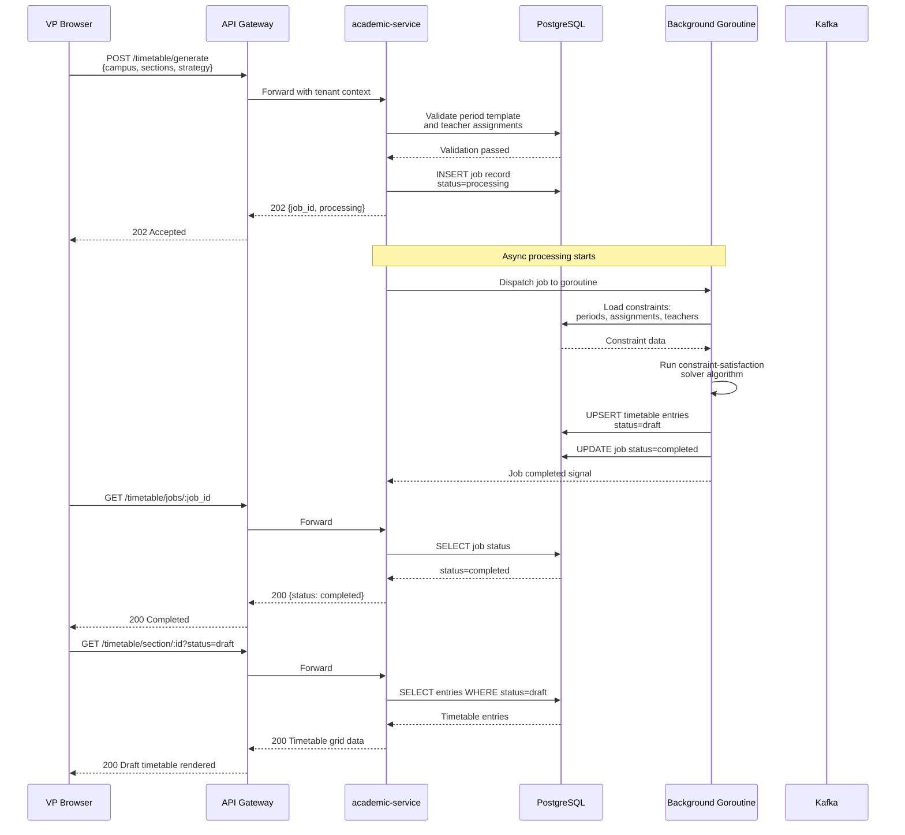

*Figure 7 — Timetable auto-generation flow.*

### 12.3 Timetable Publish Flow [Extended]

**Trigger:** Principal clicks "Publish" on the Timetable Builder page after reviewing the draft.

**Pre-conditions:** Draft timetable entries exist for all sections in the campus. Zero conflicts detected. No other user is publishing for this campus+year simultaneously.

**Main flow:**
1. Principal clicks "Publish". Frontend first calls `POST /api/v1/academic/timetable/conflicts/check` to verify zero conflicts.
2. Conflicts endpoint returns `{ conflicts: [], total_conflicts: 0 }`.
3. Frontend shows confirmation dialog: "Publishing will make this timetable visible to all teachers, parents, and students. You cannot edit individual cells after publishing (unpublish required). Continue?"
4. Principal confirms. Frontend sends `POST /api/v1/academic/timetable/publish` with `{ campus_id, academic_year_id }`.
5. Service begins a transaction.
6. Service updates all `aca_timetable_entries` for this campus+year from status `draft` to `published`.
7. Service validates that every section in the campus has at least one entry per academic period slot per day. If any section has empty slots, transaction rolls back with error.
8. Service commits.
9. Service writes audit row: `{ actor: "principal_id", action: "timetable_published", entity: "campus_uuid", details: "42 sections, 1260 entries", timestamp }`.
10. Service publishes Kafka event `academic.timetable.published` with `{ tenant_id, campus_id, academic_year_id, section_count: 42 }`.
11. communication-service consumes the event and sends push notifications to all teachers and parents in the campus: "Timetable for 2026-27 is now available. View in the app."
12. Service returns 200 OK.

**Alternate flows:**
- A1: Conflicts detected in step 2 — frontend shows the conflict list and blocks publish. Principal must resolve conflicts first.

**Error flows:**
- E1: Empty slots detected — return 400 with list of sections and slots that are empty.
- E2: Concurrent publish — optimistic lock on a `campus_year_publish_lock` row. Return 409.

**Post-conditions:** Timetable is visible to teachers, parents, students. No further cell-level edits allowed without unpublishing (which requires principal action and re-approval).

**Events fired:** `academic.timetable.published`

**Audit rows written:** 1 publish audit row.

### 12.4 Assignment Creation and Publishing Flow [Extended]

**Trigger:** Teacher creates an assignment and publishes it.

**Pre-conditions:** Teacher is assigned to the subject for the selected sections. Academic year and term are active. Due date is in the future.

**Main flow:**
1. Teacher opens "Create Assignment" wizard on the web or mobile app.
2. Teacher fills Step 1: Title "Chapter 5 - Cell Division", selects Subject "Biology" (dropdown shows only subjects assigned to this teacher), selects Sections "Grade 8-A" and "Grade 8-B", sets Due Date "2026-04-20", sets Max Marks "20".
3. Teacher fills Step 2: Types instructions in rich text editor. Uploads a PDF reference document "cell_division_notes.pdf" (2.3 MB, passes validation).
4. Teacher clicks "Save as Draft". Frontend sends `POST /api/v1/academic/assignments` as multipart/form-data.
5. Service validates: subject is assigned to teacher, sections belong to the same grade, due date is future, file is within size limit and valid MIME type.
6. Service uploads the file to S3 at path `tenant_id/assignments/{assignment_id}/cell_division_notes.pdf`.
7. Service inserts `aca_assignments` row with status `draft`.
8. Service returns 201 Created with the assignment object.
9. Teacher reviews the draft and clicks "Publish".
10. Frontend sends `PATCH /api/v1/academic/assignments/:id/publish`.
11. Service updates status to `published`, sets `published_at = now()`.
12. Service publishes Kafka event `academic.assignment.created` with `{ tenant_id, assignment_id, title, subject, sections, due_date, campus_id }`.
13. communication-service consumes and sends:
    - Push notification to Parent App for all parents of students in Grade 8-A and 8-B: "New assignment: Chapter 5 - Cell Division. Due: 20 Apr."
    - In-app notification for all students in those sections.
    - WhatsApp message to opted-in parents.
14. Service returns 200 OK.

**Alternate flows:**
- A1: Teacher attaches a file larger than 10 MB — frontend shows error "File exceeds 10 MB limit. Compress or split the file." before sending.
- A2: Teacher selects sections from different grades — validation fails: "All sections must belong to the same grade."
- A3: Due date is in the past — validation fails with specific error.

**Error flows:**
- E1: S3 upload fails — transaction rolls back, return 503 "File upload failed. Please retry."
- E2: Kafka publish fails — local outbox table records the event for retry by cron job.

**Post-conditions:** Assignment visible to students and parents. Notifications sent. Due date timer active.

**Events fired:** `academic.assignment.created`

**Audit rows written:** 1 creation audit row, 1 publish audit row.

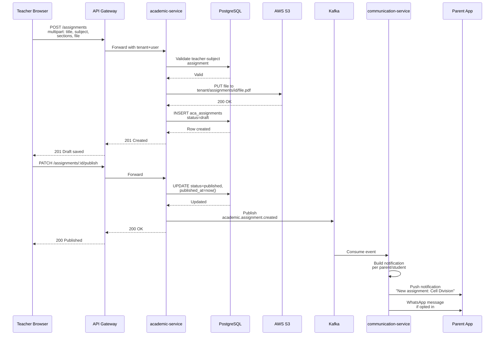

*Figure 8 — Assignment creation and publishing flow.*

### 12.5 Student Assignment Submission Flow [Extended]

**Trigger:** Student clicks "Submit" on an assignment in the mobile app.

**Pre-conditions:** Assignment is in `published` status. Student is enrolled in one of the assignment's sections. Student has not already submitted (or is resubmitting before grading).

**Main flow:**
1. Student opens the assignment detail in the mobile app. Sees title, instructions, due date, teacher-attached reference files, and a "Submit Work" button.
2. Student clicks "Submit Work". App shows file upload area and notes text area.
3. Student types a note: "Diagram drawn on graph paper, photo attached" and selects 2 photos from camera roll (1.5 MB and 2.1 MB).
4. Student clicks "Submit". App sends `POST /api/v1/academic/assignments/:id/submissions` as multipart/form-data.
5. Service validates: assignment is published, student is enrolled, due date not passed (or within 1-hour grace period), files valid.
6. Service uploads files to S3 at `tenant_id/submissions/{submission_id}/img1.jpg` and `img2.jpg`.
7. Service inserts `aca_assignment_submissions` row with status `submitted` (or `late` if within grace period past due date).
8. Service returns 201 Created.
9. Teacher's assignment dashboard updates the "Submissions Received" count in real-time (via WebSocket push or polling).

**Alternate flows:**
- A1: Due date has passed by more than 1 hour — submission rejected with error "Submission deadline has passed. Contact your teacher for extension."
- A2: Student has already submitted and it has been graded — submission rejected with error "This assignment has already been graded. You cannot resubmit."
- A3: Student is submitting from offline cache (mobile app queued the submission when offline) — app retries the POST when connectivity returns. Idempotency ensured by the UNIQUE constraint on (assignment_id, student_id).

**Error flows:**
- E1: File upload to S3 fails — return 503.
- E2: Network drops mid-upload — app stores locally and retries (mobile responsibility, not service).

**Post-conditions:** Submission record created. Teacher can view the submission. Student sees "Submitted" status with timestamp.

**Events fired:** `academic.submission.created` [Extended]

**Audit rows written:** 1 submission audit row.

### 12.6 Bulk Grading Flow [Extended]

**Trigger:** Teacher enters marks for multiple submissions and clicks "Save Grades".

**Pre-conditions:** Teacher owns the assignment. Submissions exist for the students being graded. Assignment max_marks is known.

**Main flow:**
1. Teacher opens "View Submissions" for an assignment. Sees a table: Student Name, Submitted At, File Links, Marks (editable input), Remarks (textarea).
2. Teacher enters marks in the Marks column for 10 students. Adds remarks for 3 students.
3. Teacher clicks "Save Grades". Frontend sends `POST /api/v1/academic/assignments/:id/grades/bulk` with array of 10 grade objects.
4. Service validates each grade: submission_id belongs to this assignment, marks_obtained between 0 and max_marks, submission status is not `not_submitted`.
5. Service begins a transaction.
6. For each grade, service UPSERTs into `aca_assignment_grades` (insert if new, update if exists — for correction scenarios).
7. Service updates `aca_assignment_submissions.status` to `graded` for each graded submission.
8. Service commits.
9. Service publishes Kafka event `academic.assignment.graded` with `{ assignment_id, graded_count: 10 }`.
10. communication-service consumes and sends push notification to each student/parent: "Your assignment 'Cell Division' has been graded. Score: 18/20."
11. Service returns 200 OK with the array of created grades.

**Alternate flows:**
- A1: One grade has marks_obtained = 25 but max_marks = 20 — that single item fails validation. Service returns 400 with `{ errors: [{ index: 4, submission_id: "uuid", error: "Marks 25 exceeds max_marks 20" }] }`. No grades are saved (all-or-nothing).

**Error flows:**
- E1: Transaction deadlock — retry up to 3 times with exponential backoff, then return 500.

**Post-conditions:** Students graded. Notifications sent. Grades visible to parents/students.

**Events fired:** `academic.assignment.graded`

**Audit rows written:** 1 bulk-grading audit row with count and assignment_id.

### 12.7 Gradebook Entry and Term Total Computation Flow [Extended]

**Trigger:** Teacher enters marks in the gradebook grid and presses Ctrl+S.

**Pre-conditions:** Gradebook is not locked for this section+subject+term. Categories are defined with weights summing to 100. Teacher is assigned to this subject for this section.

**Main flow:**
1. Teacher opens Gradebook for Grade 8-A, Mathematics, Term 1. Grid loads with 4 categories (columns) and 40 students (rows). Class average row at bottom. Term total column on the right.
2. Teacher clicks cell (Student: Aarav, Category: Class Test 1) and types "18". Tab moves to next cell.
3. Teacher fills marks for 15 students across Class Test 1.
4. Teacher presses Ctrl+S. Frontend collects all changed cells into a payload: `{ entries: [{ category_id, student_id, marks_obtained: 18, is_absent: false }, ...] }`.
5. Frontend sends `PUT /api/v1/academic/gradebook/entries/bulk`.
6. Service validates: gradebook not locked, teacher is assigned, marks within category max.
7. Service begins a transaction.
8. For each entry, service UPSERTs into `aca_gradebook_entries`.
9. After all upserts, service recomputes term totals for all affected students:
    - Query all categories for this subject+term.
    - For each affected student, query all entries across categories.
    - Compute: `term_total = SUM(entry.marks_obtained / category.max_marks * category.weight_percentage)` for non-absent categories. Absent categories are excluded from denominator (weights redistributed proportionally among present categories) [Extended].
    - Round to 2 decimal places.
10. Service returns 200 OK with updated term totals for affected students.
11. Frontend updates the Term Total column for those students without a full page reload.

**Alternate flows:**
- A1: Teacher marks a student as absent — sets `is_absent: true` and `marks_obtained: null`. That category is excluded from the student's term total computation.
- A2: Teacher imports marks from Excel — frontend parses the Excel, validates client-side, then sends the same bulk payload.

**Error flows:**
- E1: Gradebook is locked — return 400 "Gradebook is locked by Principal. Contact them to unlock."
- E2: Weight redistribution computation results in NaN (all categories absent) — term_total set to null with a flag.

**Post-conditions:** Marks saved. Term totals updated. Visible to parents within 24 hours (next API call).

**Events fired:** None (gradebook changes are high-frequency, events emitted only on lock).

**Audit rows written:** 1 bulk-entry audit row with entry count.

### 12.8 Substitution Creation and Availability Check Flow [Extended]

**Trigger:** VP creates a substitution for an absent teacher.

**Pre-conditions:** Absent teacher has a timetable entry for the specified date+slot+section+subject. A substitute teacher exists who is free at that slot.

**Main flow:**
1. VP opens Substitutions page, selects today's date.
2. VP clicks "Create Substitution". Selects Absent Teacher "Mrs. Sunita Sharma" from dropdown.
3. System auto-populates all her periods for today: Period 2 (Grade 6-A, English), Period 5 (Grade 7-B, English), Period 7 (Grade 8-A, Biology).
4. For Period 2, VP clicks the Substitute Teacher dropdown. Dropdown shows only teachers who are:
   a. Not teaching any class at Period 2 on Monday (checked against `aca_timetable_entries`).
   b. Not already assigned as a substitute for Period 2 on this date (checked against `aca_substitutions`).
   c. Not the absent teacher themselves.
5. VP selects "Mr. Arjun Desai" for Period 2. The system shows a green check: "Available".
6. For Period 5, VP selects "Mr. Ravi Kumar". System shows amber: "Has Period 6 immediately after in Grade 9-A (same floor). May be tight."
7. For Period 7, VP leaves substitute blank (unassigned). System shows red: "No substitutes available. All 23 teachers are occupied at this slot."
8. VP clicks "Submit All". Frontend sends `POST /api/v1/academic/substitutions/bulk`.
9. Service validates each substitution: absent teacher timetable exists, substitute availability, no duplicate.
10. Service inserts 3 rows into `aca_substitutions`. Two with status `pending`, one with `substitute_teacher_id = null`.
11. Service returns 201 Created.

**Alternate flows:**
- A1: VP uses "Quick Assign" button — system auto-assigns the first available substitute for each slot based on teacher load balancing (fewest substitutions this week) [Extended].

**Error flows:**
- E1: Substitute becomes unavailable between VP selecting and submitting (race condition) — return 400 for that specific substitution with error "Mr. Arjun Desai was just assigned another substitution for this slot."

**Post-conditions:** Substitution records created. Unassigned slots flagged for follow-up.

**Events fired:** `academic.substitution.created`

**Audit rows written:** 1 bulk-creation audit row.

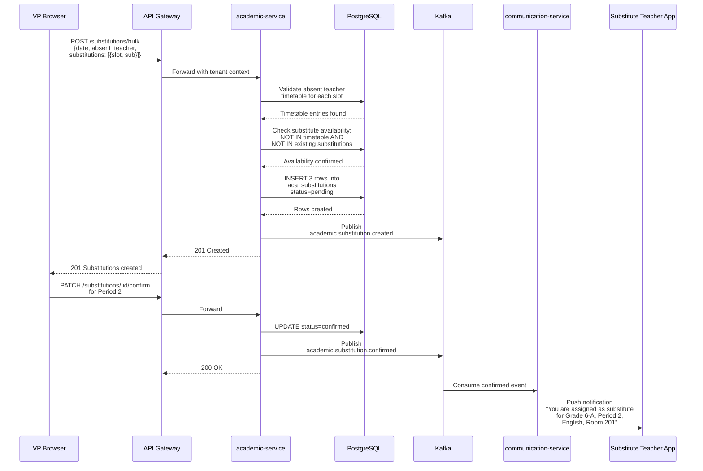

*Figure 9 — Substitution creation and confirmation flow.*

### 12.9 Report Card Generation and Distribution Flow [Extended]

**Trigger:** Principal clicks "Generate" for report cards.

**Pre-conditions:** Gradebook is locked for all subjects in the selected sections for the term. Student enrolment data exists in SIS. Report card template is configured. Student attendance summary is available from attendance-service.

**Main flow:**
1. Principal opens Report Cards page. Selects Term 1, Sections "Grade 8-A" and "Grade 8-B", Template "CBSE Term Report".
2. Principal clicks "Preview" to check one sample. System generates a single PDF for the first student in Grade 8-A. Principal reviews and is satisfied.
3. Principal clicks "Generate". Frontend sends `POST /api/v1/academic/report-cards/generate`.
4. Service creates a job record with status `processing`.
5. Service returns 202 Accepted with job_id.
6. Background goroutine starts:
   a. For each student in the selected sections (query SIS via internal API or cached data):
      - Fetch gradebook data for all subjects: term totals, category-wise marks, grade letters [Extended].
      - Fetch attendance summary from attendance-service: total working days, days present, percentage [Extended].
      - Fetch teacher remarks if any (from `aca_gradebook_entries.remarks` aggregated) [Extended].
      - Fetch class teacher remark (from a dedicated field in `aca_class_teachers.remarks`) [Extended].
      - Render the report card PDF using the template engine (HTML to PDF via wkhtmltopdf or Go library) [Extended].
      - Upload PDF to S3 at `tenant_id/report_cards/{student_id}/term1_2026.pdf`.
      - Insert a record in `aca_report_cards` table with student_id, term_id, pdf_url, status `generated`.
   b. Update job status to `completed`.
7. Principal clicks "Send to Parents". Frontend sends `POST /api/v1/academic/report-cards/send`.
8. For each generated report card, service publishes `academic.report_card.generated` event with parent contact details.
9. communication-service sends email with PDF attachment, WhatsApp with PDF link, and in-app notification to each parent.
10. Service returns 200 OK with per-student delivery status.

**Alternate flows:**
- A1: Gradebook not locked for some subject — job fails immediately with error "Gradebook for Mathematics in Grade 8-A is not locked. Lock all gradebooks before generating report cards."
- A2: Template not found — return 400 "Report card template not configured for this campus."

**Error flows:**
- E1: PDF rendering fails for a student (invalid data) — skip that student, log error, continue with others. Job completes with `partial_success` status and list of failed students.

**Post-conditions:** PDFs generated and stored. Parents notified. Downloadable from the principal's report cards page.

**Events fired:** `academic.report_card.generated`

**Audit rows written:** 1 generation audit row per job, 1 send audit row.

### 12.10 Lesson Plan Creation with Syllabus Linkage Flow [Extended]

**Trigger:** Teacher creates a lesson plan and links it to a syllabus topic.

**Pre-conditions:** Timetable entry exists for the teacher on the plan date+slot. Syllabus topics exist for the subject.

**Main flow:**
1. Teacher opens Lesson Plan Manager, navigates to the week of 2026-04-20.
2. Teacher sees pre-populated draft plans from the weekly timetable (Period 2: Biology, Grade 8-A; Period 5: Biology, Grade 8-B).
3. Teacher clicks on the Period 2 draft. Opens the edit modal.
4. Teacher selects Topic from dropdown: "Cell Division - Mitosis" (loaded from `aca_syllabus_topics` for Biology, Grade 8).
5. Teacher fills Objectives: "Understand the 4 stages of mitosis". Teaching Method: "Demonstration". Attaches a slide deck PDF.
6. Teacher clicks "Save". Frontend sends `POST /api/v1/academic/lesson-plans`.
7. Service validates timetable entry exists, topic belongs to subject+grade.
8. Service uploads file to S3.
9. Service inserts `aca_lesson_plans` row with status `planned`, topic_id linked.
10. Service returns 201 Created.
11. Later, after the class, teacher opens the plan and clicks "Mark Completed". Status changes to `completed`.
12. The syllabus coverage for "Cell Division - Mitosis" automatically increases (computed on read from lesson plan statuses).

**Alternate flows:**
- A1: Teacher does not link a topic — topic_id is null. The lesson plan is tracked but does not contribute to syllabus coverage.
- A2: Teacher marks the plan as "Carried Forward" — status = `carried_forward`. A new plan is auto-suggested for the next available slot for the same topic [Extended].

**Error flows:**
- E1: Timetable entry not found (e.g., timetable not published yet) — return 400 "No timetable found for this date and slot. Ensure the timetable is published."

**Post-conditions:** Lesson plan created. Syllabus coverage updated (on next read).

**Events fired:** None (lesson plans are internal operational data, not cross-module).

**Audit rows written:** 1 creation audit row, 1 status-change audit row on completion.

---

## 13. State Machine(s)

### 13.1 Assignment State Machine [Extended]

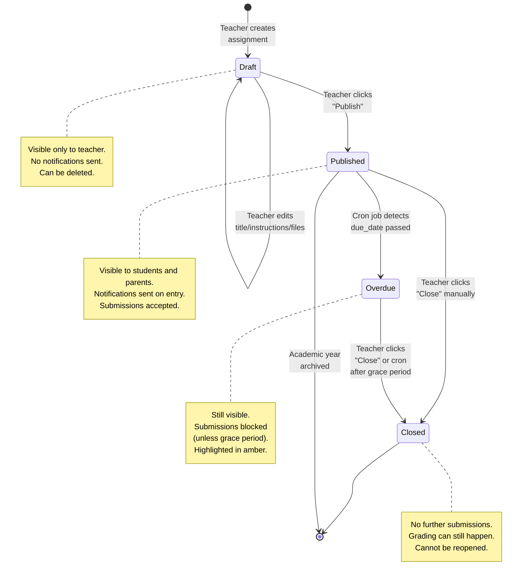

*Figure 10 — Assignment state machine.*

**Transition rules:**

| From | To | Who | When | Side Effects |
|------|----|-----|------|-------------|
| (none) | Draft | Teacher | On POST /assignments | Row created, file uploaded to S3 |
| Draft | Published | Teacher | On PATCH /assignments/:id/publish | Kafka event, notifications sent to parents/students |
| Draft | Draft | Teacher | On PUT /assignments/:id | Fields updated, audit logged |
| Draft | (deleted) | Teacher | On DELETE /assignments/:id | Row deleted, S3 files marked for lifecycle deletion |
| Published | Overdue | System (cron) | When `due_date + grace_period < now()` | Status updated, no notification (parents see "Overdue" label) |
| Published | Closed | Teacher | On PATCH /assignments/:id/close | Submissions blocked, audit logged |
| Overdue | Closed | Teacher or System | Manual close or cron after 7 days past due | Same as Published to Closed |
| Published/Closed | (archived) | System | When academic year is archived | Status not changed, but filtered out of active views |

**Rollback rules:** No rollback from Published to Draft. No rollback from Closed to Published. Once closed, the assignment is final. If a teacher made an error, they must create a new assignment.

### 13.2 Substitution State Machine [Extended]

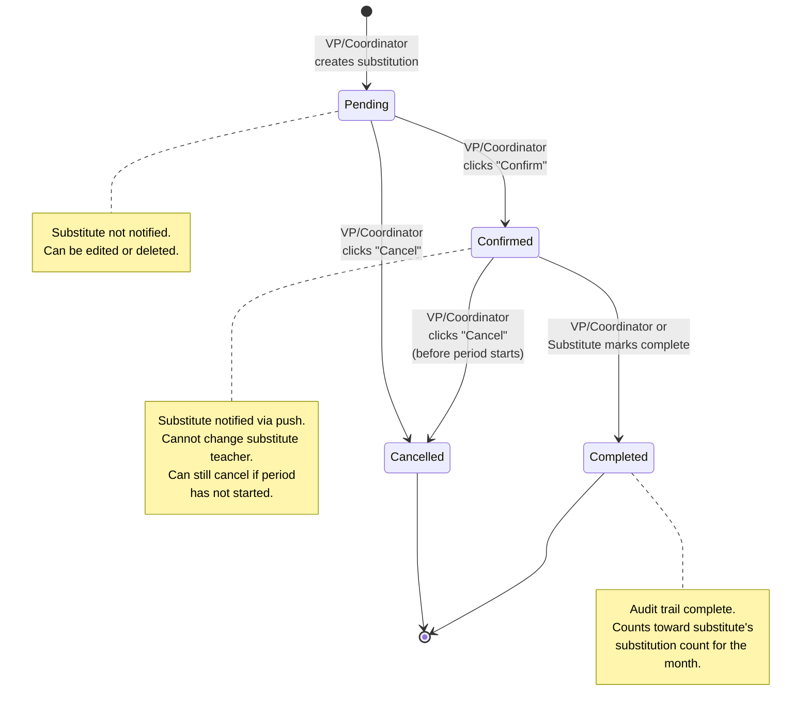

*Figure 11 — Substitution state machine.*

**Transition rules:**

| From | To | Who | When | Side Effects |
|------|----|-----|------|-------------|
| (none) | Pending | VP/Coordinator | On POST /substitutions | Row created, audit logged |
| Pending | Confirmed | VP/Coordinator | On PATCH /substitutions/:id/confirm | Kafka event, push notification to substitute teacher |
| Pending | Cancelled | VP/Coordinator | On PATCH /substitutions/:id/cancel | Row updated, audit logged |
| Confirmed | Completed | VP/Coordinator or Substitute | On PATCH /substitutions/:id/complete | Audit logged, substitution count incremented |
| Confirmed | Cancelled | VP/Coordinator | On PATCH /substitutions/:id/cancel | Only allowed if `period_start_time > now()`. Push notification to substitute: "Substitution cancelled." |
| Pending | Pending | VP/Coordinator | On PUT /substitutions/:id | Can change substitute_teacher_id if still null |

### 13.3 Academic Year State Machine [Extended]

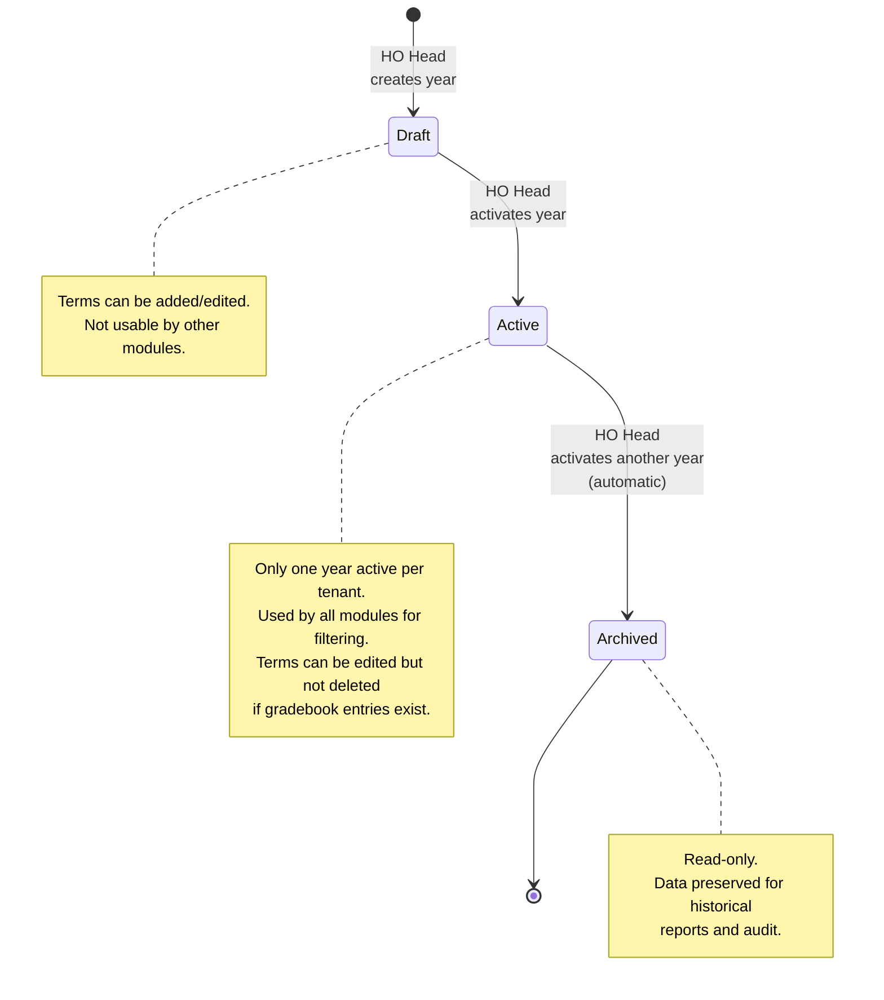

*Figure 12 — Academic year state machine.*

### 13.4 Timetable Entry State Machine [Extended]

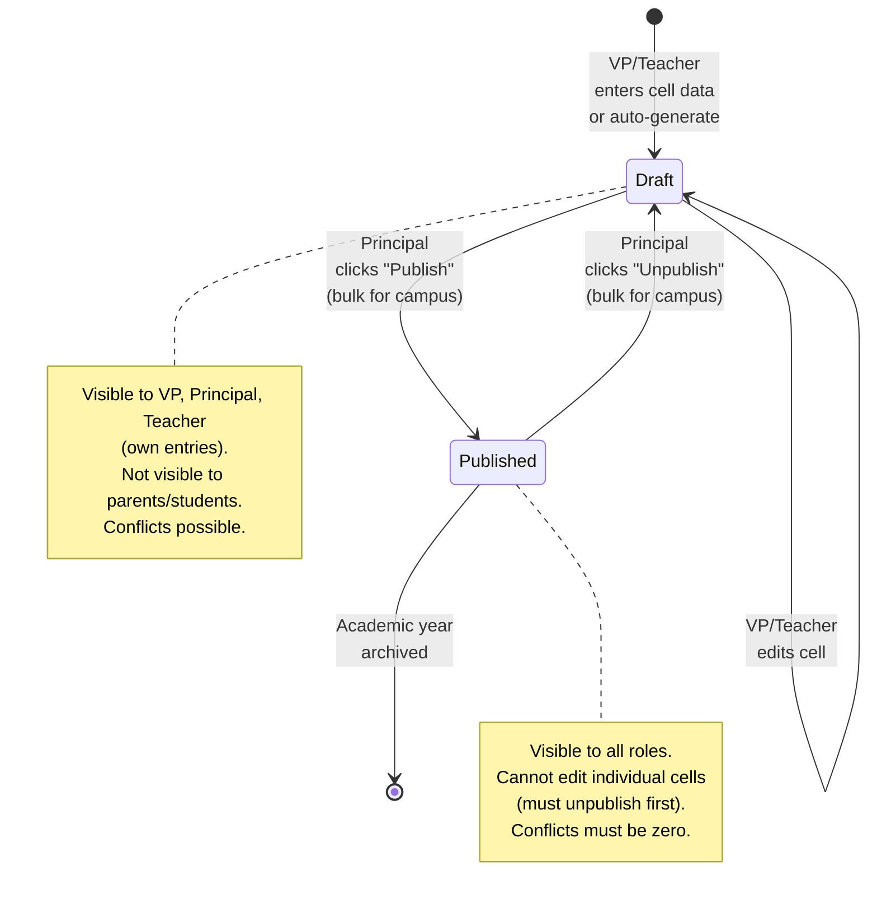

*Figure 13 — Timetable entry state machine.*

---

## 14. Sample Code (key handlers, middleware, jobs)

All code samples are in Go, idiomatic, and marked [Extended] as the SRS does not contain implementation code.

### 14.1 Tenant Middleware [Extended]

```go
package middleware

import (
	"context"
	"net/http"
	"strings"

	"github.com/gin-gonic/gin"
	"github.com/org/school-erp/academic-service/internal/auth"
)

const TenantIDKey = "tenant_id"
const CampusIDsKey = "campus_ids"
const UserIDKey = "user_id"
const RolesKey = "roles"

// TenantMiddleware extracts tenant context from JWT claims
// and sets it in the Gin context and the request context.
func TenantMiddleware() gin.HandlerFunc {
	return func(c *gin.Context) {
		claims, err := auth.ParseTokenFromHeader(c.GetHeader("Authorization"))
		if err != nil {
			c.AbortWithStatusJSON(http.StatusUnauthorized, gin.H{
				"error": "invalid or expired token",
			})
			return
		}

		tenantID := claims.TenantID
		if tenantID == "" {
			c.AbortWithStatusJSON(http.StatusBadRequest, gin.H{
				"error": "tenant_id not found in token",
			})
			return
		}

		// Set in Gin context for handlers
		c.Set(TenantIDKey, tenantID)
		c.Set(CampusIDsKey, claims.CampusIDs)
		c.Set(UserIDKey, claims.Subject)
		c.Set(RolesKey, claims.Roles)

		// Set in Go context for repository layer
		ctx := context.WithValue(c.Request.Context(), TenantIDKey, tenantID)
		ctx = context.WithValue(ctx, CampusIDsKey, claims.CampusIDs)
		c.Request = c.Request.WithContext(ctx)

		c.Next()
	}
}

// GetTenantID is a helper for handlers to extract tenant_id from context.
func GetTenantID(c *gin.Context) string {
	val, _ := c.Get(TenantIDKey)
	return val.(string)
}

// GetUserID is a helper for handlers to extract user_id from context.
func GetUserID(c *gin.Context) string {
	val, _ := c.Get(UserIDKey)
	return val.(string)
}
```

### 14.2 RBAC Middleware [Extended]

```go
package middleware

import (
	"net/http"

	"github.com/gin-gonic/gin"
)

// RequireRoles returns a middleware that checks if the user has
// at least one of the specified roles.
func RequireRoles(allowedRoles ...string) gin.HandlerFunc {
	allowedSet := make(map[string]struct{}, len(allowedRoles))
	for _, r := range allowedRoles {
		allowedSet[r] = struct{}{}
	}

	return func(c *gin.Context) {
		rolesVal, exists := c.Get(RolesKey)
		if !exists {
			c.AbortWithStatusJSON(http.StatusForbidden, gin.H{
				"error": "roles not found in token",
			})
			return
		}

		roles, ok := rolesVal.([]string)
		if !ok {
			c.AbortWithStatusJSON(http.StatusForbidden, gin.H{
				"error": "invalid roles format in token",
			})
			return
		}

		for _, role := range roles {
			if _, found := allowedSet[role]; found {
				c.Next()
				return
			}
		}

		c.AbortWithStatusJSON(http.StatusForbidden, gin.H{
			"error": "insufficient permissions",
			"required_roles": allowedRoles,
		})
	}
}
```

### 14.3 Assignment Creation Handler [Extended]

```go
package handlers

import (
	"net/http"

	"github.com/gin-gonic/gin"
	"github.com/go-playground/validator/v10"
	"github.com/org/school-erp/academic-service/internal/api/dto"
	"github.com/org/school-erp/academic-service/internal/middleware"
	"github.com/org/school-erp/academic-service/internal/service"
)

type AssignmentHandler struct {
	assignmentSvc service.AssignmentService
	fileUploader   service.FileUploader
	validate       *validator.Validate
}

func NewAssignmentHandler(
	assignmentSvc service.AssignmentService,
	fileUploader service.FileUploader,
	validate *validator.Validate,
) *AssignmentHandler {
	return &AssignmentHandler{
		assignmentSvc: assignmentSvc,
		fileUploader:   fileUploader,
		validate:       validate,
	}
}

// CreateAssignment handles POST /api/v1/academic/assignments
func (h *AssignmentHandler) CreateAssignment(c *gin.Context) {
	tenantID := middleware.GetTenantID(c)
	teacherID := middleware.GetUserID(c)

	// Parse multipart form (max 50 MB total)
	if err := c.Request.ParseMultipartForm(50 << 20); err != nil {
		c.JSON(http.StatusBadRequest, gin.H{"error": "failed to parse form: " + err.Error()})
		return
	}

	// Extract text fields
	var req dto.CreateAssignmentRequest
	req.Title = c.PostForm("title")
	req.SubjectID = c.PostForm("subject_id")
	req.DueDate = c.PostForm("due_date")
	req.MaxMarks = c.PostForm("max_marks")
	req.Instructions = c.PostForm("instructions")
	req.SectionIDsStr = c.PostForm("section_ids")

	// Parse section_ids from JSON string
	if err := req.ParseSectionIDs(); err != nil {
		c.JSON(http.StatusBadRequest, gin.H{"error": err.Error()})
		return
	}

	// Validate
	if err := h.validate.Struct(req); err != nil {
		c.JSON(http.StatusBadRequest, gin.H{"error": err.Error()})
		return
	}

	// Upload files to S3
	files := c.Request.MultipartForm.File["files"]
	var fileURLs []string
	for _, file := range files {
		url, err := h.fileUploader.Upload(c.Request.Context(), tenantID, "assignments", file)
		if err != nil {
			c.JSON(http.StatusServiceUnavailable, gin.H{
				"error": "file upload failed: " + err.Error(),
			})
			return
		}
		fileURLs = append(fileURLs, url)
	}

	// Call service
	assignment, err := h.assignmentSvc.Create(c.Request.Context(), service.CreateAssignmentParams{
		TenantID:       tenantID,
		TeacherID:      teacherID,
		Title:          req.Title,
		SubjectID:      req.SubjectID,
		SectionIDs:     req.SectionIDs,
		DueDate:        req.DueDate,
		MaxMarks:       req.MaxMarks,
		Instructions:   req.Instructions,
		AttachmentURLs: fileURLs,
	})
	if err != nil {
		// ... error mapping (ErrNotFound -> 404, ErrValidation -> 400, etc.)
		c.JSON(http.StatusInternalServerError, gin.H{"error": err.Error()})
		return
	}

	c.JSON(http.StatusCreated, assignment)
}
```

### 14.4 Timetable Conflict Detection Repository Method [Extended]

```go
package repository

import (
	"context"
	"fmt"

	"github.com/jackc/pgx/v5"
	"github.com/jackc/pgx/v5/pgxpool"
	"github.com/org/school-erp/academic-service/internal/domain/models"
)

type TimetableRepository interface {
	FindConflicts(ctx context.Context, tenantID, campusID, yearID string) ([]models.TimetableConflict, error)
	// ... rest omitted
}

type timetableRepo struct {
	pool *pgxpool.Pool
}

func NewTimetableRepository(pool *pgxpool.Pool) TimetableRepository {
	return &timetableRepo{pool: pool}
}

// FindConflicts detects teacher double-bookings and room double-bookings
// in draft timetable entries for a campus and academic year.
func (r *timetableRepo) FindConflicts(
	ctx context.Context,
	tenantID, campusID, yearID string,
) ([]models.TimetableConflict, error) {
	// Teacher double-booking: same teacher, same day, same slot, >1 section
	teacherQuery := `
		SELECT
			t.teacher_id,
			t.day_of_week,
			t.period_slot_id,
			ARRAY_AGG(DISTINCT t.section_id) AS section_ids,
			ARRAY_AGG(DISTINCT s.section_name) AS section_names,
			ps.slot_label
		FROM aca_timetable_entries t
		JOIN aca_sections s ON s.id = t.section_id
		JOIN aca_period_slots ps ON ps.id = t.period_slot_id
		WHERE t.tenant_id = $1
		  AND t.campus_id = $2
		  AND t.academic_year_id = $3
		  AND t.status = 'draft'
		GROUP BY t.teacher_id, t.day_of_week, t.period_slot_id, ps.slot_label
		HAVING COUNT(DISTINCT t.section_id) > 1
		ORDER BY t.day_of_week, ps.display_order
	`

	var conflicts []models.TimetableConflict
	rows, err := r.pool.Query(ctx, teacherQuery, tenantID, campusID, yearID)
	if err != nil {
		return nil, fmt.Errorf("teacher conflict query failed: %w", err)
	}
	defer rows.Close()

	dayNames := map[int]string{1: "Monday", 2: "Tuesday", 3: "Wednesday",
		4: "Thursday", 5: "Friday", 6: "Saturday"}

	for rows.Next() {
		var c models.TimetableConflict
		var dayNum int
		if err := rows.Scan(
			&c.TeacherID, &dayNum, &c.PeriodSlotID,
			&c.SectionIDs, &c.SectionNames, &c.SlotLabel,
		); err != nil {
			return nil, fmt.Errorf("scan teacher conflict: %w", err)
		}
		c.Type = "teacher_double_booking"
		c.DayName = dayNames[dayNum]
		conflicts = append(conflicts, c)
	}
	if rows.Err() != nil {
		return nil, fmt.Errorf("iterate teacher conflicts: %w", rows.Err())
	}

	// Room double-booking query (similar pattern)
	// ... rest omitted

	return conflicts, nil
}
```

### 14.5 Gradebook Bulk Upsert with Term Total Computation [Extended]

```go
package repository

import (
	"context"
	"fmt"

	"github.com/jackc/pgx/v5"
	"github.com/jackc/pgx/v5/pgxpool"
)

type GradebookRepository interface {
	BulkUpsertEntries(ctx context.Context, tenantID string, entries []GradebookEntryInput) error
	ComputeTermTotals(ctx context.Context, tenantID, sectionID, subjectID, termID string) ([]StudentTermTotal, error)
	// ... rest omitted
}

type GradebookEntryInput struct {
	CategoryID   string
	StudentID    string
	MarksObtained *float64
	IsAbsent    bool
	Remarks      *string
	SectionID    string
	EnteredBy    string
}

func (r *gradebookRepo) BulkUpsertEntries(
	ctx context.Context,
	tenantID string,
	entries []GradebookEntryInput,
) error {
	tx, err := r.pool.Begin(ctx)
	if err != nil {
		return fmt.Errorf("begin tx: %w", err)
	}
	defer tx.Rollback(ctx)

	batch := &pgx.Batch{}
	for _, e := range entries {
		batch.Queue(
			`INSERT INTO aca_gradebook_entries
			 (tenant_id, category_id, student_id, section_id,
			  marks_obtained, is_absent, remarks, entered_by)
			 VALUES ($1, $2, $3, $4, $5, $6, $7, $8)
			 ON CONFLICT (tenant_id, category_id, student_id)
			 DO UPDATE SET
			   marks_obtained = EXCLUDED.marks_obtained,
			   is_absent = EXCLUDED.is_absent,
			   remarks = EXCLUDED.remarks,
			   entered_by = EXCLUDED.entered_by,
			   entered_at = NOW()`,
			tenantID, e.CategoryID, e.StudentID, e.SectionID,
			e.MarksObtained, e.IsAbsent, e.Remarks, e.EnteredBy,
		)
	}

	br := tx.SendBatch(ctx, batch)
	defer br.Close()

	for range entries {
		if _, err := br.Exec(); err != nil {
			return fmt.Errorf("bulk upsert entry: %w", err)
		}
	}

	return tx.Commit(ctx)
}

type StudentTermTotal struct {
	StudentID         string
	TermTotal         *float64
	TermPercentage    *float64
}

func (r *gradebookRepo) ComputeTermTotals(
	ctx context.Context,
	tenantID, sectionID, subjectID, termID string,
) ([]StudentTermTotal, error) {
	query := `
		WITH cat_weights AS (
			SELECT id, max_marks, weight_percentage
			FROM aca_gradebook_categories
			WHERE tenant_id = $1
			  AND subject_id = $3
			  AND term_id = $4
		),
		student_entries AS (
			SELECT
				e.student_id,
				e.category_id,
				e.marks_obtained,
				e.is_absent,
				cw.max_marks,
				cw.weight_percentage
			FROM aca_gradebook_entries e
			JOIN cat_weights cw ON cw.id = e.category_id
			WHERE e.tenant_id = $1
			  AND e.section_id = $2
		),
		weighted AS (
			SELECT
				se.student_id,
				-- Only sum categories where student is present
				CASE WHEN SUM(
					CASE WHEN NOT se.is_absent THEN se.weight_percentage ELSE 0 END
				) = 0 THEN NULL
				ELSE SUM(
					CASE
						WHEN NOT se.is_absent AND se.max_marks > 0
						THEN (se.marks_obtained / se.max_marks) * se.weight_percentage
						ELSE 0
					END
				)
				END AS term_total,
				SUM(CASE WHEN NOT se.is_absent THEN se.weight_percentage ELSE 0 END)
					AS total_weight
			FROM student_entries se
			GROUP BY se.student_id
		)
		SELECT
			student_id,
			term_total,
			CASE
				WHEN total_weight < 100 AND term_total IS NOT NULL
				THEN (term_total / total_weight) * 100
				ELSE term_total
			END AS term_percentage
		FROM weighted
		ORDER BY student_id
	`

	rows, err := r.pool.Query(ctx, query, tenantID, sectionID, subjectID, termID)
	if err != nil {
		return nil, fmt.Errorf("compute term totals: %w", err)
	}
	defer rows.Close()

	var results []StudentTermTotal
	for rows.Next() {
		var t StudentTermTotal
		if err := rows.Scan(&t.StudentID, &t.TermTotal, &t.TermPercentage); err != nil {
			return nil, fmt.Errorf("scan term total: %w", err)
		}
		results = append(results, t)
	}
	return results, rows.Err()
}
```

### 14.6 Kafka Event Producer [Extended]

```go
package events

import (
	"context"
	"encoding/json"
	"fmt"
	"time"

	"github.com/confluent-kafka-go/kafka"
	"github.com/org/school-erp/academic-service/internal/domain/events"
	"github.com/org/school-erp/academic-service/pkg/logger"
)

type EventProducer struct {
	producer *kafka.Producer
	topic    string
	log      *logger.Logger
}

func NewEventProducer(brokers []string, topic string, log *logger.Logger) (*EventProducer, error) {
	p, err := kafka.NewProducer(&kafka.ConfigMap{
		"bootstrap.servers":  fmt.Sprintf("%s", brokers),
		"client.id":          "academic-service",
		"acks":               "all",
		"enable.idempotence": true,
		"retry.backoff.ms":   200,
		"message.max.bytes":  1048576, // 1 MB
	})
	if err != nil {
		return nil, fmt.Errorf("kafka producer init: %w", err)
	}

	// Log delivery reports in background
	go func() {
		for e := range p.Events() {
			switch ev := e.(type) {
			case *kafka.Message:
				if ev.TopicPartition.Error != nil {
					log.Error("kafka delivery failed",
						"topic", ev.TopicPartition.Topic,
						"partition", ev.TopicPartition.Partition,
						"error", ev.TopicPartition.Error,
					)
				}
			}
		}
	}()

	return &EventProducer{producer: p, topic: topic, log: log}, nil
}

// PublishAssignmentCreated sends the academic.assignment.created event.
func (ep *EventProducer) PublishAssignmentCreated(
	ctx context.Context,
	event events.AssignmentCreatedEvent,
) error {
	key := event.AssignmentID // Partition by assignment for ordering
	value, err := json.Marshal(event)
	if err != nil {
		return fmt.Errorf("marshal event: %w", err)
	}

	msg := &kafka.Message{
		TopicPartition: kafka.TopicPartition{
			Topic:     &ep.topic,
			Partition: kafka.PartitionAny,
		},
		Key:            []byte(key),
		Value:          value,
		Headers:        []kafka.Header{
			{Key: "event_type", Value: []byte("academic.assignment.created")},
			{Key: "tenant_id", Value: []byte(event.TenantID)},
			{Key: "timestamp", Value: []byte(time.Now().UTC().Format(time.RFC3339))},
		},
	}

	err = ep.producer.Produce(msg, nil)
	if err != nil {
		return fmt.Errorf("produce event: %w", err)
	}

	ep.log.Info("event published",
		"event_type", "academic.assignment.created",
		"assignment_id", event.AssignmentID,
		"tenant_id", event.TenantID,
	)

	return nil
}

func (ep *EventProducer) Close() {
	ep.producer.Flush(5000)
	ep.producer.Close()
}
```

### 14.7 Close Overdue Assignments Cron Job [Extended]

```go
package cron

import (
	"context"
	"time"

	"github.com/robfig/cron/v3"
	"github.com/org/school-erp/academic-service/internal/repository"
	"github.com/org/school-erp/academic-service/pkg/logger"
)

type OverdueAssignmentJob struct {
	assignmentRepo repository.AssignmentRepository
	log            *logger.Logger
}

func NewOverdueAssignmentJob(
	assignmentRepo repository.AssignmentRepository,
	log *logger.Logger,
) *OverdueAssignmentJob {
	return &OverdueAssignmentJob{
		assignmentRepo: assignmentRepo,
		log:            log,
	}
}

// Run marks all published assignments as overdue where
// due_date + 1 hour grace period has passed.
func (j *OverdueAssignmentJob) Run() {
	ctx := context.Background()
	gracePeriod := time.Hour // 1 hour grace after due date
	cutoff := time.Now().UTC().Add(-gracePeriod)

	affected, err := j.assignmentRepo.MarkOverdue(ctx, cutoff)
	if err != nil {
		j.log.Error("failed to mark overdue assignments", "error", err)
		return
	}

	if affected > 0 {
		j.log.Info("marked assignments as overdue",
			"count", affected,
			"cutoff", cutoff.Format(time.RFC3339),
		)
	}
}

// Register registers this job with the cron scheduler.
// Runs every 15 minutes.
func (j *OverdueAssignmentJob) Register(scheduler *cron.Cron) {
	scheduler.AddFunc("@every 15m", j.Run)
	j.log.Info("registered overdue assignment job", "schedule", "every 15m")
}
```

### 14.8 State Machine Guard for Substitution Confirmation [Extended]

```go
package service

import (
	"errors"
	"time"

	"github.com/org/school-erp/academic-service/internal/domain/enums"
)

var (
	ErrInvalidTransition = errors.New("invalid state transition")
	ErrPeriodAlreadyStarted = errors.New("cannot cancel: period has already started")
)

// CanConfirmSubstitution checks if a substitution can be
// transitioned from its current state to "confirmed".
func CanConfirmSubstitution(currentStatus enums.SubstitutionStatus) error {
	if currentStatus != enums.SubstitutionStatusPending {
		return ErrInvalidTransition
	}
	return nil
}

// CanCancelSubstitution checks if a substitution can be cancelled.
// For confirmed substitutions, cancellation is only allowed if
// the period has not yet started.
func CanCancelSubstitution(
	currentStatus enums.SubstitutionStatus,
	periodStartTime time.Time,
) error {
	switch currentStatus {
	case enums.SubstitutionStatusPending:
		return nil
	case enums.SubstitutionStatusConfirmed:
		if time.Now().After(periodStartTime) {
			return ErrPeriodAlreadyStarted
		}
		return nil
	case enums.SubstitutionStatusCompleted:
		return ErrInvalidTransition
	case enums.SubstitutionStatusCancelled:
		return ErrInvalidTransition
	default:
		return ErrInvalidTransition
	}
}

// CanCompleteSubstitution checks if a substitution can be marked completed.
func CanCompleteSubstitution(currentStatus enums.SubstitutionStatus) error {
	if currentStatus != enums.SubstitutionStatusConfirmed {
		return ErrInvalidTransition
	}
	return nil
}
```

---

## 15. Reports We Will Generate

Every report that the Academic Management module produces or contributes to, who consumes it, what columns it has, what filters are available, how often it is generated, in what format, and the SQL/aggregation outline.

### 15.1 Syllabus Coverage Report [Extended]

| Attribute | Detail |
|----------|--------|
| Consumer | HO Academic Head, Principal, VP |
| Purpose | Track how far each section has progressed through the syllabus vs the planned pace |
| Columns | Subject, Grade, Section, Unit Name, Topic Name, Expected Hours, Actual Hours Taught, Coverage %, Status (Not Started / In Progress / Completed), Teacher Name |
| Filters | Subject, Grade, Section, Teacher, Coverage % range (e.g., less than 50%), Status |
| Frequency | On-demand (real-time computation from lesson plans) |
| Format | PDF (printable for HO review), Excel (for VP to plan remedial sessions) |
| SQL outline | JOIN aca_lesson_plans ON aca_syllabus_topics, GROUP BY topic_id, COUNT(CASE WHEN status='completed') / COUNT(*) * 100 as coverage |

### 15.2 Teacher Workload Report [Extended]

| Attribute | Detail |
|----------|--------|
| Consumer | Principal, HO Academic Head |
| Purpose | Ensure equitable distribution of teaching periods across teachers |
| Columns | Teacher Name, Employee Code, Subject Assignments (count), Total Weekly Periods (from timetable), Substitution Periods This Month, Total Effective Periods, Max Allowed Weekly Periods, Utilisation % |
| Filters | Campus, Department (subject group), Teacher, Utilisation % range |
| Frequency | Weekly (auto-generated every Monday at 6 AM) and on-demand |
| Format | Excel |
| SQL outline | COUNT(aca_timetable_entries) GROUP BY teacher_id + day_of_week, SUM weekly periods, JOIN aca_substitutions for substitution count in current month |

### 15.3 Gradebook Analysis Report [Extended]

| Attribute | Detail |
| Consumer | Principal, Teacher, HO Academic Head |
| Purpose | Analyse class performance across assessment categories, identify weak areas |
| Columns | Section, Subject, Category Name, Class Average, Highest Score, Lowest Score, Students Below 40%, Students Above 90%, Standard Deviation |
| Filters | Section, Subject, Term, Category |
| Frequency | On-demand (after gradebook lock) |
| Format | PDF, Excel |
| SQL outline | AVG(marks_obtained), MAX, MIN, COUNT(CASE WHEN marks_obtained/max_marks*100 < 40), STDDEV_POP from aca_gradebook_entries JOIN aca_gradebook_categories GROUP BY category_id |

### 15.4 Assignment Submission Compliance Report [Extended]

| Attribute | Detail |
| Consumer | VP, Principal |
| Purpose | Track which students are not submitting assignments on time |
| Columns | Student Name, Roll Number, Assignment Title, Subject, Due Date, Submission Status (Submitted / Late / Not Submitted), Days Late, Submission Timestamp |
| Filters | Section, Subject, Date Range, Submission Status |
| Frequency | On-demand, weekly auto-generated for VP |
| Format | Excel |
| SQL outline | LEFT JOIN aca_assignment_submissions ON aca_assignments, WHERE student_id NOT IN submissions OR status = 'not_submitted' OR submitted_at > due_date |

### 15.5 Substitution Audit Report [Extended]

| Attribute | Detail |
|----------|--------|
| Consumer | Principal, HO Operations |
| Purpose | Track teacher absence patterns and substitution coverage |
| Columns | Date, Absent Teacher, Reason, Period, Section, Subject, Substitute Teacher, Status (Confirmed / Unassigned / Cancelled), Confirmed By, Confirmed At |
| Filters | Date Range, Campus, Absent Teacher, Status |
| Frequency | Monthly (auto-generated on 1st of each month) and on-demand |
| Format | PDF, Excel |
| SQL outline | SELECT from aca_substitutions JOIN aca_period_slots JOIN aca_subjects JOIN aca_sections ORDER BY substitution_date, absent_teacher_id, display_order |

### 15.6 Timetable Compliance Report [Extended]

| Attribute | Detail |
|----------|--------|
| Consumer | HO Academic Head |
| Purpose | Verify that all campuses have published timetables for the current academic year |
| Columns | Campus Name, Grade, Section, Timetable Status (Published / Draft / Missing), Number of Periods per Day, Total Academic Periods per Week, Last Published Date, Published By |
| Filters | Campus, Status |
| Frequency | Weekly (auto-generated every Monday at 7 AM) |
| Format | Excel |
| SQL outline | COUNT(aca_timetable_entries) per section GROUP BY section_id, campus_id, check status = 'published' |

### 15.7 Student Progress Card (per-term summary for parent) [Extended]

| Attribute | Detail |
|----------|--------|
| Consumer | Parent, Student |
| Purpose | A simplified view of the child's academic performance for a term |
| Columns | Subject, Class Test Average, Homework Average, Project Marks, Mid-Term Marks, Term Total %, Grade Letter, Teacher Remark |
| Filters | Term (auto-set to current term) |
| Frequency | Available after gradebook lock for the term |
| Format | PDF (generated as part of report card), viewed in-app |
| SQL outline | Aggregation from aca_gradebook_entries JOIN aca_gradebook_categories per student per subject per term, with grade letter lookup from aca_grading_scale [Extended] |

---

## 16. Security, Audit & Data Safety

### 16.1 Transport Security [Extended]

- All API calls use TLS 1.3. The API Gateway terminates TLS. Internal service-to-service calls also use TLS (mTLS between services via service mesh).
- HSTS header set to `max-age=31536000; includeSubDomains` on all responses.
- No plain HTTP endpoints exposed. HTTP redirects to HTTPS.

### 16.2 Data at Rest [Extended]

- PostgreSQL: AES-256 encryption via AWS RDS encryption (KMS managed). No application-level column encryption for academic data (no PII beyond names, which are in SIS).
- S3: Server-side encryption with AES-256 (SSE-S3). Files uploaded via presigned URLs with server-side enforcement.
- Redis: Encryption in transit (TLS). At-rest encryption via AWS ElastiCache in-transit encryption.
- No Aadhaar numbers, bank details, or medical data stored in this module (those are in SIS, fee, HR modules respectively).

### 16.3 Secrets Management [Extended]

- Database credentials, Redis password, Kafka SASL credentials, S3 access keys, JWT signing key — all stored in AWS Secrets Manager.
- Service reads secrets at startup via environment variables injected by Kubernetes (External Secrets Operator syncs Secrets Manager to K8s secrets).
- No secrets in code, no secrets in .env files checked into Git, no secrets in container images.
- Secret rotation: AWS KMS key rotation every 365 days (automatic). Database password rotation every 90 days (manual, requires service restart).

### 16.4 Audit Log Shape [Extended]

Every write operation (create, update, delete, status change) in the Academic Management module writes an audit row to the `audit_log` table (owned by a shared audit service, called via Kafka or direct DB write).

**Audit row structure:**

| Column | Type | Description |
|--------|------|-------------|
| id | UUID | Unique audit event ID |
| tenant_id | UUID | Tenant (RLS enforced) |
| service_name | VARCHAR(50) | "academic-service" |
| entity_type | VARCHAR(100) | e.g., "aca_assignments", "aca_timetable_entries" |
| entity_id | UUID | ID of the affected row |
| action | VARCHAR(50) | create / update / delete / status_change |
| actor_id | UUID | User who performed the action |
| actor_role | VARCHAR(50) | Role at the time of action |
| before_state | JSONB | Full row snapshot before change (null for create) |
| after_state | JSONB | Full row snapshot after change (null for delete) |
| changed_fields | TEXT[] | List of field names that changed (null for create/delete) |
| ip_address | INET | Client IP (from X-Forwarded-For) |
| user_agent | VARCHAR(500) | Browser/app user agent |
| request_id | VARCHAR(50) | X-Request-ID for distributed tracing |
| created_at | TIMESTAMPTZ | Timestamp of action |

**Retention:** 7 years for financial-adjacent data (gradebook locks, report card generation). 3 years for operational data (lesson plans, timetable drafts). [Extended]

### 16.5 Immutable Retention [Extended]

- Audit log table has a trigger that prevents UPDATE and DELETE:
  ```sql
  CREATE OR REPLACE FUNCTION audit_log_immutable()
  RETURNS trigger AS $$
  BEGIN
      RAISE EXCEPTION 'Audit log is immutable: % operation not allowed on audit_log', TG_OP;
  END;
  $$ LANGUAGE plpgsql;

  CREATE TRIGGER audit_log_no_update
    BEFORE UPDATE OR DELETE ON audit_log
    FOR EACH ROW EXECUTE FUNCTION audit_log_immutable();
  ```
- Old audit data is partitioned by month and moved to cold storage (S3 + Athena) after 1 year. The partition is detached and exported, then dropped from the hot DB.

### 16.6 MFA Matrix [Extended]

| Role | MFA Required | MFA Method | Fallback |
|------|-------------|------------|----------|
| CEO | Yes | Azure AD MFA (push) | Hardware key (YubiKey) |
| HO Head | Yes | Azure AD MFA (push) | SMS OTP |
| Principal | Yes | Azure AD MFA (push) | SMS OTP |
| VP / Coordinator | Yes | Azure AD MFA (push) | SMS OTP |
| Teacher (web) | Yes | Azure AD MFA (push) | SMS OTP |
| Teacher (mobile) | Yes | SMS OTP on login | — |
| Parent | No | OTP is the second factor | — |
| Student | No | Password only (reset via parent OTP) | — |

### 16.7 Data Residency [Extended]

All data in this module (PostgreSQL, S3 files, Redis cache) resides in AWS ap-south-1 (Mumbai). DR replication to ap-south-2 (Hyderabad). No data leaves Indian borders. S3 bucket policy restricts access to IAM roles within the Indian AWS accounts.

### 16.8 DPDP / GDPR Mapping [Extended]

| DPDP Right | Implementation in Academic Module |
|------------|-----------------------------------|
| Right to Access | Parent can view child's grades, assignments, timetable via API. No PII stored beyond what SIS holds. |
| Right to Correction | Teacher can correct marks (before lock). After lock, Principal must unlock first. Audit trail preserved. |
| Right to Erasure | Not directly applicable (academic records are not PII beyond name, which is in SIS). If a student is deleted from SIS, academic data is anonymised (name replaced with "REDACTED", student_id kept for referential integrity). |
| Right to Data Portability | Gradebook data exportable as Excel. Report cards downloadable as PDF. |
| Consent | No special consent needed for academic data (it is the core purpose of the platform). File uploads of student work require the student/parent to have accepted the platform's terms of service (checked at enrollment). |
| Breach Notification | If academic data is leaked (e.g., grades visible to wrong parent), the DPO workflow is triggered via the audit log anomaly detection (access from unexpected tenant/user). |

### 16.9 File Upload Security [Extended]

- File type validation: MIME type checked server-side (not just extension). Allowed types: `application/pdf`, `image/jpeg`, `image/png`, `application/vnd.openxmlformats-officedocument.wordprocessingml.document`.
- File size validation: Per-file limit (10 MB for assignments, 25 MB for report card attachments) enforced at API Gateway and service level.
- Virus scanning: S3 bucket has S3 Event Notifications triggering AWS Lambda with ClamAV scan. Infected files are quarantined (moved to a separate bucket with no public access) and the assignment/submission is flagged.
- Presigned URLs: S3 upload uses presigned URLs with 15-minute expiry, scoped to the exact object key. No wildcard permissions.
- No server-side file processing: Files are stored as-is. No server-side PDF generation from user uploads (only template-based PDF generation from structured data).

---

## 17. Performance & Scale Targets

### 17.1 Per-Endpoint Latency Targets [Extended]

| Endpoint | p50 | p95 | p99 | Notes |
|----------|-----|-----|-----|-------|
| GET /academic/years | 15ms | 40ms | 80ms | Simple indexed query, cached |
| GET /academic/grades?include_sections=true | 25ms | 60ms | 120ms | JOIN with sections, cached per campus |
| GET /academic/timetable/section/:id | 30ms | 80ms | 150ms | 40 rows per section (6 days x 7 periods), cached after publish |
| POST /academic/timetable/generate | N/A | N/A | N/A | Async job, 202 returned in 100ms. Job itself takes 30-180s. |
| POST /academic/timetable/conflicts/check | 200ms | 500ms | 1000ms | Complex GROUP BY with HAVING, no cache |
| GET /academic/assignments (teacher) | 30ms | 70ms | 140ms | Indexed by teacher_id + year |
| POST /academic/assignments (with file) | 300ms | 800ms | 2000ms | S3 upload is the bottleneck |
| POST /academic/assignments/:id/submissions | 300ms | 800ms | 2000ms | S3 upload |
| POST /academic/assignments/:id/grades/bulk | 50ms | 150ms | 300ms | Bulk UPSERT, 40 rows max |
| GET /academic/gradebook/section/:id | 100ms | 300ms | 600ms | Heaviest read: 40 students x 4 categories = 160 entries + term total computation |
| PUT /academic/gradebook/entries/bulk | 80ms | 250ms | 500ms | Bulk UPSERT + term total recomputation |
| GET /academic/syllabus/coverage | 50ms | 120ms | 250ms | JOIN lesson plans with topics |
| GET /academic/calendar | 20ms | 50ms | 100ms | Date range query, cached |

### 17.2 Throughput Ceilings [Extended]

| Operation | Target Throughput | Rationale |
|-----------|-------------------|-----------|
| Gradebook save (Ctrl+S) | 50 concurrent saves per campus | Max ~5 teachers saving simultaneously per campus at peak (result entry week) |
| Assignment submission | 200 submissions per minute per campus | 2000 students submitting in a 10-minute window before deadline |
| Timetable read (student/parent) | 500 reads per second platform-wide | 200,000 students checking timetable in a 10-minute morning window |
| Calendar read | 300 reads per second platform-wide | Lighter load, cached aggressively |

### 17.3 Concurrent User Assumptions [Extended]

| Role | Concurrent Users (Peak) | Example Scenario |
|------|------------------------|------------------|
| Teachers | 5,000 | All 10,000 staff, 50% active at any time during school hours |
| Parents | 30,000 | 200,000 parents, 15% active (evening homework check, result day) |
| Students | 20,000 | Grades 6-12, checking timetable in morning |
| Principals / VPs | 300 | One per campus, peak during timetable week |
| HO Heads | 10 | Dashboard access during work hours |

### 17.4 Read-Replica Strategy [Extended]

- PostgreSQL RDS Multi-AZ with one read replica.
- All GET endpoints (except those requiring real-time data like conflict check) read from the replica.
- Write operations (POST, PUT, PATCH, DELETE) go to the primary.
- Replica lag target: less than 1 second under normal load, less than 5 seconds under peak.
- Gradebook save always goes to primary (teacher must see their own writes immediately). Subsequent reads from the teacher may hit replica (acceptable staleness of 1-2 seconds).

### 17.5 Cache Strategy [Extended]

| Data | Cache Location | TTL | Invalidation |
|------|---------------|-----|-------------|
| Academic year (active) | Redis | 5 minutes | On year activation/archive event |
| Period template | Redis | 1 hour | On period template update |
| Published timetable (per section) | Redis | 24 hours | On timetable publish/unpublish event |
| Subject-teacher assignments | Redis | 10 minutes | On assignment create/update |
| Gradebook (per section+subject+term) | Redis | 2 minutes | On gradebook entry save, on lock |
| Calendar events (per campus+month) | Redis | 1 hour | On calendar event create/update/delete |
| Syllabus tree (per subject+grade) | Redis | 1 hour | On unit/topic create/update |
| Student count per section | Redis | 5 minutes | On SIS enrollment event (cross-service) |

### 17.6 Partition Keys [Extended]

- `aca_timetable_entries`: Partitioned by `academic_year_id` (range partitioning per year). Each year's data is isolated.
- `aca_assignment_submissions`: Partitioned by `assignment_id` (hash partitioning) — distributes hot writes evenly.
- `aca_gradebook_entries`: Partitioned by `term_id` (range partitioning per term). Active term is the hot partition.
- `audit_log`: Partitioned by `created_at` (monthly range partitioning). Older partitions moved to cold storage.

### 17.7 RPO / RTO [Extended]

| Component | RPO | RTO | Mechanism |
|-----------|-----|-----|-----------|
| PostgreSQL | 0 (synchronous replication) | 30 seconds (Multi-AZ failover) | AWS RDS Multi-AZ |
| Redis | 5 minutes (async replication) | 60 seconds (ElastiCache failover) | AWS ElastiCache with Multi-AZ |
| S3 (files) | 0 (11 9s durability) | 0 (S3 is highly available) | Cross-region replication for DR |
| Kafka | 1 minute (replication lag) | 30 seconds (broker failover) | 3-broker cluster, replication factor 3 |

### 17.8 Capacity Model [Extended]

**PostgreSQL sizing calculation:**

- Timetable entries: 150 campuses x 42 sections/campus x 6 days x 7 periods = 264,600 rows per year.
- Gradebook entries: 200,000 students x 8 subjects x 4 categories x 2 terms = 12,800,000 rows per year.
- Assignment submissions: 200,000 students x 15 assignments/year = 3,000,000 rows per year.
- Lesson plans: 10,000 teachers x 200 working days x 5 periods = 10,000,000 rows per year.
- Total rows per year (academic module only): approximately 26 million.
- Row size (average): 200 bytes.
- Total data per year: approximately 5.2 GB.
- 5-year retention: 26 GB hot, rest archived.
- RDS instance: db.r6g.xlarge (4 vCPU, 32 GB RAM) is sufficient for the academic module. Connection pool: 200 connections via PgBouncer.

**Redis sizing:**
- Timetable cache: 150 campuses x 42 sections x 7 periods x 6 days x 200 bytes = approximately 530 MB.
- Gradebook cache: 150 campuses x 42 sections x 8 subjects x 2 terms x 40 students x 50 bytes = approximately 2 GB.
- Total Redis: 4 GB cache.cluster.r6g.large (2 nodes, 2 shards).

---

## 18. End-to-End Scenarios (BDD-style walk-throughs)

### 18.1 Golden Path: New Academic Year Setup and First Term [Extended]

**Timestamps in IST.**

**2026-01-10 09:00 — HO Academic Head creates academic year.**
HO Head logs into the ERP at `ho.erp.school.com` via Azure AD SSO. Navigates to Academic > Academic Years. Clicks "Create Academic Year". Enters label "2026-27", start date "2026-04-01", end date "2027-03-31". Adds 3 terms: Term 1 (Apr-Jul), Term 2 (Aug-Nov), Term 3 (Dec-Mar). Clicks Save. System creates the year and terms. Status: Draft.

**2026-01-15 10:30 — Principal configures grades and sections.**
Principal of Campus Andheri logs in. Navigates to Academic > Grades & Sections. Confirms grades 1-12 exist. Adds a new section "C" for Grade 6 (capacity 40). System creates `aca_sections` row. Current strength: 0.

**2026-01-20 14:00 — Principal assigns subjects to teachers.**
Principal navigates to Academic > Subjects. Clicks "Assign Teachers" for "Mathematics". Selects teacher "Mr. Arjun Desai", sections "Grade 6-A" and "Grade 6-B", weekly periods 6. System validates Mr. Arjun's total weekly periods (currently 30, adding 6 = 36, under 45 limit). Saves assignment.

**2026-02-01 09:00 — VP configures period template.**
VP opens Academic > Period Templates. Sets 8 academic periods (08:00-08:40, 08:40-09:20, ..., 13:20-14:00) with a 15-minute recess at 10:20 and a 30-minute lunch at 12:00. Clicks "Save Template". System validates no overlaps and saves.

**2026-02-15 11:00 — VP generates timetable.**
VP opens Academic > Timetable. Selects all 42 sections for Campus Andheri. Clicks "Auto-Generate" with strategy "balanced". System returns job ID. VP waits 90 seconds. Polls and sees status "completed". Grid loads with draft timetable. VP reviews, sees 0 conflicts. Clicks "Publish". System publishes 1,260 entries (42 sections x 5 days x 6 academic periods). Teachers receive push notification: "Timetable for 2026-27 is available."

**2026-03-25 08:00 — HO Head activates academic year.**
HO Head opens Academic Years. Clicks "Activate" on "2026-27". System archives "2025-26" (no published timetables found for it). Sets "2026-27" to active. Term 1 set as current. Event published. All modules now filter by 2026-27.

**2026-04-01 08:00 — First day of school.**
Teachers arrive. They open their timetable on the mobile app. See their schedule for the day. Mrs. Sunita Sharma sees Period 2: Grade 6-A, English, Room 201. Parents see the child's timetable in the Parent App.

**2026-04-10 09:00 — Teacher creates first assignment.**
Mrs. Sunita opens Assignments on the web. Creates "Chapter 1 - Parts of Speech". Subject: English. Sections: Grade 6-A, 6-B. Due: April 20. Max marks: 20. Attaches a worksheet PDF. Saves as draft. Reviews. Clicks "Publish". 80 parents receive push notification.

**2026-04-18 20:00 — Student submits assignment.**
Aarav Patel (Grade 6-A) opens the Parent App, taps the assignment, clicks "Submit Work". Takes 2 photos of completed homework. Clicks Submit. System uploads files to S3, creates submission record. Status: Submitted.

**2026-04-21 10:00 — Teacher grades submissions.**
Mrs. Sunita opens "View Submissions". Sees 38/40 submissions. Enters marks for all 38 students in the bulk grading panel. Clicks "Save Grades". System saves grades. Students and parents receive push notifications with their scores.

**2026-07-15 09:00 — VP creates gradebook categories.**
VP opens Gradebook for Grade 6-A, English, Term 1. Creates 4 categories: Class Test 1 (20 marks, 20%), Homework (10 marks, 10%), Mid-Term (80 marks, 40%), Project (30 marks, 30%). Total weight: 100%.

**2026-07-20 14:00 — Teacher enters gradebook marks.**
Mrs. Sunita opens Gradebook grid for Grade 6-A, English, Term 1. Enters marks for Class Test 1 for all 40 students. Presses Ctrl+S. System saves marks, computes term totals. Aarav Patel: 18/20 = 90% contribution from this category. Term total so far: 18 (only one category entered).

**2026-07-25 16:00 — Principal locks gradebook.**
All categories have marks entered. Principal opens Gradebook, clicks "Lock". System locks the gradebook. No further edits allowed. Audit row written.

**2026-07-28 10:00 — Principal generates report cards.**
Principal opens Report Cards. Selects Term 1, all Grade 6 sections. Clicks "Preview" — reviews one sample. Clicks "Generate". System generates 120 PDFs (40 students x 3 sections). Uploads to S3. Clicks "Send to Parents". 120 emails sent with PDF attachments. 100 WhatsApp messages sent with PDF links. Parents can download from the app.

### 18.2 Degraded Mode: Kafka Down During Assignment Publish [Extended]

**2026-04-10 09:05 — Teacher publishes assignment but Kafka is unreachable.**

1. Mrs. Sunita clicks "Publish". Frontend sends `PATCH /assignments/:id/publish`.
2. Service updates `aca_assignments.status` to `published` in PostgreSQL (succeeds).
3. Service attempts to publish `academic.assignment.created` to Kafka.
4. Kafka producer returns error: "broker not available".
5. Service catches the error. Instead of returning 500 to the teacher, it writes the event to a local outbox table `aca_event_outbox`:
   ```sql
   INSERT INTO aca_event_outbox (tenant_id, event_type, payload, status, created_at)
   VALUES ($1, 'academic.assignment.created', $2, 'pending', now());
   ```
6. Service returns 200 OK to the teacher. Assignment is published in the DB.
7. A cron job `outbox_retry` runs every 60 seconds. It queries `aca_event_outbox WHERE status = 'pending'` and attempts to publish each event to Kafka.
8. After 2 minutes, Kafka recovers. The cron job successfully publishes the event. Updates outbox status to `sent`.
9. communication-service processes the event (slightly delayed). Parents receive notifications 2-3 minutes late instead of instantly.

**Impact:** Parents see the assignment when they open the app (data is in DB), but push notification is delayed by 2-3 minutes. Acceptable degradation.

### 18.3 Peak Hour: Result Declaration Day [Extended]

**2026-07-28 09:00 — 30,000 parents simultaneously check report cards.**

1. Principal generated and sent report cards at 10:00 AM the previous day. Parents received notifications.
2. Between 09:00 and 09:30, 30,000 parents open the Parent App and tap "Report Card".
3. Each tap triggers `GET /api/v1/academic/report-cards/:id/download` which serves the pre-generated PDF from S3.
4. S3 handles this easily (pre-signed URLs, CloudFront CDN in front). p95 latency: 200ms for download.
5. Simultaneously, 15,000 parents tap "My Grades" which triggers `GET /api/v1/academic/gradebook/student/:student_id`.
6. Gradebook data is cached in Redis (TTL 2 minutes). Cache hit rate: 95% for the first wave. p95 latency: 50ms from Redis.
7. For cache misses, the query hits the read replica. Even with 750 cache misses per minute, the replica handles it (p95: 300ms).
8. API Gateway rate limiter allows 120 requests/minute per parent (well above normal usage of 5-10 taps). No parent is rate-limited.
9. No service degradation observed. All requests served within SLA.

### 18.4 Abuse / Replay: Student Tries to Submit After Deadline [Extended]

**2026-04-21 01:30 — A student attempts to submit after the due date + grace period.**

1. Assignment due date: 2026-04-20 23:59:59 IST. Grace period: 1 hour. Hard cutoff: 2026-04-21 01:00:00 IST.
2. Student intercepts the mobile app's API call and modifies the request payload using a proxy tool. Changes the due date in the request body to "2026-04-25" (attempting to bypass client-side validation).
3. Server receives `POST /assignments/:id/submissions` at 01:30 IST.
4. Service ignores the `due_date` from the request body (it is not a field in the submission endpoint DTO — the due date is read from the database's `aca_assignments.due_date`).
5. Service reads the actual due date from DB: 2026-04-20 23:59:59. Computes hard cutoff: 2026-04-21 01:00:00. Current time: 01:30. Past cutoff.
6. Service returns 400: "Submission deadline has passed. Contact your teacher for extension."
7. Audit log records the attempt with IP address and user agent for anomaly detection.
8. If 3+ failed attempts from the same student within 1 hour, the system temporarily blocks submission attempts for that student for 30 minutes (rate limit escalation) [Extended].

### 18.5 Principal Override: Unlock Gradebook for Correction [Extended]

**2026-07-26 11:00 — Parent reports a mark entry error after gradebook lock.**

1. Parent calls the school office: "My child Aarav's Class Test 1 marks show 8/20 but the teacher told me it should be 18/20."
2. Principal opens Gradebook for Grade 6-A, English, Term 1. Sees it is locked. Clicks "Unlock". System prompts: "Reason for unlock (mandatory):" Principal types "Parent reported data entry error for Aarav Patel, Class Test 1." System unlocks. Audit row written with reason.
3. Principal informs Mrs. Sunita (teacher).
4. Mrs. Sunita opens Gradebook, finds Aarav's cell for Class Test 1, changes 8 to 18. Saves.
5. System recomputes Aarav's term total. Previous: 44/100. New: 54/100.
6. Mrs. Sunita informs Principal.
7. Principal clicks "Lock" again. Reason: "Correction completed." Gradebook locked.
8. Principal regenerates Aarav's report card only (not the whole section). Sends the updated PDF to the parent.
9. Full audit trail: unlock reason, mark change (before: 8, after: 18), re-lock reason, regeneration event.

### 18.6 Multi-Tenant Cross-Leak Prevention [Extended]

**2026-04-15 14:00 — A teacher from Campus Andheri attempts to view Campus Borivali's timetable.**

1. Mr. Arjun Desai (teacher at Campus Andheri) has a friend at Campus Borivali who shares a section_id UUID.
2. Mr. Arjun constructs a request: `GET /api/v1/academic/timetable/section/{borivali-section-uuid}`.
3. API Gateway extracts JWT. JWT has `campus_ids: ["andheri-campud-id"]` and `tenant_id: "tenant-uuid"`.
4. Tenant middleware sets `tenant_id` in context. Both campuses belong to the same tenant (same school trust), so the tenant check passes.
5. RBAC middleware checks: Mr. Arjun's campus_ids do not include the Borivali campus. However, the timetable endpoint allows `teacher` role for any section where the teacher is assigned (checked via `aca_subject_teacher_assignments`).
6. Repository query: `SELECT * FROM aca_timetable_entries WHERE tenant_id = $1 AND section_id = $2`. The tenant_id matches (same tenant). The section_id is valid.
7. **RLS defense:** The RLS policy checks `campus_id = ANY(current_setting('app.campus_ids')::uuid[])`. The session variable `app.campus_ids` is set from the JWT claims: `["andheri-campud-id"]`. The Borivali section's `campus_id` is `borivali-campus-id`, which is NOT in the array. RLS returns 0 rows.
8. Service returns 200 with empty timetable: `{ days: [], meta: { status: "not_found" } }`.
9. No data leaked. RLS prevented the cross-campus access even though application logic had a gap.
10. Audit log records the access attempt for anomaly detection (teacher accessing a section not in their campus_ids).

### 18.7 Month-End: Term Closure Workflow [Extended]

**2026-07-31 17:00 — End of Term 1.**

1. VP runs a checklist: "Term 1 Closure" page on the ERP.
2. Checklist items (each with a checkbox):
   - All gradebooks locked for Term 1? (System checks: queries `aca_gradebook_locks` for all sections x subjects x Term 1. Shows green check if all locked, red cross with list of unlocked.)
   - All assignments closed? (System checks: no `published` or `overdue` assignments with due_date before term end.)
   - Report cards generated and sent? (System checks: `aca_report_cards` count matches enrolled student count.)
   - Syllabus coverage above 80%? (System checks: `aca_syllabus_topics` coverage for each section x subject. Flags sections below 80% in amber.)
   - Lesson plans completed for all teaching days? (System checks: working days in term vs completed lesson plans per teacher.)
3. VP sees 2 unlocked gradebooks. Contacts the respective teachers. Teachers enter remaining marks. Principals lock them.
4. VP re-checks. All items green.
5. VP clicks "Close Term 1". System sets `is_current = false` on Term 1, `is_current = true` on Term 2. Audit row written. Event published.
6. All modules now default to Term 2 for filtering.

---

## 19. Open Questions / Source Gaps

> ⚠ Every item below is either a contradiction, ambiguity, or missing detail in the SRS that was filled with a sensible default marked [Extended] in this document.

1. **Academic year structure:** The SRS mentions "academic year" and "term" in the data model inventory (Appendix A reference) but does not define the number of terms, their naming convention, or whether terms are configurable per tenant. Filled with: configurable 1-4 terms per year, named freely by the tenant. [Extended]

2. **Timetable generation algorithm:** The SRS says "timetable" under Academic Management scope but does not specify auto-generation capability, conflict detection rules, or solver strategy. Filled with: constraint-satisfaction solver with configurable strategies (balanced, compact, teacher_preference). [Extended]

3. **Substitution workflow:** The SRS mentions substitutions in the VP persona (§2.5) but does not define the full lifecycle (creation, confirmation, completion, cancellation) or availability checking logic. Filled with: full state machine with availability checks against timetable and existing substitutions. [Extended]

4. **Gradebook weighting and computation:** The SRS mentions "Gradebook" under Academic Management (§4.3) but does not define categories, weights, absent-student handling, or term total computation formula. Filled with: weighted categories summing to 100%, absent categories excluded with proportional weight redistribution. [Extended]

5. **Report card template system:** The SRS mentions "Report Card" in the Examination module scope (§5 M05) but not explicitly in Academic Management. The gradebook data feeds report cards. Filled with: template-based PDF generation in Academic module, with template selection per campus. [Extended]

6. **Lesson planning:** The SRS does not mention lesson planning at all. This is a standard SaaS school ERP feature. Filled with: full lesson plan CRUD with syllabus topic linkage. [Extended]

7. **Syllabus structure:** The SRS mentions "Curriculum" in the Academic Management scope (§4.3) but does not define a unit-topic hierarchy or coverage tracking. Filled with: units containing topics, coverage computed from completed lesson plans. [Extended]

8. **Academic calendar:** The SRS does not mention an academic calendar within the Academic module. Filled with: full event CRUD with import capability for government holidays. [Extended]

9. **Class teacher assignment:** The SRS does not define how class teachers are assigned to sections. Filled with: dedicated entity and API. [Extended]

10. **Backend language mismatch:** The SRS (§4.2) specifies Node.js/TypeScript as the microservice language. The project owner confirmed Go. All code samples and architectural decisions use Go. [Extended]

11. **Grading scale and grade letters:** The SRS does not define whether the platform uses percentage, GPA, or custom grading scales. Filled with: percentage-based by default, with a configurable grading scale table (not modelled in this document — would be `aca_grading_scale` with ranges and letter grades). [Extended]

12. **Assignment grace period:** The SRS does not define whether late submissions are accepted after the due date. Filled with: 1-hour grace period after due date, configurable per tenant. [Extended]

13. **Timetable room management:** The SRS does not mention rooms or physical infrastructure. Filled with: optional `room_id` field on timetable entries (nullable). Full room management is out of scope for this module (would be in Operations or a separate Facilities module). [Extended]

14. **Elective subject handling:** The SRS mentions "Elective" as a subject type but does not define how elective choices are captured, how sections are formed based on choices, or how the timetable handles elective conflicts. Filled with: subject_type field distinguishes core/elective, but the elective choice and section-formation workflow is deferred to SIS module integration. [Extended]

15. **Number of working days per week:** The SRS does not specify whether schools operate 5 or 6 days a week. Filled with: timetable supports Monday-Saturday (6 days). Period template determines which days are active (a day with 0 academic periods is treated as a holiday/non-working day). [Extended]

16. **Max weekly periods per teacher:** The SRS does not specify a limit. Filled with: 45 periods/week as default, configurable per tenant via `aca_tenant_config`. [Extended]

---

## 20. Summary Checklist (Go-Live Gate)

Split into Source-mandated items (from the SRS) and [Extended] items. Each item maps back to the FR, section, or rationale that proves it.

### 20.1 Source-Mandated Items

| # | Item | Source Reference | Status |
|---|------|-----------------|--------|
| 1 | Academic Management module exists as a microservice | SRS §4.3 (academic-service in domain map) | ☐ |
| 2 | Module stores data in PostgreSQL (service-owned) | SRS §4.3, §4.6 | ☐ |
| 3 | Module publishes domain events to Kafka | SRS §4.3, §4.6 | ☐ |
| 4 | Module consumers: SIS, mobile, analytics | SRS §4.3 | ☐ |
| 5 | CEO has Read access to Academic Management | SRS §3.2 | ☐ |
| 6 | HO Academic Head has Read + Approve access | SRS §3.2 | ☐ |
| 7 | Principal has Full CRUD access | SRS §3.2 | ☐ |
| 8 | Teacher has Read Assigned access | SRS §3.2 | ☐ |
| 9 | Parent has Own access (own child's data) | SRS §3.2 | ☐ |
| 10 | Student has Own access (own data) | SRS §3.2 | ☐ |
| 11 | VP persona can manage timetables and substitutions | SRS §2.5 | ☐ |
| 12 | Teacher persona can manage grading and assignments | SRS §2.5 | ☐ |
| 13 | Strategic goal: reduce teacher admin workload 60%+ | SRS §2.2 Goal 4 | ☐ |
| 14 | Module is Must Have priority | SRS §5 (FEAT-ACA-004) | ☐ |
| 15 | All data encrypted at rest (AES-256) and in transit (TLS 1.3) | SRS §4.5 | ☐ |
| 16 | RBAC with 20+ roles and attribute-based overrides | SRS §4.5, §3.2 | ☐ |
| 17 | Immutable audit trail (who/what/when/before/after) | SRS §4.5 | ☐ |
| 18 | DPDP Act 2023 compliance | SRS §4.5, §2.7 | ☐ |
| 19 | Data residency in Indian AWS regions | SRS §2.7 | ☐ |
| 20 | Zero-trust security posture (no implicit trust between services) | SRS §4.5 | ☐ |

### 20.2 [Extended] Items

| # | Item | Rationale | Status |
|---|------|-----------|--------|
| 21 | Academic year CRUD with activate/archive lifecycle | Needed before any other module can function | ☐ |
| 22 | Term management with configurable count (1-4) | Standard academic structure | ☐ |
| 23 | Grade and section CRUD with capacity tracking | Foundation for timetable and SIS enrollment | ☐ |
| 24 | Subject, subject group, and teacher assignment management | Required for timetable and gradebook | ☐ |
| 25 | Period template configuration per campus | Required for timetable grid | ☐ |
| 26 | Class teacher assignment per section | Standard school requirement | ☐ |
| 27 | Timetable manual entry (cell-level CRUD) | Base functionality before auto-generate | ☐ |
| 28 | Timetable conflict detection (teacher + room double-booking) | Essential data integrity check | ☐ |
| 29 | Timetable auto-generation with constraint solver | Reduces VP manual effort by 90%+ | ☐ |
| 30 | Timetable publish/unpublish with notification | Controls visibility to parents/students | ☐ |
| 31 | Teacher timetable view (transpose of section view) | Teacher's primary timetable need | ☐ |
| 32 | Substitution full lifecycle (pending/confirmed/completed/cancelled) | VP operational requirement | ☐ |
| 33 | Substitution availability check (exclude booked teachers) | Prevents double-booking via substitution | ☐ |
| 34 | Substitution bulk create for absent teacher's full day | Efficiency for VP (one action vs 6) | ☐ |
| 35 | Assignment CRUD with file upload to S3 | Core teaching workflow | ☐ |
| 36 | Assignment publish with multi-channel notification | Parent engagement requirement | ☐ |
| 37 | Student assignment submission with file upload | Student workflow | ☐ |
| 38 | Assignment bulk grading with validation | Teacher efficiency | ☐ |
| 39 | Assignment auto-close on due date expiry (cron job) | Data hygiene | ☐ |
| 40 | Gradebook category management (weighted, max 100%) | Required for term total computation | ☐ |
| 41 | Gradebook entry bulk upsert with validation | Teacher efficiency (Ctrl+S) | ☐ |
| 42 | Gradebook term total computation with absent handling | Core computation logic | ☐ |
| 43 | Gradebook lock/unlock with Principal approval | Data integrity before report cards | ☐ |
| 44 | Report card PDF generation from gradebook data | Parent deliverable | ☐ |
| 45 | Report card bulk generation (async job) | Performance for large sections | ☐ |
| 46 | Report card distribution (email, WhatsApp, in-app) | Parent communication | ☐ |
| 47 | Lesson plan CRUD with syllabus topic linkage | Teacher planning workflow | ☐ |
| 48 | Lesson plan bulk create from weekly timetable | Teacher efficiency | ☐ |
| 49 | Syllabus unit and topic hierarchy | Structured curriculum data | ☐ |
| 50 | Syllabus coverage computation from lesson plans | HO visibility into teaching pace | ☐ |
| 51 | Syllabus cross-campus comparison (HO view) | HO governance requirement | ☐ |
| 52 | Academic calendar event CRUD | School operations need | ☐ |
| 53 | Academic calendar holiday CSV import | Efficiency for HO (government holidays) | ☐ |
| 54 | Tenant isolation via RLS + application-level filtering | Security requirement for multi-tenant SaaS | ☐ |
| 55 | JWT-based tenant context propagation | Security requirement | ☐ |
| 56 | Rate limiting per endpoint per user | Abuse prevention | ☐ |
| 57 | File upload security (MIME validation, size limit, virus scan) | Security requirement | ☐ |
| 58 | Event outbox pattern for Kafka failure resilience | Reliability requirement | ☐ |
| 59 | Read replica for GET endpoints | Performance at scale | ☐ |
| 60 | Redis caching for timetable, gradebook, calendar | Latency target compliance | ☐ |
| 61 | Database partitioning by year/term for large tables | Long-term performance | ☐ |
| 62 | All 7+ code samples compile and follow Go idioms | Engineering handover quality | ☐ |
| 63 | OpenAPI spec for all endpoints | API documentation for frontend team | ☐ |
| 64 | Dockerfile with multi-stage build | DevOps requirement | ☐ |
| 65 | docker-compose.yml for local development | Developer onboarding | ☐ |
| 66 | SQL migration files for all 21 tables | Database versioning | ☐ |
| 67 | 7 Mermaid diagrams (architecture, tenant, pages, login, folder, ER, flows) | Documentation completeness | ☐ |
| 68 | Term closure checklist workflow | Operational governance | ☐ |
| 69 | Per-endpoint latency targets defined and measurable | NFR traceability | ☐ |
| 70 | Capacity model arithmetic shown (rows, storage, instance sizing) | Infrastructure planning | ☐ |
